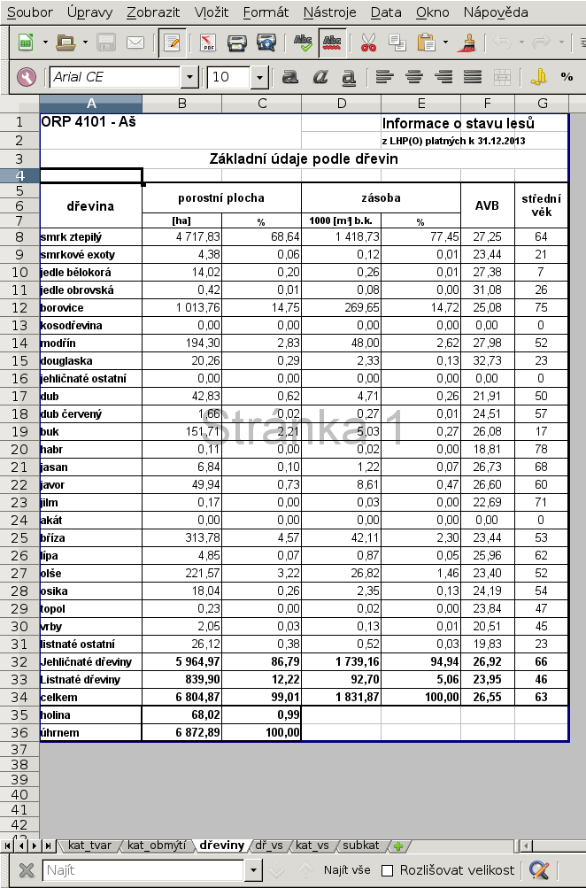
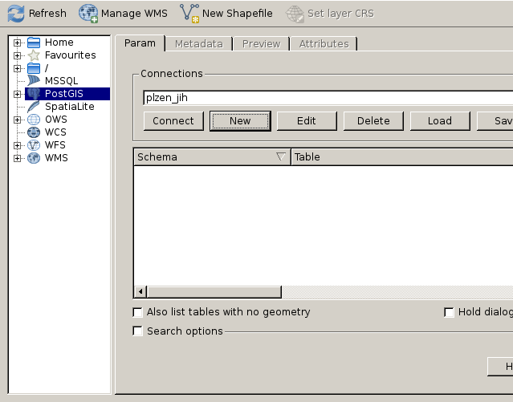
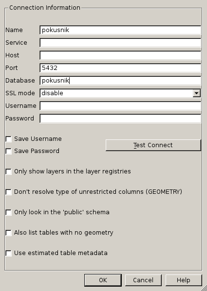
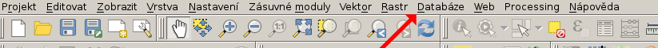
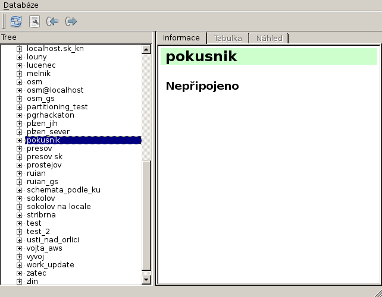
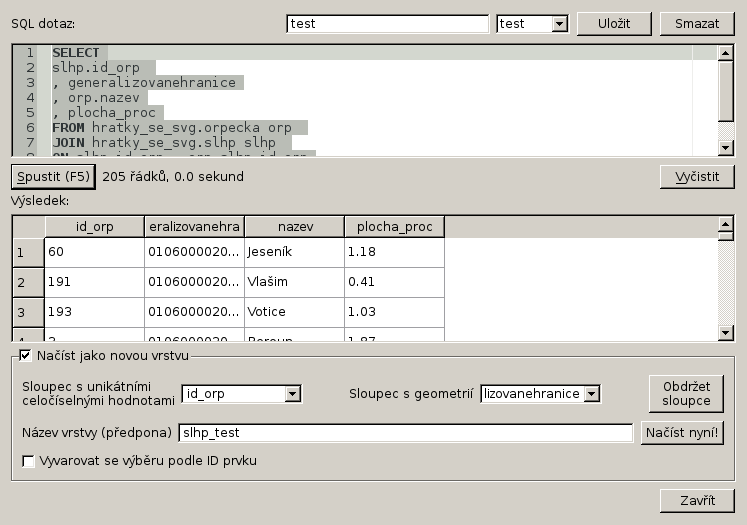
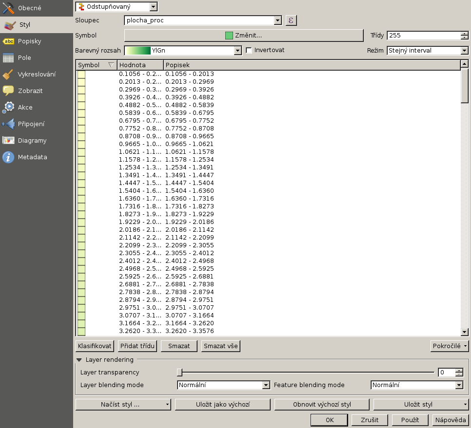
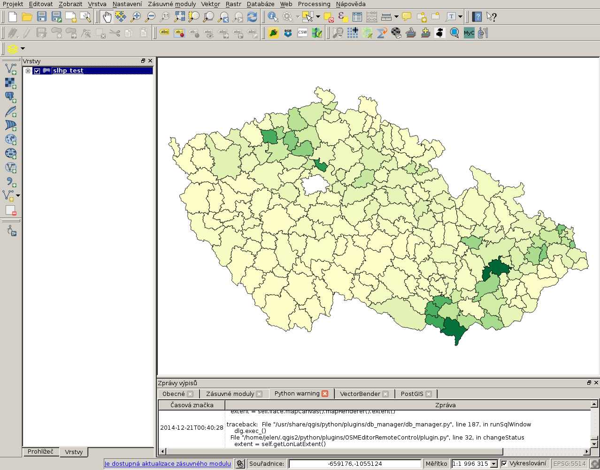

#############################
Mapa zastoupení dřevin po ORP
#############################

*******************************
Jak na generování SVG z PostGIS
*******************************

.. note:: Všechny příklady jsou dělané na linuxu (já osobně pracuji s arch linuxem), pokud je chcete zkoušet na windows, použijte `CYGWIN <https://www.cygwin.com/>`_, nebo `osgeo4w <http://trac.osgeo.org/osgeo4w/>`_ a MSYS konzoli, případně nějakou linuxovou live distribuci, například `OSGEO live <http://live.osgeo.org/en/index.html>`_.

Ukážeme si, jak stáhnout data o zastoupení dřevin po ORP poskytovaná `Ústavem pro hospodářsdkou úpravu lesa <http://www.uhul.cz/>`_ a data budeme vizualizovat v jednoduché interaktivní aplikaci s využitím `SVG`. Ukážeme si také, jakým způsobem lze data generalizovat při zachování topologie.

Motivace
========

Mezi funkcemi PostGISu pro výstup je funkce `ST_AsSVG <http://postgis.net/docs/ST_AsSVG.html>`_. `SVG`, neboli škálovatelná grafika. Není předmětem následujícího postu rozberírat do podrobna `výhody a nevýhody tohoto formátu <http://www.zdrojak.cz/clanky/svg-nebo-canvas-vyberte-si/>`_, takže jen velmi stručně. `SVG` se dá vkládat přímo do html, dá se stylovat pomocí kaskádových stylů a výborně spolupracuje s javascriptem. Vykresluje se přímo na prohlížeči. Je ovšem třeba pamatovat na to, že ne každý prohlížeč vykreslí `SVG` a některé prohlížeče nedovedou pracovat správně se všemi prvky a jejich vlastnostmi. S `SVG` je možné ve webové prezentaci pracovat interaktivně a protože se jedná o vektorovou grafiku, při zvětšení nedochází k převzorkování. Na druhou stranu pro všechna měřítka se posílá stejně velký soubor, vykreslování opravdu velkého počtu prvků, nebo hodně složitých prvků může být zátěž pro prohlížeč a práce s takovým souborem nebude plynulá.

`SVG` je vhodné pro tvorbu interaktivních kartodiagramů, grafů, přehledových map. Pro tvorbu složitějších kartografických prezentací není tento formát optimální. Já ho občas používám pro rychlou vizualizaci importovaných dat, výsledku analýz, nebo přehledky (pokud vložíme svg do divu, můžeme jako podkladový obrázek použít wms).

`SVG` je formát založený na `XML`, můžeme tedy, podle libosti, využívat funkce PostgreSQL pro práci s tímto formátem.

Data
====

Občas se mě moji přátelé ptají na to, jaká data dáváme z ÚHÚL. Budeme proto pracovat s daty `Informací o stavu lesů z LHP(O) <http://www.uhul.cz/ke-stazeni/informace-o-lese/slhp>`_ dostupnými na stránkách ÚHÚL v sešitech xlsx. Data nejsou ve formátu optimálním pro dávkové zpracování, proto si nejdříve ukážeme, jak taková data načíst. Použijeme řádkovou utilitu `ssconvert` distribuovanou jako součást linuxového nástroje na práci s tabulkami `gnumeric`. 

Grafiku použijeme z RUIAN, budeme pracovat s polygony ORP. Pro import použijeme utilitu ogr2ogr, distribuovanou s knihovnou gdal.

.. note:: VFR (formát RUIAN) zpracovává GDAL od verze 2.11.

Import dat
==========

Ve své oblíbené databázi pokusník jsem si vytvořil schéma na hraní.
::

   pokusnik=# create schema hratky_se_svg;

V databázi už mám `nainstalovaný postgis <http://postgis.net/docs/postgis_installation.html#install_short_version>`_.

A také mám již přidané `křovákovo zobrazení <http://freegis.fsv.cvut.cz/gwiki/S-JTSK>`_ ve `spatial_ref_sys`. Používám `srid 5514 <http://epsg.io/5514>`_ a `transformační klíč čuzak <http://freegis.fsv.cvut.cz/gwiki/S-JTSK#Transforma.C4.8Dn.C3.AD_kl.C3.AD.C4.8De_a_software>`_.

Stáhnul jsem si `RUIANOVÁ data z vdp <http://vdp.cuzk.cz/vymenny_format/soucasna/20141130_ST_UKSG.xml.gz>`_.

Stažení provedu pomocí programu `wget`, samozřejmě můžu data stáhnout i přímo z webového prohlížeče.
::

   wget http://vdp.cuzk.cz/vymenny_format/soucasna/20141130_ST_UKSG.xml.gz

K importu použiji, jak jsem již uvedl `ogr2ogr`. Vyberu vrstvu Orp, souřadný systém nastavím na 5514, novou tabulku pojmenuji orpecka.
::

   ogr2ogr -f PGDump /dev/stdout -a_srs 'EPSG:5514' 20141130_ST_UKSG.xml.gz Orp \
   -nln hratky_se_svg.orpecka \
   | psql pokusnik 2> err

.. note:: Použiji formát PGDump, místo PostgreSQL, protože na mé distribuci zlobí přidávání více sloupců s geometrií.

Parametrem `-f` zadám výstupní formát (v mém případě PGDump, tedy textový formát podobný tomu produkovaném PostgreSQL utilitou pg_dump), `/dev/stdout` nastaví výstup na `STDOUT` namísto výstupu do souboru. `-a_srs` nastaví výstupní souřadný systém. Následuje název vstupního souboru (který není nutné rozzipovat) a název vrstvy. Pomocí `-nln` nastavím název tabulky a schéma. Výstup z ogr2ogr pošlu rourou na psql. Chyby vypíšu do logu nazvaného *err*.

Jako numeriku použijeme `data o stavu lesa za rok 2013 <http://www.uhul.cz/images/ke_stazeni%5CSLHP/2013.rar>`_. Já si data stáhnu pomocí `wget`, ale můžete klidně opět použít prohlížeč.
::

   wget http://www.uhul.cz/images/ke_stazeni%5CSLHP/2013.rar

Data jsou, bohužel, v poměrně pitomém formátu xlsx, takže budeme muset trochu čarovat, abychom vykuchali potřebné údaje. K čtení xlsx použijeme utilitu gnumeric `ssconvert`. Pomocí `ssconvert` provedu konverzi potřebné stránky do formátu `csv` (hodnoty oddělené středníkem, nebo čárkou). S textovými soubory mohu dále pracovat unixovými utilitami jako `cut`, `grep`, `tail`, `head`, případně `sed`. 

Alternativou je konvertovat soubory řádkovou utilitou `LibreOffice`, případně na windows použít `visual basic` v `excelu`, nebo v `LibreOffice`. Jinou možností je použít `knihovny na práci s excelovými soubory <https://openpyxl.readthedocs.org/en/latest/>`_ například v pythonu.

Rozrarujeme si stažené soubory a v něm najdeme zararované výkazy. Vybereme výkazy po orp a opět je rozrarujeme.

Vidíme, že každý sešit má několik listů. Nás bude zajímat list `dřeviny`. Ačkoliv například dřeviny po věkových třídách by také byly jistě zajímavé (list `dř_vs`).

.. note:: Na stránkách ÚHÚL jsou ke stažení informace od roku 1998, můžete si vyzkoušet udělat časovou řadu a provést srovnání.

Vyzkoušíme utilitu ssconvert na jednom souboru.
::

   ssconvert --export-type=Gnumeric_stf:stf_assistant \
   -O 'separator=; eol=unix sheet=dřeviny quoting-mode=never format=raw' \
   ORP\ Aš.xslx

Pomocí `--export-type=Gnumeric_stf:stf_assistant` si vyberu jako výstupní formát konfigurovatelný textový soubor. Za přepínačem `-O` následují nastavení výstupu. Já si nastavil oddělovač na středník (`separator=;`), konce řádků na unixové (`eol=unix`),  vyberal list pro export (`sheet=dřeviny`), zrušil jsem uvozovkování a formátování (`quoting-mode=never format=raw`). 

Tento příkaz ve výsledku vytvoří soubor `ORP Aš.txt`, který bude mít následující obsah.
::

   ORP 4101 - Aš;;;;Informace o stavu lesů;;
   ;;;;z LHP(O) platných k 31.12.2013;;
   Základní údaje podle dřevin;;;;;;
   ;;;;;;
   dřevina;porostní plocha;;zásoba;;AVB;střední věk
   ;;;;;;
   ;[ha];%;1000 [m3] b.k.;%;;
   smrk ztepilý;4717,83;68,64;1418,73;77,45;27,25;64,36
   smrkové exoty;4,38;0,06;0,12;0,01;23,44;20,88
   jedle bělokorá;14,02;0,2;0,26;0,01;27,38;6,74
   jedle obrovská;0,42;0,01;0,08;0;31,08;26,12
   borovice;1013,76;14,75;269,65;14,72;25,08;75,41
   kosodřevina;0;0;0;0;0;0
   modřín;194,3;2,83;48;2,62;27,98;51,79
   douglaska;20,26;0,29;2,33;0,13;32,73;22,76
   jehličnaté ostatní;0;0;0;0;0;0
   dub;42,83;0,62;4,71;0,26;21,91;50,13
   dub červený;1,66;0,02;0,27;0,01;24,51;57,46
   buk;151,71;2,21;5,03;0,27;26,08;17,25
   habr;0,11;0;0,02;0;18,81;77,86
   jasan;6,84;0,1;1,22;0,07;26,73;68,47
   javor;49,94;0,73;8,61;0,47;26,6;59,99
   jilm;0,17;0;0,03;0;22,69;71,29
   akát;0;0;0;0;0;0
   bříza;313,78;4,57;42,11;2,3;23,44;52,67
   lípa;4,85;0,07;0,87;0,05;25,96;61,58
   olše;221,57;3,22;26,82;1,46;23,4;51,84
   osika;18,04;0,26;2,35;0,13;24,19;54,43
   topol;0,23;0;0,02;0;23,84;46,82
   vrby;2,05;0,03;0,13;0,01;20,51;44,84
   listnaté ostatní;26,12;0,38;0,52;0,03;19,83;22,72
   Jehličnaté dřeviny;5964,97;86,79;1739,16;94,94;26,92;65,52
   Listnaté dřeviny;839,9;12,22;92,7;5,06;23,95;45,64
   celkem;6804,87;99,01;1831,87;100;26,55;63,06
   holina;68,02;0,99;;;;
   úhrnem;6872,89;100;;;;

Budeme chtít převést všechny soubory jednou dávkou. Použijeme smyčku `while`, na kterou rourou pošleme názvy souborů s koncovkou xslx nalezené pomocí `find`. Protože jsou v názvech kulišácky použité mezery, musím nejdřív přenastavit proměnnou prostředí `IFS`, která obsahuje oddělovač polí. Jinak by brala smyčka každé slovo jako novou hodnotu. Aktuální hodnotu IFS si proto uložím do proměnné OLDIFS a nastavíme nové IFS. Pak můžeme posílat soubory nalezené findem rourou na smyčku. Smyčka prožene každý soubor přes ssconvert.

Nakonec uvedeme IFS do původního stavu.

Zbývá ještě srovnat pro kontrolu počet vstupních a výstupních souborů, protože se mi v logu `err` objevily chyby. Pokud bych chtěl s těmito daty nějak vážně pracovat, pochopitelně bych se s takto povrchní kontrolou nespokojil.

Dávka pak bude vypadat takto.
::

   OLDIFS=$IFS;
   IFS=`echo -en "\n\n"`;
   find *.xlsx | while read ff; do
      ssconvert --export-type=Gnumeric_stf:stf_assistant \
      -O 'separator=; eol=unix sheet=dřeviny quoting-mode=never format=raw' \
      $ff;
   done 2> err

   IFS=$OLDIFS;

   find *.xlsx | wc -l
   find *.txt | wc -l

Data budou muset někde bydlet, vyrobíme pro ně tabulky.
::

   SET SEARCH_PATH = hratky_se_svg, public;

   CREATE SEQUENCE id_orp_seq;

   CREATE TABLE soubory_slhp(
      id_orp int NOT NULL DEFAULT nextval('id_orp_seq') PRIMARY KEY
      , nazev varchar(255)
   );

   CREATE FUNCTION f_id_orp() RETURNS BIGINT LANGUAGE SQL AS
   $$
   SELECT last_value FROM hratky_se_svg.id_orp_seq;
   $$
   ;

   CREATE TABLE slhp(
      id_orp int NOT NULL DEFAULT f_id_orp()
      , drevina varchar(255)
      , plocha_ha float
      , plocha_proc float
      , zasoba_m3 float
      , zasoba_proc float
      , avb float
      , stredni_vek float
   );

   CREATE INDEX ON slhp(id_orp);

.. note:: Tady je použitý jeden takový šikovný (leč zrádný trik). Budeme střídavě nahrávat do dvou tabulek, do první název souboru a do druhé data, přičemž u druhé tabulky se nám automaticky vloží hodnota naposledy vloženého záznamu. Pokud se ovšem něco pokazí a hodnota do první tabulky se nevloží, budeme mít špatně spárované hodnoty, protože budou mít id posledního úspěšně zapsaného záznamu.

Nahrajeme data do tabulek. K nahrání použijeme `COPY FROM STDIN <http://www.postgresql.org/docs/9.3/static/sql-copy.html>`_.
::

   OLDIFS=$IFS;
   IFS=`echo -en "\n\n"`;

   find *.txt | while read ff; do 
      head -n 1 $ff | cut -d ';' -f 1 | psql -c "COPY hratky_se_svg.soubory_slhp (nazev) FROM STDIN" pokusnik;

      tail -n +8 $ff | sed 's/,/./g' | 
      psql -c "COPY hratky_se_svg.slhp (drevina, plocha_ha, plocha_proc, zasoba_m3, zasoba_proc, avb, stredni_vek) 
      FROM STDIN WITH DELIMITER ';' NULL ''" pokusnik;
   done 2> err

   IFS=$OLDIFS;

Z prvního políčka prvního řádku (`head -n 1 $ff | cut -d ';' -f 1`) získáme název ORP a zkopírujeme do databáze. Z každého listu vezmeme řádky od osmého výše (`tail -n +8 $ff`), nahradíme desetinné čárky tečkami pomocí sedu (`sed 's/,/./g'`, tohle se dá pravděpodobně nějak ošetřit v rámci proměnných prostředí, aby desetinné čárky byly už ve výstupu ze ssconvert, ale mě se to nepodařilo) a zkopírujeme do databáze, musíme však přenastavit DELIMITER, tedy oddělovač záznamů na středník a zápis hodnoty  NULL na prázdný řetězec.

.. note:: ÚHÚL bohužel používá číselník ORP podle ČSÚ, takže k párování nemůžeme použít kódy. Podle ČUZK je navíc o jedno ORP méně, proto nebudeme mít numeriku ke všem polygonům.

Srovnáme, co nám chybí.
::

   SELECT nazev FROM orpecka 
   EXCEPT 
   SELECT regexp_replace(nazev, 'ORP \d{4} \- ','') FROM soubory_slhp;

Je to `Hlavní město Praha`. Zjevně bude mít nějaký vlastní status. Nevadí. Spárujeme si to.

.. note:: Pro kontrolu doporučuji provést porovnání EXCEPTem i na druhou stranu.

Párování můžeme provést třeba takto.
::

   ALTER TABLE orpecka ADD slhp_id_orp int;

   UPDATE orpecka o SET slhp_id_orp = id_orp
   FROM soubory_slhp s WHERE o.nazev =  regexp_replace(s.nazev, 'ORP \d{4} \- ','');

Pomocí regexp odstraníme z názvu orp, vybraného ze souboru od ÚHÚL počáteční číselný kód, pomlčku a mezery. Pak bude název ORP odpovídat nůzvu ČUZK.

.. note:: V tomto případě nemá cenu pro něco málo přes dvěstě záznamů nový sloupec indexovat.

Zobrazení importovaných dat v QGIS
==================================

V QGIS browseru si přidáme naši pracovní databázi.

Vyplníme kartu.

Přepneme do QGIS desktopu. Otevřeme správce databází (databáze >správce databází > správce databází)

Ve správci databází připojíme naši pracovní databázi.

A otevřeme SQL okno.

.. image:: obrazky/db_manager_pripojeno.png

Do okna napíšeme dotaz. Pokud jste pojmenovali své tabulky stejně jako já, bude vypadat takto.
::

   SELECT
   slhp.id_orp 
   , generalizovanehranice
   , orp.nazev
   , plocha_proc
   FROM hratky_se_svg.orpecka orp 
   JOIN hratky_se_svg.slhp slhp 
   ON slhp.id_orp = orp.slhp_id_orp
   AND slhp.drevina = 'jasan'

Vybereme grafiku orp, sloupec generalizovanehranice, doplníme id_orp, název ORP a procentuální zastoupení dřeviny. Vybereme záznamy pro jasan. Jako unikátní záznam nastavíme `id_orp`, jako grafiku `generalizovanehranice`. Novou vrstvu pojmenujeme a načteme do qgisu.

Nyní můžeme upravit vlastnosti vrstvy. Otevřeme kartu symbologie.

Změníme `jednoduchý symbol` na odstupňovaný. Sloupec nastavíme na `plocha_proc`. Vybereme barevný rozsah dle svého vkusu a navýšíme počet tříd.

Příště si ukážeme jak z dat vyrobit svg přímo pomocí dotazu a jak obarvit jednotlivé ORP podle zastoupení dřevin.

Případné dotazy zodpovím na svém `twitteru <https://twitter.com/jeleniste>`_.
