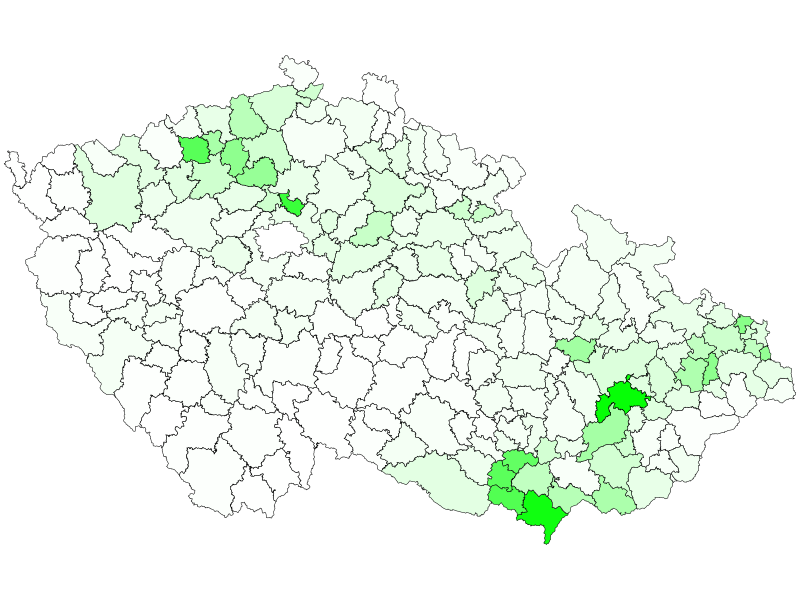

###########################
Generujeme `SVG` z POSTGISu
###########################

************************************
Zastoupení dřevin po ORP - druhý díl
************************************

Komu se nelení, tomu se jasaní
==============================

*Vyrobobíme si mapku zastoupení jasanů*

Co vrací `ST_AsSVG`
-------------------

Takže, co tedy vrací?
::

   SELECT ST_AsSVG(generalizovanehranice) FROM hratky_se_svg.orpecka LIMIT 1;

Ale to nevypadá jako `XML`! Ano, jistě. Není to totiž celé svg, pouze zápis vektorových geometrií jednotlivých prvků. Je to kvůli tomu, že budeme chtít prvkům určovat jejich grafickou reprezentaci. Tloušťku čar, barvu a tak dále.

Element path
------------

Použijeme xml funkce postgisu k sestavení kompletního elementu path.
::

   SET SEARCH_PATH = hratky_se_svg, public;

   SELECT XMLELEMENT(NAME path,
      XMLATTRIBUTES(
         ST_AsSVG(generalizovanehranice, 0, 1) AS d
         , 'black' AS stroke
         , 50 AS "stroke-width"
         , 'none' AS fill
      )
   ) svg_path

   from orpecka;

Tady se nám již vrací xml elementy. Co jsem to právě povedl? Funkce `XMLELEMENT` vyrobí, jak již název napoví elemenmt xml. Pomocí fce `XMLATTRIBUTES` tento element naplníme nějakými atributy. První atribut pojmenujeme `d` a naplníme ho výstupem z funkce `ST_AsSVG`. Všiměte si druhého a třetího parametru funkce `ST_AsSVG`. Druhý parametr rozlišuje, jestli mají být souřadnice lomových bodů v absolutních hodnotách, nebo relativně k prvku. Nula značí relativně. Druhý je počet desetinných míst. Jednička znamená jedno desetinné místo. Přesnost na deset centimetrů je u generalizovaných hranic ORP více než dostačující. Teoreticky by bylo možné posunout pomocí ST_Translate celou geometrii na souřadnice 0.0, případně to přetransformovat do SRS s jinými jednotkami pomoci ST_Transform. Tím se však ted nebudeme zdržovat.

První obrázek
-------------

Nyní si vytvořené prvky umístíme do prvku svg, kterému nastavíme atributy pro správné zobrazení.
::

   SET SEARCH_PATH = hratky_se_svg, public;

   \a \t \o orp.svg

   SELECT 
   XMLELEMENT(NAME svg,
      XMLATTRIBUTES(
      600 AS height
      , 800 AS width
      , array_to_string(ARRAY[MIN(ST_XMIN(generalizovanehranice)) - 2500, -1 * (MAX(ST_YMAX(generalizovanehranice))) - 2500
         , (@(MAX(ST_XMAX(generalizovanehranice)) - MIN(ST_XMIN(generalizovanehranice)))) + 5000
         , (@(MAX(ST_YMAX(generalizovanehranice)) - MIN(ST_YMIN(generalizovanehranice)))) + 5000], ' ') AS "viewBox"
         , 'http://www.w3.org/2000/svg' AS xmlns, '1.1' AS version
      )
      , XMLAGG (
         XMLELEMENT(NAME path,
            XMLATTRIBUTES(
               ST_AsSVG(generalizovanehranice, 0, 0) AS d
               , 'black' AS stroke
               , 300 AS "stroke-width"
               , 'none' AS fill
            )
         ) 
      )
   )

   from orpecka;

   \o \a \t

.. image:: obrazky/orp.svg

Co se tady dělo?

V prvním řádku jsem nastavil search_path na složku s daty a public (v publicu jsou funkce postgisu). Dále jsem vypnul alignování výpisu a nastavil vypisování jen na výslekdy dotazu. Soubor pro výstup jsem nastavil na `orp.svg`. Připomínám, že \\a \\t a \\o jsou metapříkazy psql, tudíž je třeba pracovat z psql konzole. V adminu toto nejspíš nebude fungovat. Nicméně můžete pustit dávku bez těchto metapříkazů a výstup uložit do souboru jinou cestou. Celý výsledek je uzavřen v elementu nazvaném svg. Tomuto elementu přiřadíme výšku a šířku a viewbox, nakonec zařadíme namespace a verzi svg. 

U viewboxu se trochu zdržíme. SVG maluje do třetího kvadrantu (neptejte se mě proč) a to tak, že x je směr doprava a ypsilon mazaně dolů. Viewbox se uvádí jako čtveřice mezerou oddělených hodnot ve tvaru "xmin ymin šířka výška". Viewbox jsem protáhnul o pět kilometrů, tedy dva a půl na každé straně. Operátor `\@` je absolutní hodnota.

Poté zagreguji do elementu svg všechny elementy path všechny elementy path (šířku linie jsem zvětšil na 300).

Nakonec zavřu soubor a zpět zapnu vypisování v psql.

Barvičky podle numeriky
-----------------------

::

   SET SEARCH_PATH = hratky_se_svg, public;

   \a \t \o orp_jasan.svg

   SELECT 
   XMLELEMENT(NAME svg,
      XMLATTRIBUTES(
      600 AS height
      , 800 AS width
      , array_to_string(ARRAY[MIN(ST_XMIN(generalizovanehranice)) - 2500, -1 * (MAX(ST_YMAX(generalizovanehranice))) - 2500
         , (@(MAX(ST_XMAX(generalizovanehranice)) - MIN(ST_XMIN(generalizovanehranice)))) + 5000
         , (@(MAX(ST_YMAX(generalizovanehranice)) - MIN(ST_YMIN(generalizovanehranice)))) + 5000], ' ') AS "viewBox"
         , 'http://www.w3.org/2000/svg' AS xmlns, '1.1' AS version
      )
      , XMLAGG (
         XMLELEMENT(NAME path,
            XMLATTRIBUTES(
               ST_AsSVG(generalizovanehranice, 0, 0) AS d
               , 'black' AS stroke
               , 300 AS "stroke-width"
               , 'rgb('||(2.55*(100-(plocha_proc*4)))::int||',255,'||(2.55*(100-(plocha_proc * 4)))::int||')' AS fill
            )
         ) 
      )
   )

   FROM orpecka o, slhp s
   WHERE o.slhp_id_orp = s.id_orp
   AND drevina = 'jasan';

   \o \a \t

Je zjevné, že obrázek o velikosti 1.6 Mb není na web ideální. Příště si tedy ukážeme, jak data nejdříve generalizovat při zachování topologie.
