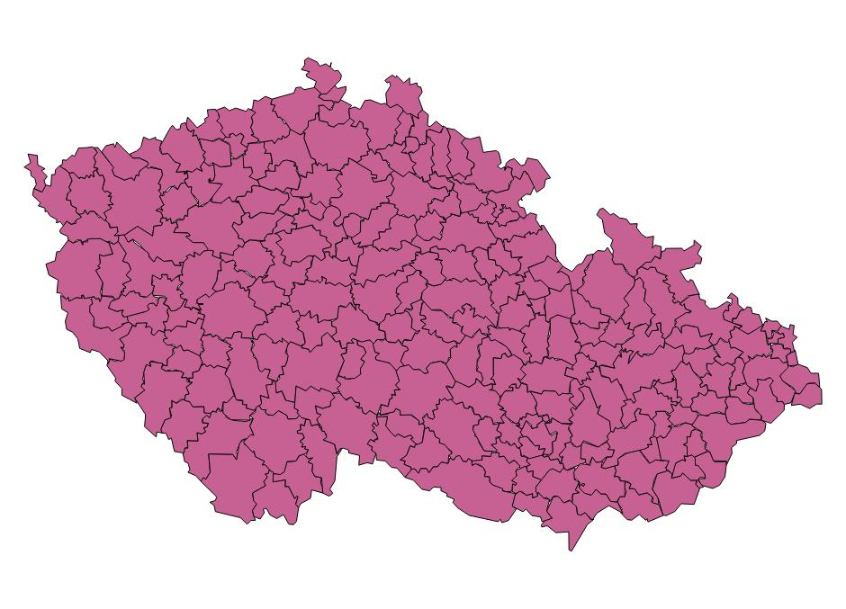
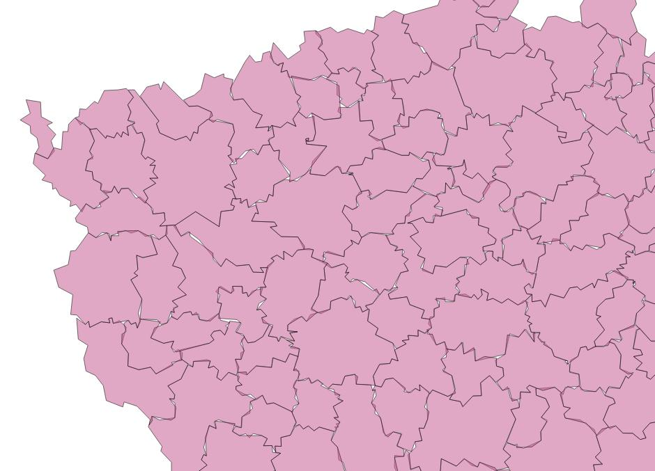
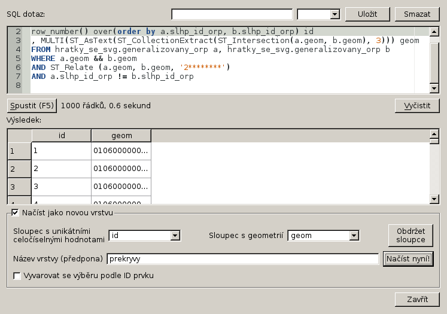
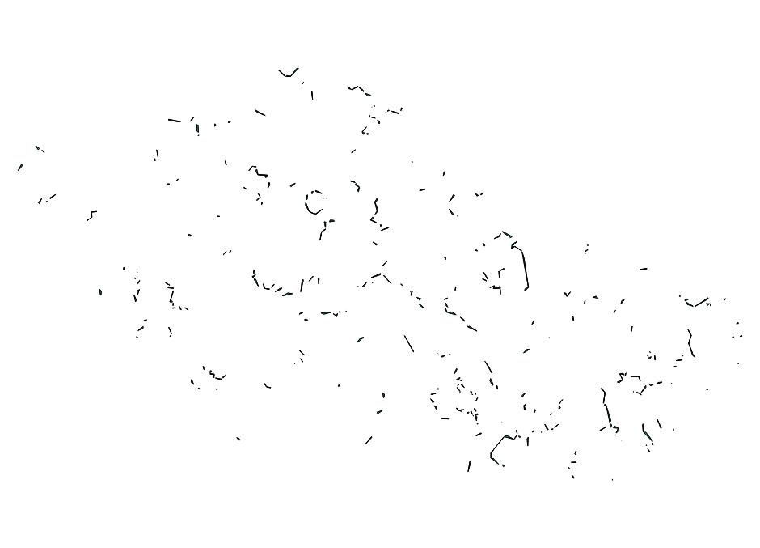
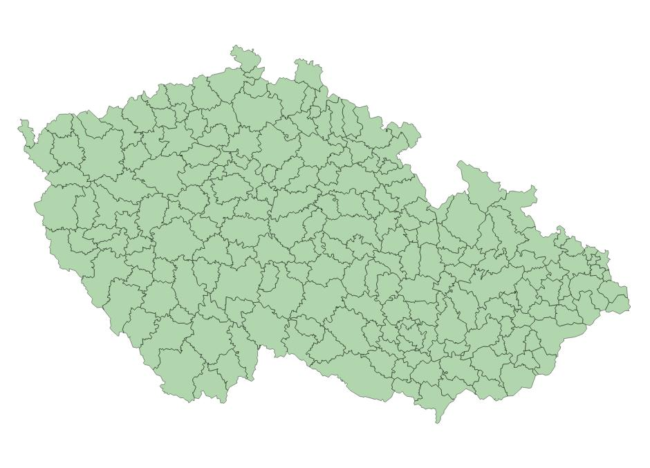
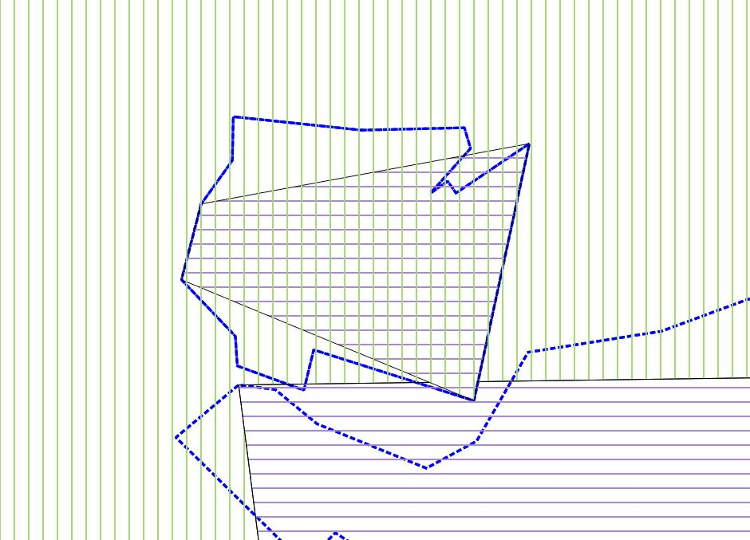

###########################
Generujeme `SVG` z POSTGISu
###########################

***************************************
Zastoupení dřevin po ORP - generalizace
***************************************

Generalizace je zvláštní disciplína, lhal bych, kdybych se prohlásil za znalého celé šíře této problematiky. Koneckonců vybočuje z mojí praxe dataře, protože se zabývá, v podstatě, vizuálnem, což je mimo ohnisko mých obvyklých zájmů. Cílem je při maximální možné redukci objemu dat zachovat maximum jejich obsahu. Zde narážíme na to, čemu se v ekologii říká `trade off`, čili, jste-li kachnou a váš zobák je placatý, bude obtížné s ním někoho, dejme tomu, uklovat, s nohami uzpůsobenými k plavání se bude špatně hrabat a tak dále. S daty je to podobné, mezi jejich objemem a jejich obsahem, je přímá úměra. V našem případě potřebujeme zachovat vzájemnou polohu jednotlivých polygonů a jejich vzájemnou polohu. Přesný průběh hranic nás netrápí, protože v měřítku, ve kterém pracujeme (celá republika) nejsou beztoho patrné. Taktéž drobné topologické *špinky* se ztratí, pokud jejich velikost nepřekročí půl kilometru.

ST_Simplify
===========

Generalizace obnáší množství různých úkonů. Vynechávání nevýznamných prvků, slučování, zjednodušování existujících prvků a tak dále. My se budeme zabývat zjednodušováním hranic existujících prvků. PostGIS nabízí funkce `ST_Simplify <http://www.postgis.org/docs/ST_Simplify.html>`_ a
`ST_SimplifyPreserveTopology <http://www.postgis.org/docs/ST_SimplifyPreservrTopology.html>`_. Funkce pracuje s `Douglas-Peckerovým algoritmem <http://en.wikipedia.org/wiki/Ramer–Douglas–Peucker_algorithm>`_. Výstup `Douglas-Peckerova algorytmu <http://www.scielo.br/scielo.php?pid=S0104-65002004000100006&script=sci_arttext>`_ si můžeme představit asi jako kdybychom na linii navlékli ohebnou trubku a výsledkem byla její osa. Postupuje se tak, že se postupně přidávají body ohybu, přičemž se přidává vždy bod nejvzdálenější od aktuální osy, dokud nejsou všechny body v rouře. Poloměr roury (tolerance) je vstupním parametrem obou funkcí. Funkce jsou dvě z toho důvodu, že generalizací může dojít k porušení topologické validity prvku ST_SimplifyPreserveTopology toto ošetřuje, ST_Simplify vrací invalidní prvek.

Geometrii máme v tabulce orpecka od minula. Je v položce generalizovanehranice (originalnihranice je prázdná). Je to proto, že už jsme stáhli data, do nějaké míry generalizovaná. Nicméně generalizace není pro náš účel (respektive měřítko) dostačující. Při generalizaci vždy kopírujeme data do nového sloupce a to proto, že generalizace je nevrtaný proces a jednou ztracenou přesnost nelze zpětně obnovit.
::

   SELECT 
   slhp_id_orp
   , MULTI(ST_SimplifyPreserveTopology(generalizovanehranice, 1000))::geometry('MULTIPOLYGON', 5514) geom 
   INTO hratky_se_svg.generalizovany_orp 
   FROM hratky_se_svg.orpecka;

Všiměte si funkce `MULTI`, kterou jsem použil přes výsledek Simplify. Je to proto, že pracuji s vrstvou typu multipolygon, nicméně simplify v případě, že vrací jeden polygon, tak udělá z multipolygonu s jedním polygonem jednoduchý polygon. Použití této funkce zajistí, že všechny vracené prvky budou multipolygony.

Výsledkem si můžeme prohlédnout v QGISU.

detaily

Zobrazíme si, kde došlo k překryvům. Následjící dotaz můžete zkopírovat do SQL okna db manageru a výsledek dotazu přidat jako novou vrstvu.
::

   SELECT 
   row_number() over(order by a.slhp_id_orp, b.slhp_id_orp) id
   , MULTI(ST_AsText(ST_CollectionExtract(ST_Intersection(a.geom, b.geom), 3))) geom
   FROM hratky_se_svg.generalizovany_orp a, hratky_se_svg.generalizovany_orp b 
   WHERE a.geom && b.geom
   AND ST_Relate (a.geom, b.geom, '2********')
   AND a.slhp_id_orp != b.slhp_id_orp
   
Vidíme funkci `MULTI`, se kterou jsme se již seznámili, dále `ST_CollectionExtract`, kdy z GEOMETRYCOLLECTION, který může intersection také vracet vybereme jen a pouze polygony. To provedeme jen na překrývajících se polygonech, které nemají stejné id. Pro urychlení dotazu si pomůžeme předvýběrem pomocí operátoru `&&`. 

Je vidět, že topologie dostala pořádně na frak. Je zjevné, že budeme muset pracovat s topologií, pokud chceme dostat spojitou vrstvu bez překryvů. Jedna z možností je generalizovat nikoliv polygony, ale jednotlivé hrany. Postup jsem našel na blogu věnovaném `topologické generalizaci <http://strk.keybit.net/blog/2012/04/13/simplifying-a-map-layer-using-postgis-topology/>`_. 

Postup zde prezentovaný pracuje nikoliv s polygony, nýbrž s hranami uloženými v topologickém schématu. Někdo ovšem může dojít ke kolizi dvou hran, například v případě různých konkávních útvarů, kdy jsou dvě hrany blízko sebe a vnější hrana s větším poloměrem je vyrovnána. To je zde řešeno tak, že v případě kolize je postupně u problematické hrany snižována tolerance, dokud hrany nepřestanou kolidovat. Ve výsledku to ovšem znamená, že ne všechny hrany jsou generalizované se stejnou tolerancí, což může na výsledku působit rušivě.

Já se nakonec rozhodl použít funkci ST_Simplify z rozšíření PostGISu `topology`, která se liší od ST_Simplify z PostGISu jako takového, protože pracuje s topogeometriemi místo geometriemi. Je to nová funkce a ještě není v dokumentaci.

Aby to bylo  možné provést, je třeba nainstalovat rozšíření PostgreSQL `postgis_topology`. Nejlépe pomocí `CREATE EXTENSION`.
::

   CREATE EXTENSION postgis_topology;

Případně puštěním skriptu topology.sql z vaší složky s postgisem.

Nejdříve si vyrobíme schéma s topologií.
::

   SELECT CreateTopology('orp_topo', 5514); 

Parametry jsou název, SRID a volitelně tolerance.

K tabulce orpecka přidám topogeometrický sloupec topogeom.
::

   SELECT AddTopoGeometryColumn('orp_topo', 'hratky_se_svg', 'orpecka', 'topogeom', 'MULTIPOLYGON');

Sloupec topogeom naplním daty.
::

   SET SEARCH_PATH = hratky_se_svg, public, topology;

   UPDATE orpecka 
   SET topogeom = toTopoGeom(generalizovanehranice, 'orp_topo', 1); 

Teď si můžeme výsledek zgeneralizovat, vysypat do tabulky a prohlédnout v QGISu.
::

   SELECT 
   slhp_id_orp, topology.ST_Simplify(topogeom, 500) geomsimp 
   INTO hratky_se_svg.generalizovany_polygony 
   FROM orpecka;

.. image:: obrazky/topologicka_generalizace_detaily.jpg

Výsledek vypadá na první i druhý pohled dokonale, přesto zkontrolujeme překryvy...
::

   SELECT 
   row_number() over(order by a.slhp_id_orp, b.slhp_id_orp) id
   , MULTI(ST_AsText(ST_CollectionExtract(ST_Intersection(a.geomsimp, b.geomsimp), 3))) geom
   FROM hratky_se_svg.generalizovany_polygony a, hratky_se_svg.generalizovany_polygony b
   WHERE a.geomsimp && b.geomsimp
   AND ST_Relate (a.geomsimp, b.geomsimp, '2********')
   AND a.slhp_id_orp != b.slhp_id_orp

A zjistíme, že se nám zde, přeci jenom vyskytly nějaké `fujtajblíky`.

a

.. image:: obrazky/chyba2.jpg

Modrá čára je původní hranice.

Problém není natolik závažný, abychom se jím museli zabývat. Nicméně stojí za zmínku, že problémem jsou podlouhlé, zahnuté útvary, se kterými se algorytmus obtížně vyrovnává. Pravděpodobně by bylo možné problém vyřešit nějak automaticky, nicméně nízká frekvence chyb a složitost problému ve výsledku vede k tomu, že podobná smítka je nejrychlejší opravit ručně.

Nyní můžeme zakomponovat výsledek do dotazu na generování svg.
::

   SET SEARCH_PATH = hratky_se_svg, public;

   \a \t \o orp_jasan_generalizovany.svg

   SELECT 
   XMLELEMENT(NAME svg,
      XMLATTRIBUTES(
      600 AS height
      , 800 AS width
      , array_to_string(ARRAY[MIN(ST_XMIN(generalizovanehranice)) - 2500, -1 * (MAX(ST_YMAX(generalizovanehranice))) - 2500
         , (@(MAX(ST_XMAX(generalizovanehranice)) - MIN(ST_XMIN(generalizovanehranice)))) + 5000
         , (@(MAX(ST_YMAX(generalizovanehranice)) - MIN(ST_YMIN(generalizovanehranice)))) + 5000], ' ') AS "viewBox"
         , 'http://www.w3.org/2000/svg' AS xmlns, '1.1' AS version
      )
      , XMLAGG (
         XMLELEMENT(NAME path,
            XMLATTRIBUTES(
               ST_AsSVG(generalizovanehranice, 0, 0) AS d
               , 'black' AS stroke
               , 300 AS "stroke-width"
               , 'rgb('||(2.55*(100-(plocha_proc*4)))::int||',255,'||(2.55*(100-(plocha_proc * 4)))::int||')' AS fill
            )
         ) 
      )
   )

   FROM (SELECT topology.ST_Simplify(topogeom, 500) generalizovanehranice, plocha_proc 
      FROM orpecka o, slhp s
      WHERE o.slhp_id_orp = s.id_orp
      AND drevina = 'jasan'
   ) g;

   \o \a \t

.. image:: obrazky/orp_jasan_generalizovany.svg

Výsledek, jak patrno, nijak zvlášť vizuálně neutrpěl.

Velikost souboru můžeme ještě dále zredukovat jedním šikovným trikem. Křovákovo zobrazení pracuje, jak známo, s poněkud výstředními souřadnicemi. 

Proto si křováka poupravíme a souřadnice zredukujeme o konstantu odpovídající maximální absolutní hodnotě x a y a také změníme jednotky z metrů na kilometry.

Nejdříve přidám nový souřadný systém. Příkaz je třeba uložit do samostatného souboru a spustit pomocí `\i`, nebo z shellu pomocí `psql -f`.
::

   COPY spatial_ref_sys FROM STDIN;
   1	jelen	5514	\N	+proj=krovak +lat_0=49.5 +lon_0=24.83333333333333 +alpha=30.28813972222222 +k=0.9999 +x_0=905000 +y_0=1228000 +ellps=bessel +pm=greenwich +units=km +no_defs
   \.

Původní definici křovákova zobrazení jsem upravil editací parametrů pro `false easting a false northing` tedy `+x_0` a `+y_0` zadáním hodnoty, která bude přičtena ke každé souřadnici a dále změnil `+units` z metrů na kilometry.
::

   SET SEARCH_PATH = hratky_se_svg, public;

   \a \t \o orp_jasan_generalizovany_srid_1.svg

   SELECT 
   XMLELEMENT(NAME svg,
      XMLATTRIBUTES(
      600 AS height
      , 800 AS width
      , array_to_string(ARRAY[MIN(ST_XMIN(generalizovanehranice)) - 2.5, -1 * (MAX(ST_YMAX(generalizovanehranice))) - 2.5
         , (@(MAX(ST_XMAX(generalizovanehranice)) - MIN(ST_XMIN(generalizovanehranice)))) + 5
         , (@(MAX(ST_YMAX(generalizovanehranice)) - MIN(ST_YMIN(generalizovanehranice)))) + 5], ' ') AS "viewBox"
         , 'http://www.w3.org/2000/svg' AS xmlns, '1.1' AS version
      )
      , XMLAGG (
         XMLELEMENT(NAME path,
            XMLATTRIBUTES(
               ST_AsSVG(generalizovanehranice, 0, 0) AS d
               , 'black' AS stroke
               , 0.3 AS "stroke-width"
               , 'rgb('||(2.55*(100-(plocha_proc*4)))::int||',255,'||(2.55*(100-(plocha_proc * 4)))::int||')' AS fill
            )
         ) 
      )
   )

   FROM (SELECT ST_Transform(topology.ST_Simplify(topogeom, 500) ,1) generalizovanehranice, plocha_proc 
      FROM orpecka o, slhp s
      WHERE o.slhp_id_orp = s.id_orp
      AND drevina = 'jasan'
   ) g;

   \o \a \t

Musel jsem ještě změnit hodnoty odečítané pro `viewBox` vydělením tisícem a to samé pro `stroke-width`.

Příště se podíváme, jak obarvit svg pomocí kaskádového stylu a jak šikovně použít javascript k přepínání mezi barvami pro jednotlivé dřeviny.
