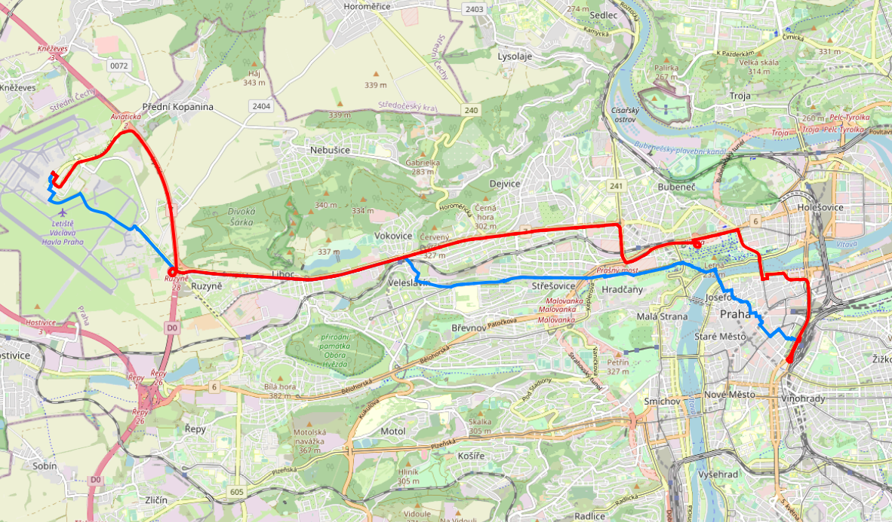

Síťové analýzy
==============

Síťové analýzy (tzv. routing) zajišťuje v prostředí PostGIS nadstavba
označovaná jako `pgRouting <http://pgrouting.org/>`__. Nadstavbu v
databázi aktivujeme příkazem:

.. code-block:: sql

   CREATE EXTENSION pgrouting;

Vytvoříme si schéma, kde budeme pracovat.

.. code-block:: sql

   CREATE SCHEMA routing;

Příprava dat
------------

Jako podkladová data použijeme data OpenStreetMap pro území Hlavního
města Prahy. Data stáhneme přes tzv. Overpass API. Území je dáno
minimálním ohraničujícím obdélníkem (bbox), který můžeme zjistit
např. ze stránek http://boundingbox.klokantech.com (formát CSV).

.. tip:: Pro vyhnutí se zadávání hesla při načítání dat můžeme postupovat podle
  https://www.postgresql.org/docs/current/libpq-pgpass.html

Příklad stažení dat:

.. code-block:: bash
                
   wget --progress=dot:mega -O praha.osm \
   "http://www.overpass-api.de/api/xapi?*[bbox=14.224435,49.941898,14.706787,50.177433][@meta]"

Data naimportujeme do databáze *gismentors*. Import dat zajišťuje
specializovaný nástroj :program:`osm2routing`, příklad volání:

.. code-block:: bash

   osm2pgrouting -f praha.osm --schema routing -d gismentors -U postgres

Po importu se ve výstupním schématu objeví následující tabulky:

.. code-block:: sql

   SELECT f_table_name,f_geometry_column,coord_dimension,srid,type
   FROM geometry_columns WHERE f_table_schema = 'routing';

::
   
      f_table_name    | f_geometry_column | coord_dimension | srid |    type    
   -------------------+-------------------+-----------------+------+------------
    pointsofinterest  | the_geom          |               2 | 4326 | POINT
    ways_vertices_pgr | the_geom          |               2 | 4326 | POINT
    ways              | the_geom          |               2 | 4326 | LINESTRING

.. note:: Jak je vidět, tak jsou data transformována do
          :skoleni:`WGS-84 <open-source-gis/soursystemy/wgs84.html>`
          (:epsg:`4326`), geometrie je uložena ve sloupci
          :dbcolumn:`the_geom`. Pro zachování konzistence v databáze
          jej přejmenujeme na :dbcolumn:`geom`.

          .. code-block:: sql

             ALTER TABLE routing.pointsofinterest RENAME the_geom TO geom;
             ALTER TABLE routing.ways_vertices_pgr RENAME the_geom TO geom;
             ALTER TABLE routing.ways RENAME the_geom TO geom;

Nalezení optimální cesty
------------------------

Algoritmus nalezení optimální cesty je implementován v pgRouting ve
dvou variantách:

* `pgr_dijkstra
  <https://docs.pgrouting.org/latest/en/pgr_dijkstra.html>`__,
  viz. :wikipedia-en:`Dijkstra's algorithm`
* `pgr_aStar
  <https://docs.pgrouting.org/latest/en/pgr_aStar.html>`__,
  viz :wikipedia-en:`A* search algorithm`

.. note:: V následujících příkladech se bude pohybovat v okolí Fakulty stavební
   ČVUT v Praze, kde školení GISMentors většinou probíhají:
   http://www.openstreetmap.org/#map=16/50.1029/14.3912

Příklad - chodec
^^^^^^^^^^^^^^^^

Nejkratší trasa (jeden chodec)
^^^^^^^^^^^^^^^^^^^^^^^^^^^^^^

Chodec se pohybuje z vlakového nádráží v Dejvicích k budově Fakulty
stavební ČVUT v Praze. Hledáme nejkratší trasu, nákladem tedy bude
*délka* segmentů trasy. Chodec se může pohybovat v obou směrech
(budeme pracovat s neorientovaným grafem).

Nastavíme si cestu ke schématům.

.. code-block:: sql
   
   SET search_path TO public,routing,ruian_praha;

Výchozí a cílový bod můžeme najít s využitím adresních míst
RÚIAN. Dojde k vyhledání všech OSM bodů do vzdálenosti 10 m od zadané
adresy.

.. code-block:: sql

   SELECT o.osm_id, o.id, a.gml_id FROM 
   ruian_praha.adresnimista a, 
   ruian_praha.ulice u, 
   routing.ways_vertices_pgr o 
   WHERE a.cislodomovni = 2077 AND a.cisloorientacni = 7 AND u.nazev = 'Thákurova' 
   AND a.ulicekod = u.kod 
   AND ST_DWithin(ST_Transform(o.geom, 5514), a.geom, 20);

::

      osm_id    |   id   |   gml_id
   -------------+--------+-------------
    4140110599  |  70968 | AD.22210156
    3776391915  | 167139 | AD.22210156
    3776391918  | 167141 | AD.22210156
    4140110598  | 168842 | AD.22210156
    4173356388  | 173367 | AD.22210156
    4173361989  | 173368 | AD.22210156
    4173437520  | 173405 | AD.22210156
    4174654158  | 173408 | AD.22210156
    4174654161  | 173409 | AD.22210156
    10816377365 | 177882 | AD.22210156
    10881875992 | 177911 | AD.22210156

.. important:: Hodnoty atributu ``osm_id`` a ``id`` se mohou
   lišit. Zaleží s jakou verzí datasetu OSM pracujete.

.. tip:: Nalezení relevatního uzlu zpomaluje transformace uzlů ze
   souřadnicového systému :epsg:`4326` do :epsg:`5514`. Pro
   urychlení výpočtu si geometrii uzlů v :epsg:`5514` předpočítáme.

   .. code-block:: sql

      ALTER TABLE routing.ways_vertices_pgr ADD COLUMN geom5514 geometry(point, 5514);
      UPDATE routing.ways_vertices_pgr set geom5514 = st_transform(geom, 5514);
      CREATE INDEX on routing.ways_vertices_pgr using gist (geom5514);

Pro snadnější vyhledání id uzlu vytvoříme uživatelskou funkci
``find_node()``. Limit posuneme na 30m.

.. code-block:: sql

    CREATE OR REPLACE FUNCTION find_node(ulice varchar, cislo_domovni int, cislo_orient int, 
                                         OUT result integer)
    AS $func$
    BEGIN
    EXECUTE format('
      SELECT o.id FROM
      ruian_praha.adresnimista a,
      ruian_praha.ulice u,
      routing.ways_vertices_pgr o
      WHERE a.cislodomovni = %s AND a.cisloorientacni = %s AND u.nazev = ''%s''
      AND a.ulicekod = u.kod
      AND ST_DWithin(geom5514, a.geom, 30) limit 1',
      cislo_domovni, cislo_orient, ulice)
    INTO result;
    END
    $func$ LANGUAGE plpgsql;

Příklad vyhledání id uzlu vychozího a cílového bodu pomocí funkce ``find_node()``.

.. code-block:: sql

   select find_node('Václavkova', 169, 1);
   
::

     find_node 
    -----------
         43771

Nejkratší trasu nalezneme voláním funkce `pgr_dijkstra
<http://docs.pgrouting.org/latest/en/src/dijkstra/doc/pgr_dijkstra.html>`__. Dijkstrův
algoritmus vyžaduje definovat celkem čtyři atributy:

* `id` - identifikátor hrany
* source - identifikátor počátečního uzlu
* target - identifikátor koncového uzlu
* cost - atribut nákladů

.. code-block:: sql
                
   SELECT * FROM pgr_dijkstra('
    SELECT gid AS id,
    source,
    target,
    length AS cost
    FROM routing.ways',
   find_node('Thákurova', 2077, 7),
   find_node('Václavkova', 169, 1),
   directed := false);

::

    seq | path_seq |  node  |  edge  |         cost         |       agg_cost
   -----+----------+--------+--------+----------------------+----------------------
      1 |        1 |  70968 |  57123 | 0.000246672110300531 |                     0
      2 |        2 |  24623 | 251742 | 9.886116527732606e-05| 0.0002466721103005314
      ...
     66 |       66 | 226619 | 327051 | 8.937169574263753e-05|  0.013830874168060458
     67 |       67 |  43771 |     -1 |                    0 |  0.013920245863803096

Náklady jsou počítány v mapových jednotkách souřadnicového systému, v
tomto případě stupních. Délku v metrech je uložena v atributu
:dbcolumn:`length_m`. Příklad výpočtu celkové délky nalezené trasy:

.. code-block:: sql
                          
   SELECT sum(cost) FROM (SELECT * FROM pgr_dijkstra('
    SELECT gid AS id,
    source,
    target,
    length_m AS cost
    FROM routing.ways',
   find_node('Thákurova', 2077, 7),
   find_node('Václavkova', 169, 1),
   directed := false)) AS foo;

::
             
   sum        
   ------------------
   1205.2407823551814

Geometrii trasy získáte spojením výsledku hledání optimální trasy s
původní tabulkou:

.. code-block:: sql
                         
   SELECT a.*, ST_AsText(b.geom) FROM pgr_dijkstra('
    SELECT gid AS id,
    source,
    target,
    length_m AS cost
    FROM routing.ways',
    find_node('Thákurova', 2077, 7),
    find_node('Václavkova', 169, 1),
    directed := false) AS a
   LEFT JOIN routing.ways AS b
   ON (a.edge = b.gid) ORDER BY seq;

.. figure:: ../images/route-single.png
   
   Vizualizace nalezené nejkratší trasy.

.. note:: Pro hledání optimální trasy lze použít funkci `pgr_astar
  <http://docs.pgrouting.org/latest/en/src/astar/doc/pgr_astar.html#description>`__,
  která pracuje s geografickou informací uzlů hran grafu. To umožňuje
  ve výpočtu preferovat hrany, které jsou blíže cíle trasy.

  .. code-block:: sql

     SELECT * FROM pgr_astar('
      SELECT gid AS id,
      source,
      target,
      length_m AS cost,
      x1, y1, x2, y2
      FROM routing.ways',
      find_node('Thákurova', 2077, 7),
      find_node('Václavkova', 169, 1),
      directed := false);

Nejkratší trasa (více chodců, jeden cíl)
^^^^^^^^^^^^^^^^^^^^^^^^^^^^^^^^^^^^^^^^

Chodci se pohybují ze stanice metra Hradčanská, vlakového nádraží
Dejvice k budově Fakulty stavební ČVUT v Praze.

.. code-block:: sql

      
   SELECT find_node('Dejvická', 184, 4);

::

     find_node 
    -----------
        48313

.. code-block:: sql
                
   SELECT * FROM pgr_dijkstra('
    SELECT gid AS id,
    source,
    target,
    length_m AS cost
    FROM routing.ways',
    ARRAY[find_node('Dejvická', 184, 4),
          find_node('Václavkova', 169, 1)],
    find_node('Thákurova', 2077, 7),
    directed := false);

.. figure:: ../images/route-multi.png

   Vizualizace nalezených nejkratších cest.

Nejrychlejší trasa (více chodců a cílů)
^^^^^^^^^^^^^^^^^^^^^^^^^^^^^^^^^^^^^^^

Chodci vycházejí od budovy Fakulty stavební ČVUT v Praze a ze stanice
Hradčanská. Cílem jsou vlakové nádraží Dejvice a tramvajová zastávka
Hradčanské náměstí. Rychlost pohybu chodců uvažujeme 1,2 m/s.

.. code-block:: sql

   SELECT find_node('Malostranské náměstí', 37, 23);
   
::

     find_node 
    -----------
          7304
   
.. code-block:: sql
                
   SELECT * FROM pgr_dijkstra('
    SELECT gid AS id,
    source,
    target,
    length_m / 1.2 / 60 AS cost
    FROM routing.ways',
   ARRAY[find_node('Thákurova', 2077, 7), find_node('Dejvická', 184, 4)],
   ARRAY[find_node('Václavkova', 169, 1), find_node('Malostranské náměstí', 37, 23)],
   directed := false);

Časovou náročnost tras získáme následujícím příkazem (náklady v
minutách):

   .. code-block:: sql

      SELECT start_vid, end_vid, agg_cost FROM pgr_dijkstra('
       SELECT gid AS id,
       source,
       target,
       length_m / 1.2 / 60 AS cost
       FROM routing.ways',
       ARRAY[find_node('Thákurova', 2077, 7), find_node('Dejvická', 184, 4)],
       ARRAY[find_node('Václavkova', 169, 1), find_node('Malostranské náměstí', 37, 23)],
       directed := false)
      WHERE edge=-1 ORDER BY agg_cost;

   ::

       start_vid | end_vid |      agg_cost
      -----------+---------+--------------------
           43765 |   43771 |  5.459139825701516
           70968 |   43771 | 16.739455310488626
           43765 |  112121 | 22.610288252313232
           70968 |  112121 |  36.27111371353636

.. tip:: Agregované náklady vrací přímo funkce `pgr_dijkstraCost
   <http://docs.pgrouting.org/latest/en/src/dijkstra/doc/pgr_dijkstraCost.html>`__,
   příklad:

   .. code-block:: sql

      SELECT * FROM pgr_dijkstraCost('
       SELECT gid AS id,
       source,
       target,
       length_m / 1.2 / 60 AS cost
       FROM routing.ways',
       ARRAY[find_node('Thákurova', 2077, 7), find_node('Dejvická', 184, 4)],
       ARRAY[find_node('Václavkova', 169, 1), find_node('Malostranské náměstí', 37, 23)],
       directed := false)
      ORDER BY agg_cost;

Příklad - automobil
^^^^^^^^^^^^^^^^^^^

Na rozdíl od chodce uvažujeme náklady ve směru (:dbcolumn:`cost`) a
proti směru (:dbcolumn:`reverse_cost`) hrany. V případě obousměrných
komunikací jsou oba náklady kladné, přičemž se ale mohou lišit. U
jednosměrných komunikací jeden z nákladů nabývá záporné hodnoty.

V našem případě se bude vozidlo pohybovat z Letiště Václava Havla k
historické budově Hlavní nádraží.

.. code-block:: sql

   select find_node('Aviatická', 1017, 2);
   
::

     find_node 
    -----------
        163267

.. code-block:: sql

   SELECT find_node('Wilsonova', 300, 8);

::

     find_node 
    -----------
        154272

Nejkratší trasa
^^^^^^^^^^^^^^^

.. code-block:: sql

   SELECT a.*, b.geom AS geom FROM pgr_dijkstra('
    SELECT gid AS id,
    source,
    target,
    CASE WHEN cost > 0 THEN length_m ELSE -1 END AS cost,
    CASE WHEN reverse_cost > 0 THEN length_m ELSE -1 END AS reverse_cost
    FROM routing.ways',
    find_node('Aviatická', 1017, 2),
    find_node('Wilsonova', 300, 8),
    directed := true) AS a
   LEFT JOIN routing.ways AS b
   ON (a.edge = b.gid) ORDER BY seq;

Nejrychlejší trasa
^^^^^^^^^^^^^^^^^^

Tabulka :dbtable:`routing.ways` obsahuje předpočítané náklady v
sekundách, jde o atribut :dbcolumn:`cost_s`.

.. code-block:: sql
                
   SELECT a.*, b.geom AS geom FROM pgr_dijkstra('
    SELECT gid AS id,
    source,
    target,
    cost_s AS cost,
    reverse_cost_s AS reverse_cost
    FROM routing.ways JOIN routing.configuration
    USING (tag_id)',
    find_node('Aviatická', 1017, 2),
    find_node('Wilsonova', 300, 8),
    directed := true) AS a
   LEFT JOIN routing.ways AS b
   ON (a.edge = b.gid) ORDER BY seq;

.. figure:: ../images/route-auto.png

   Porovnání nejkratší (červeně) a nejrychlejší (modře) trasy z
   Letiště Václava Havla na Hlavní nádraží.

Zkusme závést penalizaci, která povede k realističtějšímu
výsledku.

.. code-block:: sql

   ALTER TABLE routing.configuration ADD COLUMN penalty FLOAT;
   UPDATE routing.configuration SET penalty=100;
   UPDATE routing.configuration SET penalty=0.8 WHERE tag_key = 'highway' AND
    tag_value IN ('secondary', 'secondary_link',
                  'tertiary', 'tertiary_link');
   UPDATE routing.configuration SET penalty=0.6 WHERE tag_key = 'highway' AND
    tag_value IN ('primary','primary_link');
   UPDATE routing.configuration SET penalty=0.4 WHERE tag_key = 'highway' AND
    tag_value IN ('trunk','trunk_link');
   UPDATE routing.configuration SET penalty=0.3 WHERE tag_key = 'highway' AND
    tag_value IN ('motorway','motorway_junction','motorway_link');

Nalezená trasa by neměla vést přes území letiště.
 
.. code-block:: sql
                
   SELECT a.*, b.geom AS geom FROM pgr_dijkstra('
    SELECT gid AS id,
    source,
    target,
    cost_s * penalty AS cost,
    reverse_cost_s * penalty AS reverse_cost
    FROM routing.ways JOIN routing.configuration
    USING (tag_id)',
    find_node('Aviatická', 1017, 2),
    find_node('Wilsonova', 300, 8),
    directed := true) AS a
   LEFT JOIN routing.ways AS b
   ON (a.edge = b.gid) ORDER BY seq;

.. task:: Zkuste zavést penalizaci také do vyhledání nejkratší cesty.

..
   .. tip:: Po zavedení penalizace bude nejkratší trasa pro automobil
      věrohodnější:

      .. code-block:: sql

         SELECT a.*, b.geom AS geom FROM pgr_dijkstra('
          SELECT gid AS id,
          source,
          target,
          CASE WHEN cost > 0 THEN length_m ELSE -1 END AS cost,
          CASE WHEN reverse_cost > 0 THEN length_m ELSE -1 END AS reverse_cost
          FROM routing.ways JOIN routing.configuration
          USING (tag_id)',
          find_node('Aviatická', 1017, 2),
          find_node('Wilsonova', 300, 8),
          directed := true) AS a
         LEFT JOIN routing.ways AS b
         ON (a.edge = b.gid) ORDER BY seq;

   Porovnání nejrychlejší trasy bez penalizace (mondrá) a s penalizací (červeně) trasy z
   Letiště Václava Havla na Hlavní nádraží.

Servisní síť
------------

Častou operací v síťových analýzách je výpočet servisní sítě. Zajímá
nás, kam je možné se v rámci sítě dostat do určitého času. V našem
případě nastavíme 300 sekund.

Upravíme penalizaci pro průchod, aby se více blížil realitě. Budeme
uvažovat, že můžeme jet kdekoli jen o něco málo pomaleji než po
hlavních silnicích a zásadně zvýhodníme jen dálnice.

.. code-block:: sql

   UPDATE routing.configuration SET penalty=1.2;
   UPDATE routing.configuration SET penalty=1.0 WHERE tag_key = 'highway' AND
    tag_value IN ('secondary', 'secondary_link', 'tertiary', 'tertiary_link');
   UPDATE routing.configuration SET penalty=1.0 WHERE tag_key = 'highway' AND
    tag_value IN ('primary','primary_link');
   UPDATE routing.configuration SET penalty=1.0 WHERE tag_key = 'highway' AND
    tag_value IN ('trunk','trunk_link');
   UPDATE routing.configuration SET penalty=0.8 WHERE tag_key = 'highway' AND
    tag_value IN ('motorway','motorway_junction','motorway_link'); 

.. code-block:: sql
                
   SELECT a.*, b.geom AS geom FROM pgr_drivingDistance('
    SELECT gid AS id,
    source,
    target,
    cost_s * penalty AS cost,
    reverse_cost_s * penalty AS reverse_cost
    FROM routing.ways JOIN routing.configuration
    USING (tag_id)',
    find_node('Thákurova', 2077, 7),
    300,
    directed := true) AS a
   LEFT JOIN routing.ways AS b
   ON (a.edge = b.gid) ORDER BY seq;

      
.. figure:: ../images/route-distance.png

   Servisní síť z vybraného místa.

.. note:: Algoritmus má limity, které jsme zatím podrobně netestovali,
   přesto pro určení přibližného servisního území (sítě) může posloužit.

Cesta obchodního cestujícího
----------------------------

Vyjíždíme z Dejvic (Thákurova 2077/7). Chceme se cestou zastavit na
výstavišti v Holešovicích (U Výstaviště, 1286/21), v Europarku
(Černokostelecká 128/161) a na Andělu (Plzeňská 344/1) a pak dojet zpátky
do Dejvic. Algoritimus naplánuje cestu tak, abychom navštívili každé
místo pouze jednou a urazili cestu s nejmenšími náklady.

Využití vzdálenosti po síti
^^^^^^^^^^^^^^^^^^^^^^^^^^^

Navržená cesta je přes zastávky Anděl, Europark, Holešovice.

.. code-block:: sql

   SELECT * FROM pgr_TSP(
       $$
       SELECT * FROM pgr_dijkstraCostMatrix(
           'SELECT gid as id, source, target, cost, reverse_cost FROM routing.ways',
           (SELECT array[find_node('Thákurova', 2077, 7), find_node('U Výstaviště', 1286, 21), find_node('Černokostelecká', 128, 161), find_node('Plzeňská', 344, 1)]),
           directed := false
       )
       $$,
       start_id := find_node('Thákurova', 2077, 7),
       randomize := false
   );

::

   seq |  node  |         cost         |      agg_cost
  -----+--------+----------------------+---------------------
     1 |  70968 |  0.04640480515133084 |                   0
     2 | 157622 |  0.12761437347907223 | 0.04640480515133084
     3 | 156604 |  0.13971389693707958 | 0.17401917863040306
     4 | 180378 | 0.044233748325529225 | 0.31373307556748264
     5 |  70968 |                    0 |  0.3579668238930119

.. tip:: S využitím :dbcolumn:`cost_s` a :dbcolumn:`reverse_cost_s`
   spočítejte náklady v sekundách.

Vytvoření sítě
--------------

Ne vždy je možné pracovat se sítí postavenou nad daty OSM. 
Pokud máme vlastní síť, můžeme se pokusit vybudovat graf nad ní.

Příprava dat
^^^^^^^^^^^^

Pokud nemáme data připravena pro síťové analýzy, např. nám chybí uzly
v místech křížení silnic, pak je nutné před vlastním vybudováním grafu
realizovat úpravu dat.

K dispozici je funce `pgr_nodeNetwork
<http://docs.pgrouting.org/latest/en/pgr_nodeNetwork.html>`__,
která dokáže doplnit uzly v místech křížení, případně dotáhnout linie
k jiným liniím, v případě nedotahů.

V případě, že funkce selže, jako v následujícím ukázce nad ulicemi
Prahy, můžeme zkusit alternativní postup popsaný dále.

.. code-block:: sql

   SELECT pgr_nodeNetwork('ruian_praha.ulice', 1, 'ogc_fid', 'geom');
   
::
  
   ERROR:  line_locate_point: 1st arg isn't a line
   CONTEXT:  SQL statement "create temp table inter_loc on commit drop as ( select * from (
        (select l1id, l2id, st_linelocatepoint(line,source) as locus from intergeom)
         union
        (select l1id, l2id, st_linelocatepoint(line,target) as locus from intergeom)) as foo
        where locus<>0 and locus<>1)"
   PL/pgSQL function pgr_nodenetwork(text,double precision,text,text,text,text,boolean) line 191 at EXECUTE   
   
Alternativní způsob využívá běžných nástrojů PostGIS a snahu o
vytvoření multilinie agregací z existující kolekce linií.

.. code-block:: sql

 CREATE TABLE ulice_noded AS
 SELECT d.path[1], geom FROM (
   SELECT ST_Union(geom) g FROM ruian_praha.ulice
 ) dta
 , ST_Dump(g) d;

Vytvoření grafu
^^^^^^^^^^^^^^^

Před vytvořením grafu, který realizuje funkce `pgr_createTopology
<http://docs.pgrouting.org/latest/en/pgr_createTopology.html>`__,
je nutné přidat sloupce :dbcolumn:`source` a :dbcolumn:`target`, kam jsou zapsány
identifikátory uzlů.

Vhodné je také vytvořit primární klíč a indexovat geometrii.

.. code-block:: sql

 ALTER TABLE ulice_noded ADD PRIMARY KEY (path);
 CREATE INDEX ON ulice_noded USING gist(geom);
 ALTER TABLE ulice_noded ADD COLUMN "source" integer;
 ALTER TABLE ulice_noded ADD COLUMN "target" integer;

Graf se vytvoří pomocí funkce ``pgr_createTopology()``, kde se zadají
názvy sloupců s geometrií, id a sloupce pro zápis id nodů
(:dbcolumn:`source`, :dbcolumn:`target`). Hodnota 1 ve funkci
představuje toleranci pro tvorbu grafu (v mapových jednotkách, tj. v
našem případě jde o 1 metr).
 
.. code-block:: sql

 SELECT pgr_createTopology('ulice_noded', 1, 'geom', 'path', 'source', 'target');

Na závěr je vhodné ohodnotit graf pomocí např. délky úseků.

.. code-block:: sql

 ALTER TABLE ulice_noded ADD COLUMN length FLOAT;
 UPDATE ulice_noded SET length = ST_Length(geom);
   
Další materiály
---------------

* http://workshop.pgrouting.org
