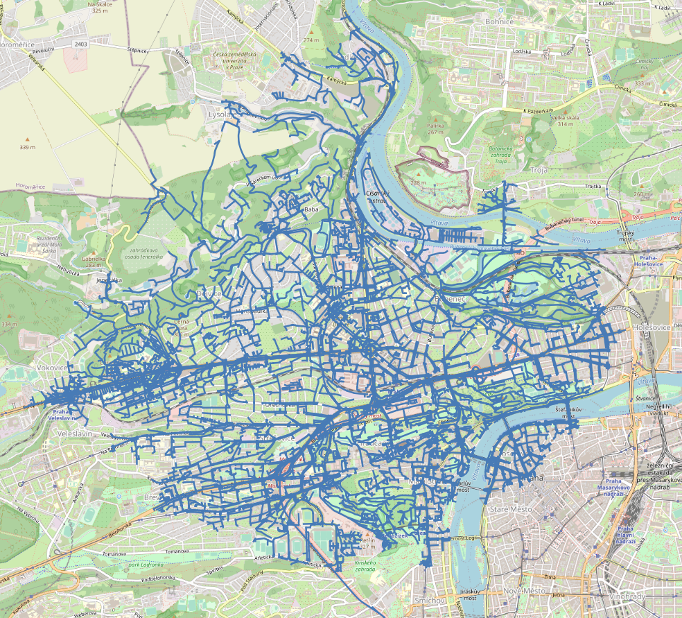

Síťové analýzy
==============

Síťové analýzy (tzv. routing) zajišťuje v prostředí PostGIS nadstavba
označovaná jako `pgRouting <http://pgrouting.org/>`__. Nadstavbu v
databázi aktivujeme příkazem:

.. code-block:: sql

   CREATE EXTENSION pgrouting;

Příprava dat
------------

Jako podkladová data použijeme data OpenStreetMap pro území Hlavního
města Prahy. Data stáhneme přes tzv. Overpass API. Území je dáno
minimálním ohraničujícím obdélníkem (bbox), který můžeme zjistit
např. ze stránek http://boundingbox.klokantech.com (formát CSV).

Příklad stažení dat:

.. code-block:: bash
                
   wget --progress=dot:mega -O praha.osm \
   "http://www.overpass-api.de/api/xapi?*[bbox=14.224435,49.941898,14.706787,50.177433][@meta]"

Data naimportujeme do databáze *gismentors*. Import dat zajišťuje
specializovaný nástroj :program:`osm2routing`, příklad volání:

.. code-block:: bash

   osm2pgrouting -f praha.osm --schema routing -d gismentors -U postgres

Po importu se ve výstupním schématu objeví následující tabulky:

.. code-block:: sql

   SELECT f_table_name,f_geometry_column,coord_dimension,srid,type
   FROM geometry_columns WHERE f_table_schema = 'routing';

::
   
      f_table_name    | f_geometry_column | coord_dimension | srid |    type    
   -------------------+-------------------+-----------------+------+------------
    osm_nodes         | the_geom          |               2 | 4326 | POINT
    ways_vertices_pgr | the_geom          |               2 | 4326 | POINT
    ways              | the_geom          |               2 | 4326 | LINESTRING

.. note:: Jak je vidět, tak jsou data transformována do
          :skoleni:`WGS-84 <open-source-gis/soursystemy/wgs84.html>`
          (:epsg:`4326`), geometrie je uložena ve sloupci
          :dbcolumn:`the_geom`. Pro zachování konzistence v databáze
          jej přejmenujeme na :dbcolumn:`geom`.

          .. code-block:: sql

             ALTER TABLE osm_nodes RENAME the_geom TO geom;
             ALTER TABLE ways_vertices_pgr RENAME the_geom TO geom;
             ALTER TABLE ways RENAME the_geom TO geom;

Nalezení optimální cesty
------------------------

Algoritmus nalezení optimální cesty je implementován v pgRouting ve
dvou variantách:

* `pgr_dijkstra
  <http://docs.pgrouting.org/latest/en/src/dijkstra/doc/pgr_dijkstra.html>`__,
  viz. :wikipedia-en:`Dijkstra's algorithm`
* `pgr_astar
  <http://docs.pgrouting.org/latest/en/src/astar/doc/pgr_astar.html#description>`__,
  viz :wikipedia-en:`A* search algorithm`

.. note:: V následujících příkladech se bude pohybovat v okolí Fakulty stavební
   ČVUT v Praze, kde školení GISMentors většinou probíhají:
   http://www.openstreetmap.org/#map=16/50.1029/14.3912

Příklad - chodec
^^^^^^^^^^^^^^^^

Nejkratší trasa (jeden chodec)
^^^^^^^^^^^^^^^^^^^^^^^^^^^^^^

Chodec se pohybuje z vlakového nádráží v Dejvicích k budově Fakulty
stavební ČVUT v Praze. Hledáme nejkratší trasu, nákladem tedy bude
*délka* segmentů trasy. Chodec se může pohybovat v obou směrech
(budeme pracovat s neorientovaným grafem).

Nastavíme si cestu ke schématům.

.. code-block:: sql
   
   SET search_path TO public,routing,ruian_praha;

Výchozí a cílový bod můžeme najít s využitím adresních míst
RÚIAN. Dojde k vyhledání všech OSM bodů do vzdálenosti 10 m od zadané
adresy.

.. code-block:: sql

   SELECT o.osm_id, o.id, a.gml_id FROM 
   ruian_praha.adresnimista a, 
   ruian_praha.ulice u, 
   routing.ways_vertices_pgr o 
   WHERE a.cislodomovni = 2077 AND a.cisloorientacni = 7 AND u.nazev = 'Thákurova' 
   AND a.ulicekod = u.kod 
   AND ST_DWithin(ST_Transform(o.geom, 5514), a.geom, 10);

::

      osm_id   |   id   |   gml_id
   ------------+--------+-------------
    4173356375 | 128574 | AD.22210156
 
.. code-block:: sql

   SELECT o.osm_id, o.id, a.gml_id FROM 
   ruian_praha.adresnimista a, 
   ruian_praha.ulice u, 
   routing.ways_vertices_pgr o 
   WHERE a.cislodomovni = 169 and a.cisloorientacni = 1 AND u.nazev = 'Václavkova' 
   AND a.ulicekod = u.kod 
   AND ST_DWithin(ST_Transform(o.geom, 5514), a.geom, 10);

::

      osm_id   |   id   |   gml_id
   ------------+--------+-------------
    4196659627 | 120249 | AD.22187006
    4196659626 | 137956 | AD.22187006

Nejkratší trasu nalezneme voláním funkce `pgr_dijkstra
<http://docs.pgrouting.org/latest/en/src/dijkstra/doc/pgr_dijkstra.html>`__. Dijkstrův
algoritmus vyžaduje definovat celkem čtyři atributy:

* `id` - identifikátor hrany
* source - identifikátor počátečního uzlu
* target - identifikátor koncového uzlu
* cost - atribut nákladů

.. code-block:: sql
                
   SELECT * FROM pgr_dijkstra('
    SELECT gid AS id,
    source,
    target,
    length AS cost
    FROM ways',
   120249, 128574, directed := false);

::

    seq | path_seq |  node  |  edge  |         cost         |       agg_cost
   -----+----------+--------+--------+----------------------+----------------------
      1 |        1 | 120249 | 110252 | 7.57929416242359e-05 |                    0
      2 |        2 |  35204 |  34307 | 0.000258500986459147 | 7.57929416242359e-05
      ...
     59 |       59 |  97513 | 142754 |   8.676018672102e-05 |   0.0149044747275315
     60 |       60 | 128574 |     -1 |                    0 |   0.0149912349142525

Náklady jsou počítány v mapových jednotkách souřadnicového systému, v
tomto případě stupních. Délku v metrech je uložena v atributu
:dbcolumn:`length_m`. Příklad výpočtu celkové délky nalezené trasy:

.. code-block:: sql
                          
   SELECT sum(cost) FROM (SELECT * FROM pgr_dijkstra('
    SELECT gid AS id,
    source,
    target,
    length_m AS cost
    FROM ways',
   120249, 128574, directed := false)) AS foo;

::
             
   sum        
   ------------------
   1270.47520134678

Geometrii trasy získáte spojením výsledku hledání optimální trasy s
původní tabulkou:

.. code-block:: sql
                         
   SELECT a.*, ST_AsText(b.geom) FROM pgr_dijkstra('
    SELECT gid AS id,
    source,
    target,
    length_m AS cost
    FROM ways',
    120249, 128574, directed := false) AS a
   LEFT JOIN ways AS b
   ON (a.edge = b.gid) ORDER BY seq;

.. figure:: ../images/route-single.png
   
   Vizualizace nalezené nejkratší trasy.

.. note:: Pro hledání optimální trasy lze použít funkci `pgr_astar
  <http://docs.pgrouting.org/latest/en/src/astar/doc/pgr_astar.html#description>`__,
  která pracuje s geografickou informací uzlů hran grafu. To umožňuje
  ve výpočtu preferovat hrany, které jsou blíže cíle trasy.

  .. code-block:: sql

     SELECT * FROM pgr_astar('
      SELECT gid AS id,
      source,
      target,
      length AS cost,
      x1, y1, x2, y2
      FROM ways',
     120249, 128574 directed := false);

Nejkratší trasa (více chodců, jeden cíl)
^^^^^^^^^^^^^^^^^^^^^^^^^^^^^^^^^^^^^^^^

Chodci se pohybují ze stanice metra Hradčanská, vlakového nádraží
Dejvice k budově Fakulty stavební ČVUT v Praze.

.. code-block:: sql

   SELECT o.osm_id, o.id, a.gml_id FROM 
   ruian_praha.adresnimista a, 
   ruian_praha.ulice u, 
   routing.ways_vertices_pgr o 
   WHERE a.cislodomovni = 2558 AND a.cisloorientacni = 17 AND u.nazev = 'K Brusce' 
   AND a.ulicekod = u.kod 
   AND ST_DWithin(ST_Transform(o.geom, 5514), a.geom, 10);

::

      osm_id   |   id   |   gml_id
   ------------+--------+-------------
     889215289 |  42531 | AD.22719881

.. code-block:: sql
                
   SELECT * FROM pgr_dijkstra('
    SELECT gid AS id,
    source,
    target,
    length AS cost
    FROM ways',
   ARRAY[42531, 120249], 128574, directed := false);

.. figure:: ../images/route-multi.png

   Vizualizace nalezených nejkratších cest.

Nejrychlejší trasa (více chodců a cílů)
^^^^^^^^^^^^^^^^^^^^^^^^^^^^^^^^^^^^^^^

Chodci vycházejí od budovy Fakulty stavební ČVUT v Praze a ze stanice
Hradčanská. Cílem jsou vlakové nádraží Dejvice a tramvajová zastávka
Hradčanské náměstí. Rychlost pohybu chodců uvažujeme 1,2 m/s.

.. code-block:: sql

   SELECT o.osm_id, o.id, a.gml_id FROM 
   ruian_praha.adresnimista a, 
   ruian_praha.ulice u, 
   routing.ways_vertices_pgr o 
   WHERE a.cislodomovni = 37 AND a.cisloorientacni = 23 AND u.nazev = 'Malostranské náměstí' 
   AND a.ulicekod = u.kod 
   AND ST_DWithin(ST_Transform(o.geom, 5514), a.geom, 10);

::

      osm_id   |   id   |   gml_id
   ------------+--------+-------------
    4763711106 | 22516  | AD.21694419
     340112849 | 32791  | AD.21694419
   

.. code-block:: sql
                
   SELECT * FROM pgr_dijkstra('
    SELECT gid AS id,
    source,
    target,
    length_m / 1.2 / 60 AS cost
    FROM ways',
   ARRAY[128574, 42531], ARRAY[120249, 22516], directed := false);

Časovou náročnost tras získáme následujícím příkazem (náklady v
minutách):

   .. code-block:: sql

      SELECT start_vid, end_vid, agg_cost FROM pgr_dijkstra('
       SELECT gid AS id,
       source,
       target,
       length_m / 1.2 / 60 AS cost
       FROM ways',
      ARRAY[128574, 42531], ARRAY[120249, 22516], directed := false)
      WHERE edge=-1 ORDER BY agg_cost;

   ::

       start_vid | end_vid |     agg_cost     
      -----------+---------+------------------
           42531 |  120249 | 5.02036761819399
          128574 |  120249 | 17.6454889075942
           42531 |   22516 | 22.9976299203542
          128574 |   22516 | 36.7067900923121

.. tip:: Agregované náklady vrací přímo funkce `pgr_dijkstraCost
   <http://docs.pgrouting.org/latest/en/src/dijkstra/doc/pgr_dijkstraCost.html>`__,
   příklad:

   .. code-block:: sql

      SELECT * FROM pgr_dijkstraCost('
       SELECT gid AS id,
       source,
       target,
       length_m / 1.2 / 60 AS cost
       FROM ways',
      ARRAY[128574, 42531], ARRAY[120249, 22516], directed := false)
      ORDER BY agg_cost;

Příklad - automobil
^^^^^^^^^^^^^^^^^^^

Na rozdíl od chodce uvažujeme náklady ve směru (:dbcolumn:`cost`) a
proti směru (:dbcolumn:`reverse_cost`) hrany. V případě obousměrných
komunikací jsou oba náklady kladné, přičemž se ale mohou lišit. U
jednosměrných komunikací jeden z nákladů nabývá záporné hodnoty.

V našem případě se bude vozidlo pohybovat z Letiště Václava Havla k
historické budově Hlavní nádraží.

.. code-block:: sql

   SELECT o.osm_id, o.id, a.gml_id FROM 
   ruian_praha.adresnimista a, 
   ruian_praha.ulice u, 
   routing.ways_vertices_pgr o 
   WHERE a.cislodomovni = 1039 AND a.cisloorientacni = 6 AND u.nazev = 'Aviatická' 
   AND a.ulicekod = u.kod 
   AND ST_DWithin(ST_Transform(o.geom, 5514), a.geom, 30);

::

      osm_id   |   id   |   gml_id
   ------------+--------+-------------
    1207486584 | 23491 | AD.22738142

.. code-block:: sql

   SELECT o.osm_id, o.id, a.gml_id FROM 
   ruian_praha.adresnimista a, 
   ruian_praha.ulice u, 
   routing.ways_vertices_pgr o 
   WHERE a.cislodomovni = 300 AND a.cisloorientacni = 8 AND u.nazev = 'Wilsonova' 
   AND a.ulicekod = u.kod 
   AND ST_DWithin(ST_Transform(o.geom, 5514), a.geom, 10);

::

      osm_id   |   id   |   gml_id
   ------------+--------+-------------
    4303448349 |  95535 | AD.21742367
    4303448365 | 100649 | AD.21742367
    4303448546 | 102169 | AD.21742367
    4303448356 | 107212 | AD.21742367
    4303448466 | 118339 | AD.21742367
    4303448747 | 143944 | AD.21742367

Nejkratší trasa
^^^^^^^^^^^^^^^

.. code-block:: sql

   SELECT a.*, b.geom AS geom FROM pgr_dijkstra('
    SELECT gid AS id,
    source,
    target,
    CASE WHEN cost > 0 THEN length_m ELSE -1 END AS cost,
    CASE WHEN reverse_cost > 0 THEN length_m ELSE -1 END AS reverse_cost
    FROM ways',
   (SELECT id FROM ways_vertices_pgr WHERE osm_id = 1207486584),
   (SELECT id FROM ways_vertices_pgr WHERE osm_id = 4303448349),
   directed := true) AS a
   LEFT JOIN ways AS b
   ON (a.edge = b.gid) ORDER BY seq;

Nejrychlejší trasa
^^^^^^^^^^^^^^^^^^

Před samotným výpočtem pro jednotlivé typy komunikací nastavíme
odpovídající maximální dovolené rychlosti. Na základě toho budou poté
určeny náklady pohybu v časových jednotkách. Náklady v atributu
:dbcolumn:`cost_s` jsou uvedeny v sekundách.

Příklad úpravy časových nákladu podle typu komunikace:

.. code-block:: sql

   ALTER TABLE osm_way_classes ADD COLUMN penalty FLOAT;
   UPDATE osm_way_classes SET penalty=100;
   UPDATE osm_way_classes SET penalty=0.8 WHERE name IN ('secondary', 'secondary_link',
                                                         'tertiary', 'tertiary_link');
   UPDATE osm_way_classes SET penalty=0.6 WHERE name IN ('primary','primary_link');
   UPDATE osm_way_classes SET penalty=0.4 WHERE name IN ('trunk','trunk_link');
   UPDATE osm_way_classes SET penalty=0.3 WHERE name IN ('motorway','motorway_junction','motorway_link');

.. todo:: Přepsat, aby se blížilo realitě.
             
.. code-block:: sql
                
   SELECT a.*, b.geom AS geom FROM pgr_dijkstra('
    SELECT gid AS id,
    source,
    target,
    cost_s * penalty AS cost,
    reverse_cost_s * penalty AS reverse_cost
    FROM ways JOIN osm_way_classes
    USING (class_id)',
   (SELECT id FROM ways_vertices_pgr WHERE osm_id = 1207486584),
   (SELECT id FROM ways_vertices_pgr WHERE osm_id = 4303448349),
   directed := true) AS a
   LEFT JOIN ways AS b
   ON (a.edge = b.gid) ORDER BY seq;

.. tip:: Po zavedení penalizace bude nejkratší trasa pro automobil
   věrohodnější:

   .. todo:: penalizace
                   
   .. code-block:: sql
                   
      SELECT a.*, b.geom AS geom FROM pgr_dijkstra('
       SELECT gid AS id,
       source,
       target,
       CASE WHEN cost > 0 THEN length_m ELSE -1 END AS cost,
       CASE WHEN reverse_cost > 0 THEN length_m ELSE -1 END AS reverse_cost
       FROM ways JOIN osm_way_classes
       USING (class_id)',
      (SELECT id FROM ways_vertices_pgr WHERE osm_id = 1207486584),
      (SELECT id FROM ways_vertices_pgr WHERE osm_id = 4303448349),
      directed := true) AS a
      LEFT JOIN ways AS b
      ON (a.edge = b.gid) ORDER BY seq;

.. figure:: ../images/route-auto.png

   Porovnání nejkratší (červeně) a nejrychlejší (modře) trasy z
   Letiště Václava Havla na Hlavní nádraží.

Servisní síť
------------

Častou operací v síťových analýzách je výpočet servisní sítě. Zajímá
nás, kam je možné se v rámci sítě dostat do určitého času. V našem
případě nastavíme 300 sekund.

Upravíme penalizaci pro průchod, aby se více blížil realitě. Budeme
uvažovat, že můžeme jet kdekoli jen o něco málo pomaleji než po
hlavních silnicích a zásadně zvýhodníme jen dálnice.

.. code-block:: sql

   UPDATE osm_way_classes SET penalty=1.2;
   UPDATE osm_way_classes SET penalty=1.0 WHERE name IN ('secondary', 'secondary_link',
                                                         'tertiary', 'tertiary_link');
   UPDATE osm_way_classes SET penalty=1.0 WHERE name IN ('primary','primary_link');
   UPDATE osm_way_classes SET penalty=1.0 WHERE name IN ('trunk','trunk_link');
   UPDATE osm_way_classes SET penalty=0.8 WHERE name IN ('motorway','motorway_junction','motorway_link'); 

.. code-block:: sql
                
   SELECT a.*, b.geom AS geom FROM pgr_drivingDistance('
    SELECT gid AS id,
    source,
    target,
    cost_s * penalty AS cost,
    reverse_cost_s * penalty AS reverse_cost
    FROM ways JOIN osm_way_classes
    USING (class_id)',
   (SELECT id FROM ways_vertices_pgr WHERE osm_id = 250862),
   300,
   directed := true) AS a
   LEFT JOIN ways AS b
   ON (a.edge = b.gid) ORDER BY seq;

      

   Servisní síť z vybraného místa.

.. note:: Algoritmus má limity, které jsme zatím podrobně netestovali,
   přesto pro určení přibližného servisního území (sítě) může posloužit.

Cesta obchodního cestujícího
----------------------------

Vyjíždíme z Dejvic (id: 12333). Chceme se cestou zastavit na
výstavišti v Holešovicích (id: 7436), v Europarku (id: 144884) a na
Andělu (id: 116748) a pak dojet zpátky do Dejvic. Algoritimus
naplánuje cestu tak, abychom navštívili každé místo pouze jednou a
urazili cestu s nejmenšími náklady.

.. todo:: Přepsat ID na adresní body.
          
Využití vzdálenosti po síti
^^^^^^^^^^^^^^^^^^^^^^^^^^^

Navržená cesta je přes zastávky Anděl, Europark, Holešovice.

.. code-block:: sql

   SELECT * FROM pgr_TSP(
       $$
       SELECT * FROM pgr_dijkstraCostMatrix(
           'SELECT gid as id, source, target, cost, reverse_cost FROM ways',
           (SELECT array_agg(id) FROM ways_vertices_pgr WHERE id IN (12333, 7436, 144884, 116748)),
           directed := false
       )
       $$,
       start_id := 12333,
       randomize := false
   );

::

    seq |  node  |        cost        |      agg_cost      
   -----+--------+--------------------+--------------------
      1 |  12333 | 0.0484455749225172 |                  0
      2 | 116748 |  0.148717683986367 | 0.0484455749225172
      3 | 144884 |  0.133988564693275 |  0.197163258908885
      4 |   7436 | 0.0443240851172554 |   0.33115182360216
      5 |  12333 |                  0 |  0.375475908719415

Využití euklidovské vzdálenosti
^^^^^^^^^^^^^^^^^^^^^^^^^^^^^^^

K dispozici je také výpočet cesty obchodního cestujícího, která
využívá pouze euklidovský prostor. Tento výpočet je sice méně přesný,
ale měl by být o dost rychlejší, zejména v případě většího počtu míst.
Rychlost jsme netestovali.

Navržená cesta je přes Anděla, Holešovice a Europark. Tedy jinak než
v případě předchozího algoritmu.

.. code-block:: sql

   SELECT * FROM pgr_eucledianTSP('SELECT *
   FROM (
     SELECT DISTINCT id AS source_id,
                       ST_X(geom) AS x,
                       ST_Y(geom) AS y FROM ways_vertices_pgr
             WHERE id IN (12333, 7436, 144884, 116748)
   ) t
   ORDER BY
   CASE source_id
     WHEN 12333 THEN 1 
     WHEN 7436 THEN 2
     WHEN 144884 THEN 3
     WHEN 116748 THEN 4  
    END');

::

     seq | node |         cost          |      agg_cost      
    -----+------+-----------------------+--------------------
       1 |    1 |    0.0382006302085469 |                  0
       2 |    4 |    0.0462512161967639 | 0.0382006302085469
       3 |    2 |     0.117270931512459 | 0.0844518464053108
       4 |    3 | 4.64686056594346e-310 |   0.20172277791777
       5 |    1 |                     0 |   0.20172277791777

Vytvoření sítě
--------------

Ne vždy je možné pracovat se sítí postavenou nad daty OSM. 
Pokud máme vlastní síť, můžeme se pokusit vybudovat graf nad ní.

Příprava dat
^^^^^^^^^^^^

Pokud nemáme data připravena pro síťové analýzy, např. nám chybí uzly
v místech křížení silnic, pak je nutné před vlastním vybudováním grafu
realizovat úpravu dat.

K dispozici je funce `pgr_nodeNetwork
<http://docs.pgrouting.org/2.0/en/src/common/doc/functions/node_network.html>`__,
která dokáže doplnit uzly v místech křížení, případně dotáhnout linie
k jiným liniím, v případě nedotahů.

V případě, že funkce selže, jako v následujícím ukázce nad ulicemi
Prahy, můžeme zkusit alternativní postup popsaný dále.

.. code-block:: sql

   SELECT pgr_nodeNetwork('ruian_praha.ulice', 1, 'ogc_fid', 'geom');
   
::
  
   ERROR:  line_locate_point: 1st arg isn't a line
   CONTEXT:  SQL statement "create temp table inter_loc on commit drop as ( select * from (
        (select l1id, l2id, st_linelocatepoint(line,source) as locus from intergeom)
         union
        (select l1id, l2id, st_linelocatepoint(line,target) as locus from intergeom)) as foo
        where locus<>0 and locus<>1)"
   PL/pgSQL function pgr_nodenetwork(text,double precision,text,text,text,text,boolean) line 191 at EXECUTE   
   
Alternativní způsob využívá běžných nástrojů PostGIS a snahu o
vytvoření multilinie agregací z existující kolekce linií.

.. code-block:: sql

 CREATE TABLE ruian_praha.ulice_noded AS
 SELECT d.path[1], geom FROM (
   SELECT ST_UNION(geom) g FROM ruian_praha.ulice
 ) dta
 , ST_Dump(g) d;

Vytvoření grafu
^^^^^^^^^^^^^^^

Před vytvořením grafu, který realizuje funkce `pgr_createTopology
<http://docs.pgrouting.org/2.2/en/src/topology/doc/pgr_createTopology.html>`__,
je nutné přidat sloupce :dbcolumn:`source` a :dbcolumn:`target`, kam jsou zapsány
identifikátory uzlů.

Vhodné je také vytvořit primární klíč a indexovat geometrii.

.. code-block:: sql

 ALTER TABLE ruian_praha.ulice_noded ADD PRIMARY KEY (path);
 CREATE INDEX ON ruian_praha.ulice_noded USING gist(geom);
 ALTER TABLE ruian_praha.ulice_noded ADD COLUMN "source" integer;
 ALTER TABLE ruian_praha.ulice_noded ADD COLUMN "target" integer;

Graf se vytvoří pomocí funkce ``pgr_createTopology``, kde se zadají
názvy sloupců s geometrií, id a sloupce pro zápis id nodů
(:dbcolumn:`source`, :dbcolumn:`target`). Hodnota 1 ve funkci
představuje toleranci pro tvorbu grafu.
 
.. code-block:: sql

 SELECT pgr_createTopology('ruian_praha.ulice_noded', 1, 'geom', 'path', 'source', 'target');

Na závěr je vhodné ohodnotit graf pomocí např. délky úseků.

.. code-block:: sql

 ALTER TABLE ruian_praha.ulice_noded ADD COLUMN length FLOAT;
 UPDATE ruian_praha.ulice_noded SET length = ST_Length(geom);
   
Další materiály
---------------

* http://workshop.pgrouting.org
