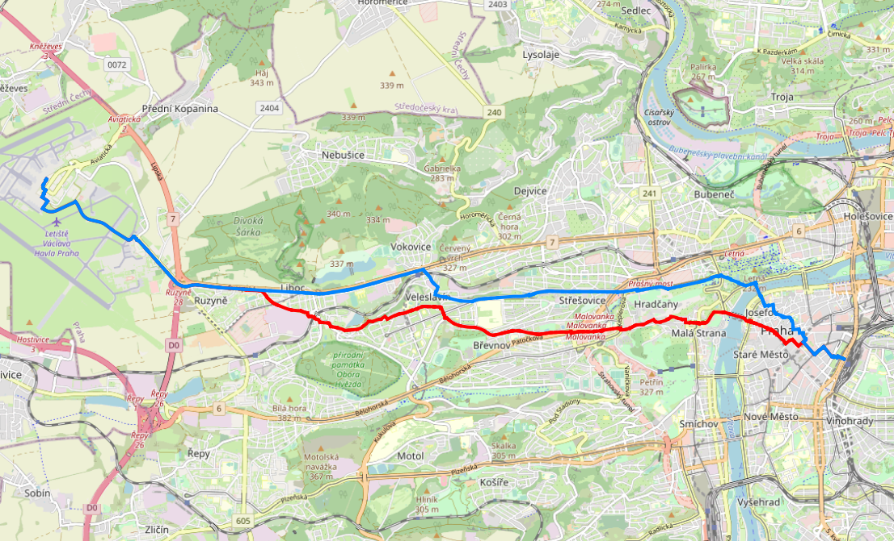

Síťové analýzy
==============

Síťové analýzy (tzv. routing) zajišťuje v prostředí PostGIS nadstavba
označovaná jako `pgRouting <http://pgrouting.org/>`__. Nadstavba se v
databázi aktivuje příkazem:

.. code-block:: sql

   CREATE EXTENSION pgrouting;

Příprava dat
------------

Jako podkladová data použijeme data OpenStreetMap pro území Hlavního
města Praha. Tato data stáhneme přes tzv. Overpass API. Území je dáno
minimálním ohraničujícím obdélníkem (bbox), který můžeme zjistit
např. ze stránek http://boundingbox.klokantech.com (formát CSV).

Příklad stažení dat:

.. code-block:: bash
                
   wget --progress=dot:mega -O praha.osm \
   "http://www.overpass-api.de/api/xapi?*[bbox=14.224435,49.941898,14.706787,50.177433][@meta]"

Data naimportujeme do databáze *gismentors*. Import dat zajišťuje
specializovaný nástroj :program:`osm2routing`, příklad volání:

.. code-block:: bash

   osm2pgrouting -f praha.osm --schema routing -d gismentors -U postgres

Po importu se ve výstupním schématu objeví následující tabulky:

.. code-block:: sql

   SELECT f_table_name,f_geometry_column,coord_dimension,srid,type
   FROM geometry_columns WHERE f_table_schema = 'routing';

::
   
      f_table_name    | f_geometry_column | coord_dimension | srid |    type    
   -------------------+-------------------+-----------------+------+------------
    osm_nodes         | the_geom          |               2 | 4326 | POINT
    ways_vertices_pgr | the_geom          |               2 | 4326 | POINT
    ways              | the_geom          |               2 | 4326 | LINESTRING

.. note:: Jak je vidět tak jsou data transformována do WGS-84
          (:epsg:`4326`), geometrie je uložena ve sloupci
          :dbcolumn:`the_geom`. Pro zachování konzistence v databáze
          jej přejmenujeme na :dbcolumn:`geom`.

          .. code-block:: sql

             ALTER TABLE osm_nodes RENAME the_geom TO geom;
             ALTER TABLE ways_vertices_pgr RENAME the_geom TO geom;
             ALTER TABLE ways RENAME the_geom TO geom;

Nalezení optimální cesty
------------------------

Algoritmus nalezení optimální cesty je implementován v pgRouting ve
třech variantách:

* `pgr_dijkstra
  <http://docs.pgrouting.org/latest/en/src/dijkstra/doc/pgr_dijkstra.html>`__,
  viz. :wikipedia-en:`Dijkstra's algorithm`
* `pgr_astar
  <http://docs.pgrouting.org/latest/en/src/astar/doc/pgr_astar.html#description>`__,
  viz :wikipedia-en:`A* search algorithm`

V následujících příkladech se bude pohybovat v okolí Fakulty stavební
ČVUT v Praze, kde školení GISMentors většinou probíhají:
http://www.openstreetmap.org/#map=16/50.1029/14.3912

Příklad - chodec
^^^^^^^^^^^^^^^^

Nejkratší trasa (jeden chodec)
~~~~~~~~~~~~~~~~~~~~~~~~~~~~~~

Chodec se pohybuje ze stanice metra Dejvická (``osm_id: 2911015007``) k
budově Fakulty stavební ČVUT v Praze (``osm_id: 2905257304``). Hledáme
nejkratší trasu, nákladem tedy bude *délka* segmentů trasy. Chodec se
může pohybovat ve všech směrech (budeme pracovat s neorientovaným
grafem).

Zjistíme ID uzlů v rámci grafu:

.. code-block:: sql

   SELECT osm_id, id FROM ways_vertices_pgr
   WHERE osm_id IN (2911015007, 2905257304);

::

      osm_id   |  id   
   ------------+-------
    2911015007 |  1594
    2905257304 | 10824

Nejkratší trasu nalezneme voláním funkce `pgr_dijkstra
<http://docs.pgrouting.org/latest/en/src/dijkstra/doc/pgr_dijkstra.html>`__. Dijkstrův
algoritmus vyžaduje definovat celkem čtyři atributy:

* `id` - identifikátor hrany
* source - identifikátor počátečního uzlu
* target - identifikátor koncového uzlu
* cost - atribut nákladů

.. code-block:: sql
                
   SELECT * FROM pgr_dijkstra('
    SELECT gid AS id,
    source,
    target,
    length AS cost
    FROM ways',
   1594, 10824, directed := false);

::

     seq | path_seq |  node  |  edge  |         cost         |       agg_cost       
    -----+----------+--------+--------+----------------------+----------------------
       1 |        1 |  1594 | 137005 |  9.9040395796202e-06 |                    0
       2 |        2 | 88646 |  71297 | 0.000129719697808577 | 9.90403957962019e-06
    ...
      24 |       24 |  1164 |  31277 |  6.8521529463256e-05 |  0.00684939507573181
      25 |       25 | 10824 |     -1 |                    0 |  0.00691791660519507

Náklady jsou počítány v mapových jednotkách souřadnicového
systému, v tomto případě stupních. Délku v metrech získáme
pomocí atributu :dbcolumn:`length_m`. Příklad výpočtu
celkové délky nalezené trasy:

.. code-block:: sql
                          
   SELECT sum(cost) FROM (SELECT * FROM pgr_dijkstra('
    SELECT gid AS id,
    source,
    target,
    length_m AS cost
    FROM ways',
   1594, 10824, directed := false)) AS foo;

::
             
   sum        
   ------------------
   578.522948228576

Geometrie trasy získáte spojením výsledku hledání optimální trasy s
původní tabulkou:

.. code-block:: sql
                         
   SELECT a.*, ST_AsText(b.geom) FROM pgr_dijkstra('
    SELECT gid AS id,
    source,
    target,
    length_m AS cost
    FROM ways',
    1594, 10824, directed := false) AS a
   LEFT JOIN ways AS b
   ON (a.edge = b.gid) ORDER BY seq;

.. figure:: ../images/route-single.png
   :class: small
   
   Vizualizace nalezené nejkratší trasy.

.. note:: Pro hledání optimální trasy lze použít funkci `pgr_astar
  <http://docs.pgrouting.org/latest/en/src/astar/doc/pgr_astar.html#description>`__,
  která pracuje s geografickou informací uzlů hran grafu. To umožňuje
   ve výpočtu preferovat hrany, které jsou blíže cíle trasy.

  .. code-block:: sql

     SELECT * FROM pgr_astar('
      SELECT gid AS id,
      source,
      target,
      length AS cost,
      x1, y1, x2, y2
      FROM ways',
     1594, 10824, directed := false);

   
Nejkratší trasa (více chodců, jeden cíl)
~~~~~~~~~~~~~~~~~~~~~~~~~~~~~~~~~~~~~~~~

Chodci se pohybují ze stanice metra Dejvická (``osm_id: 2911015007``),
Hradčanská (``osm_id: 1990839852``) a nádraží Dejvice (``osm_id:
4196659626``) k budově Fakulty stavební ČVUT v Praze (``osm_id:
2905257304``).

.. code-block:: sql

   SELECT osm_id, id FROM ways_vertices_pgr
   WHERE osm_id IN (2911015007, 1990839852, 4196659626, 2905257304);

::

      osm_id   |  id   
   ------------+-------
    2911015007 |   1594
    1990839852 |  99683
    4196659626 | 141866
    2905257304 |  10824

.. code-block:: sql
                
   SELECT * FROM pgr_dijkstra('
    SELECT gid AS id,
    source,
    target,
    length AS cost
    FROM ways',
   ARRAY[1594, 99683, 141866], 10824, directed := false);

.. figure:: ../images/route-multi.png

   Vizualizace nalezených nejkratších cest (cíl je znázorněn zelenou barvou).

Nejrychlejší trasa (více chodců a cílů)
~~~~~~~~~~~~~~~~~~~~~~~~~~~~~~~~~~~~~~~

Chodci vycházejí od budovy Fakulty stavební ČVUT v Praze (``osm_id:
2905257304``) a ze stanice Hradčanská (``osm_id: 1990839852``). Cílem
jsou nádraží Dejvice (``osm_id: 4196659626``) a tramvajová zastávka
Hradčanské náměstí (``osm_id: 2825726603``). Rychlost pohybu chodců
uvažujeme 1,2 m/s.

.. code-block:: sql

   SELECT osm_id, id FROM ways_vertices_pgr
   WHERE osm_id IN (2905257304, 4196659626, 1990839852, 2825726603);

::

      osm_id   |  id   
   ------------+-------
    2905257304 |  10824
    4196659626 | 141866
    1990839852 |  99683
    2825726603 | 109998

.. code-block:: sql
                
   SELECT * FROM pgr_dijkstra('
    SELECT gid AS id,
    source,
    target,
    length_m / 1.2 / 60 AS cost
    FROM ways',
   ARRAY[10824, 99683], ARRAY[141866, 109998], directed := false);

Časovou náročnost tras získáme následujícím příkazem (náklady v
minutách):

   .. code-block:: sql

      SELECT start_vid, end_vid, agg_cost FROM pgr_dijkstra('
       SELECT gid AS id,
       source,
       target,
       length_m / 1.2 / 60 AS cost
       FROM ways',
      ARRAY[10824, 99683], ARRAY[141866, 109998], directed := false)
      WHERE edge=-1 ORDER BY agg_cost;

   ::

       start_vid | end_vid |     agg_cost     
      -----------+---------+------------------
           99683 |  141866 | 4.92821083982696
           10824 |  141866 |  17.095297862879
           99683 |  109998 | 22.9298945807643
           10824 |  109998 | 35.6259236702052

.. tip:: Agregované náklady vrací přímo funkce `pgr_dijkstraCost
   <http://docs.pgrouting.org/latest/en/src/dijkstra/doc/pgr_dijkstraCost.html>`__,
   příklad:

   .. code-block:: sql

      SELECT * FROM pgr_dijkstraCost('
       SELECT gid AS id,
       source,
       target,
       length_m / 1.2 / 60 AS cost
       FROM ways',
      ARRAY[10824, 99683], ARRAY[141866, 109998], directed := false)
      ORDER BY agg_cost;

Příklad - automobil
^^^^^^^^^^^^^^^^^^^

Na rozdíl od chodce uvažujeme náklady ve směru (:dbcolumn:`cost`) a
proti směru (:dbcolumn:`reverse_cost`) hrany. V případě obousměrných
komunikací jsou oba náklady kladné, přičemž se mohou lišit. U
jednosměrných komunikací jeden z nákladů nabývá záporné hodnoty.

V našem případě se bude vozidlo pohybovat z Letiště Václava Havla
(Terminál 2, ``osm_id: 2088346069``) k historické budově Hlavní
nádraží (``osm_id: 2800419931``).

Nejkratší trasa
~~~~~~~~~~~~~~~

.. code-block:: sql

   SELECT a.*, b.geom AS geom FROM pgr_dijkstra('
    SELECT gid AS id,
    source,
    target,
    CASE WHEN cost > 0 THEN length_m ELSE -1 END AS cost,
    CASE WHEN reverse_cost > 0 THEN length_m ELSE -1 END AS reverse_cost
    FROM ways',
   (SELECT id FROM ways_vertices_pgr WHERE osm_id = 2088346069),
   (SELECT id FROM ways_vertices_pgr WHERE osm_id = 2800419931),
   directed := true) AS a
   LEFT JOIN ways AS b
   ON (a.edge = b.gid) ORDER BY seq;

Nejrychlejší trasa
~~~~~~~~~~~~~~~~~~

Před samotných výpočtem pro jednotlivé typy komunikací nastavíme
odpovídající maximální dovolené rychlosti. Na základě toho bude poté
určeny náklady pohybu v časových jednotkách. Náklady v atribut
:dbcolumn:`cost_s` jsou uvedeny v sekundách.

Příklad úpravy časových nákladu podle typu komunikace:

.. code-block:: sql

   ALTER TABLE osm_way_classes ADD COLUMN penalty FLOAT;
   UPDATE osm_way_classes SET penalty=100;
   UPDATE osm_way_classes SET penalty=0.8 WHERE name IN ('secondary', 'secondary_link',
                                                         'tertiary', 'tertiary_link');
   UPDATE osm_way_classes SET penalty=0.6 WHERE name IN ('primary','primary_link');
   UPDATE osm_way_classes SET penalty=0.4 WHERE name IN ('trunk','trunk_link');
   UPDATE osm_way_classes SET penalty=0.3 WHERE name IN ('motorway','motorway_junction','motorway_link');

.. code-block:: sql
                
   SELECT a.*, b.geom AS geom FROM pgr_dijkstra('
    SELECT gid AS id,
    source,
    target,
    cost_s * penalty AS cost,
    reverse_cost_s * penalty AS reverse_cost
    FROM ways JOIN osm_way_classes
    USING (class_id)',
   (SELECT id FROM ways_vertices_pgr WHERE osm_id = 2088346069),
   (SELECT id FROM ways_vertices_pgr WHERE osm_id = 2800419931),
   directed := true) AS a
   LEFT JOIN ways AS b
   ON (a.edge = b.gid) ORDER BY seq;

.. tip:: Po penalizaci bude nejkratší trasa pro automobil věrohodnější:

   .. code-block:: sql
                   
      SELECT a.*, b.geom AS geom FROM pgr_dijkstra('
       SELECT gid AS id,
       source,
       target,
       CASE WHEN cost > 0 THEN length_m * penalty ELSE -1 END AS cost,
       CASE WHEN reverse_cost > 0 THEN length_m * penalty ELSE -1 END AS reverse_cost
       FROM ways JOIN osm_way_classes
       USING (class_id)',
      (SELECT id FROM ways_vertices_pgr WHERE osm_id = 2088346069),
      (SELECT id FROM ways_vertices_pgr WHERE osm_id = 2800419931),
      directed := true) AS a
      LEFT JOIN ways AS b
      ON (a.edge = b.gid) ORDER BY seq;

   .. todo:: upravit
      

   Porovnání nejkratší (červeně) a nejrychlejší (modře) trasy z
   Letiště Václava Havla na Hlavní nádraží. Společná část trasy je
   znázorněn fialovou barvou.
   
Další materiály
---------------

* http://workshop.pgrouting.org
