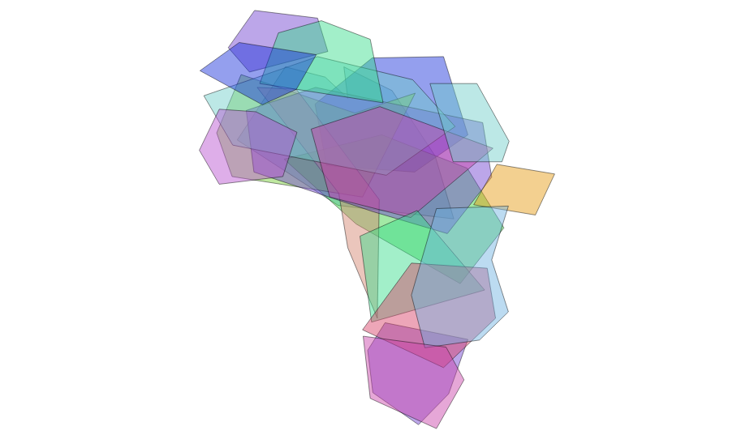

Extra buřty
===========

Lovkyně Míša jede do Afriky
---------------------------

*Světoznámá lovkyně Míša plánuje cestu do Afriky. Ráda by zastřelila 
slona, hrocha a opici. Poraďte jí, kam se má vypravit.*

Zde si předvedeme příklad s mnohonásobným průnikem jedné vrstvy. Jedná 
se o typickou ukázku příkladu, který se v PostGIS neřeší snadno. Jádro pudla je
v tom, že v PostGISu je každý záznam uložen odděleně, bez ohledu na polohu
zbytku vrstvy (viz. SFA), pakliže provádíme průnik, pracujeme s dvěma
geometrickými operandy.

V podstatě potřebujeme získat vrstvu s nejmenšími společnými jmenovateli a k ní
tabulku popisující vazby na původní prvky, nebo kategorie. Teoreticky toho lze
dosáhnout několika různými způsoby. Můžeme například cyklicky přidávat prvky po
jednom a provádět postupně průnik a rozdíl. 

Použít jde třeba rekurzivní common table expression, nebo anonymní blok 
kódu a smyčka, eventuelně funkce, ať již napsaná v plpgsql, nebo v jiném 
programovacím jazyce.

Řešení s CTE by mohlo vypadat například takto.

.. code-block:: sql

   --pouziju id_0, v id je mezera

   CREATE TABLE prunik_a AS
   WITH RECURSIVE cte AS (
      SELECT id_0, (ST_Dump(geom)).geom--, array[id_0] r_id
      FROM zver
      WHERE id_0 = 1
      --prunik
      UNION ALL
      SELECT a.id_0
      , (ST_Dump(
            ST_CollectionExtract(
               ST_Collect(
                  ST_Intersection(a.geom, b.geom)
                  , ST_SymDifference(a.geom, b.geom)
            )
         ,3)
      )). geom
      --, r_id || a.id_0 r_id
      FROM zver a, cte b
      WHERE a.id_0 = b.id_0 + 1
      --jeste treba poresit, aby bralo jen nejvetsi z b
   )
   SELECT * FROM cte WHERE id_0 = 19;

To je ovšem pomalé, škaredé, neefktivní a navíc to nebude fungovat, 
rekurze v CTE má své limity. Ale ve smyčce v plpgsql by to fungovat mohlo, 
nebo v trigeru...

Podíváme se tedy na problém uplně z druhé strany. Potřebujeme vlastně vytvořit
topologickou vrstvu, prvky uložené v SFA o sobě však navzájem neví. Co se ale
dodržuje je OGC validita, tedy topologická správnost jednotlivých prvků. Pokud
sloučíme plochy, rozpustí se nám hranice a plochy se slijí. Proto nejdříve
pomocí funkce :pgiscmd:`ST_ExteriorRing` získáme vnější hranice polygonů.

Zde narážíme na dva problémy. Za prvé, :pgiscmd:`ST_ExteriorRing` pracuje pouze
s polygony a za druhé, nezajímá nás jen vnější hranice, ale i hranice děr.
Musíme tedy rozpusti multipolygony pomocí funkce :pgiscmd:`ST_Dump` a převést
polygony s dírami na soubor plných polygonů pomocí funkce
:pgiscmd:`ST_DumpRings`.

Celý dotaz pak může vypadat následovně.

.. code-block:: sql

   SELECT ST_ExteriorRing(
      (ST_DumpRings((ST_Dump(geom)).geom)).geom
   ) geom
   FROM zver;

.. figure:: ../images/zvirata_v_africe_02.png
   :class: big

Linie zunionujeme a následně rozpustíme. Použijeme common table expression.

.. code-block:: sql

   WITH bound AS (
   SELECT ST_ExteriorRing((ST_DumpRings((ST_Dump(geom)).geom)).geom) geom
   FROM zver
   )
   , uni AS (
   SELECT ST_Union(geom) geom FROM bound
   ) 
   SELECT (ST_Dump(geom)).geom FROM uni;

.. figure:: ../images/zvirata_v_africe_03.png
   :class: big

Výsledek můžeme zaplochovat.

.. code-block:: sql

   WITH bound AS (
   SELECT ST_ExteriorRing((ST_DumpRings((ST_Dump(geom)).geom)).geom) geom
   FROM zver
   )
   , uni AS (
   SELECT ST_Union(geom) geom FROM bound
   ) 
   , dump AS (
   SELECT ST_Dump(ST_Polygonize(geom)) dump FROM uni
   )
   SELECT (dump).path [1] id, (dump).geom from dump;

.. figure:: ../images/zvirata_v_africe_04.png
   :class: big

Teď už zbývá jen přiřadit k nově vytvořeným polygonům původní hodnoty.

.. code-block:: sql

   WITH bound AS (
   SELECT ST_ExteriorRing((ST_DumpRings((ST_Dump(geom)).geom)).geom) geom
   FROM zver
   )
   , uni AS (
   SELECT ST_Union(geom) geom FROM bound
   ) 
   , dump AS (
   SELECT ST_Dump(ST_Polygonize(geom)) dump FROM uni
   )
   , base_geom AS (
   SELECT (dump).path [1] id, (dump).geom from dump
   )
   SELECT 
   b.id, array_agg(z.zvire) zvirata FROM
   zver z,base_geom b
   WHERE ST_Contains(z.geom, ST_PointOnSurface(b.geom))
   GROUP BY b.id;

.. table::
   :class: border

   +-----+----------------------------------------------------+
   | id  |                      zvirata                       |
   +=====+====================================================+
   | 129 | {zebra,opice,velbloud}                             |
   +-----+----------------------------------------------------+
   | 106 | {slon,zebra,zirafa,velbloud}                       |
   +-----+----------------------------------------------------+
   | 120 | {hroch,opice}                                      |
   +-----+----------------------------------------------------+
   | 171 | {slon,hroch,opice,buvol}                           |
   +-----+----------------------------------------------------+
   |   8 | {opice,prasatko,slon,hyena}                        |
   +-----+----------------------------------------------------+
   | ...                                                      |  
   +-----+----------------------------------------------------+
   | 138 | {slon,lev,opice,velbloud}                          |
   +-----+----------------------------------------------------+
   |  80 | {slon,hroch,zebra,zirafa,opice,velbloud}           |
   +-----+----------------------------------------------------+
   |  16 | {buvol,prasatko,slon}                              |
   +-----+----------------------------------------------------+
   | 163 | {slon,hroch,opice}                                 |
   +-----+----------------------------------------------------+
   |   6 | {opice,prasatko,hyena}                             |
   +-----+----------------------------------------------------+
   | 102 | {slon,hroch,zebra,zirafa,opice}                    |
   +-----+----------------------------------------------------+
   |  71 | {slon,hroch,opice}                                 |
   +-----+----------------------------------------------------+
   |  29 | {zirafa,buvol,prasatko}                            |
   +-----+----------------------------------------------------+
   |   2 | {opice,hyena}                                      |
   +-----+----------------------------------------------------+
   | 159 | {plamenak,slon}                                    |
   +-----+----------------------------------------------------+
   |  72 | {slon,opice}                                       |
   +-----+----------------------------------------------------+
   |  41 | {buvol,lev}                                        |
   +-----+----------------------------------------------------+
   | 177 | {lev,opice,velbloud}                               |
   +-----+----------------------------------------------------+

A úplně nakonec můžeme vybrat požadovaná zvířata. 

.. code-block:: sql

   WITH bound AS (
   SELECT ST_ExteriorRing((ST_DumpRings((ST_Dump(geom)).geom)).geom) geom
   FROM zver
   )
   , uni AS (
   SELECT ST_Union(geom) geom FROM bound
   ) 
   , dump AS (
   SELECT ST_Dump(ST_Polygonize(geom)) dump FROM uni
   )
   , base_geom AS (
   SELECT (dump).path [1] id, (dump).geom from dump
   )
   , pary AS (
   SELECT 
   b.id, array_agg(z.zvire) zvirata FROM
   zver z,base_geom b
   WHERE ST_Contains(z.geom, ST_PointOnSurface(b.geom))
   GROUP BY b.id
   ) 
   SELECT 1 id, ST_Union(geom) geom FROM pary p
   JOIN base_geom b using(id)
   WHERE zvirata @> ARRAY ['slon', 'hroch', 'opice']::varchar[];

Zde je na místě poukázat na operátor `@>` typu pole.

.. figure:: ../images/zvirata_v_africe_05.png
   :class: big

Výpočetně efektivnější by samozřejmě bylo na začátku vyselektovat jen polygony vybraných zvířat.

.. code-block:: sql

   WITH z AS (
      SELECT * FROM zver WHERE zvire IN ('slon', 'hroch', 'opice')
   ) , bound AS (
   SELECT ST_ExteriorRing((ST_DumpRings((ST_Dump(geom)).geom)).geom) geom
   FROM z
   )
   , uni AS (
   SELECT ST_Union(geom) geom FROM bound
   ) 
   , dump AS (
   SELECT ST_Dump(ST_Polygonize(geom)) dump FROM uni
   )
   , base_geom AS (
   SELECT (dump).path [1] id, (dump).geom from dump
   )
   , pary AS (
   SELECT 
   b.id, array_agg(z.zvire) zvirata FROM
   zver z,base_geom b
   WHERE ST_Contains(z.geom, ST_PointOnSurface(b.geom))
   GROUP BY b.id
   ) 
   SELECT 1 id, ST_Union(geom) geom FROM pary p
   JOIN base_geom b using(id)
   WHERE zvirata @> ARRAY ['slon', 'hroch', 'opice']::varchar[];

Použité řešení je založeno na `blogu 
<http://boundlessgeo.com/2014/10/postgis-training-creating-overlays/>`_
Paula Ramseyho.

.. note:: U této metody je na první pohled patrný její limit. Do jednoho 
   prvku nemůžeme nacpat neomezeně velkou geometrii a i kdyby, práce s ní
   nebude efektivní, ale naopak výpočetně náročná. U tabulek s větším 
   množstvím záznamů nezbude než si vypomoct smyčkou, případně trigerem
   a postupným přidáváním prvků s tím, že se pro každý další prvek 
   provede výše uvedená metoda jen s jeho nejbližšími sousedy.

.. noteadvanced:: Tuto úlohu je možné řešit také pomocí topologie.

Hrátky s povodím Jizery
-----------------------

.. code-block:: sql

   BEGIN;

   CREATE SCHEMA jizera;

   SET SEARCH_PATH TO jizera, dibavod, public;

   CREATE TABLE povodi_jizery (
       gid SERIAL PRIMARY KEY,
       tok_id numeric UNIQUE,
       max_utokjn numeric,
       tokrec_id numeric,
       idvt numeric(10,0),
       naz_tok character varying(30),
       shape_len numeric,
       geom public.geometry(MultiLineString,5514),
       rad int
   );

   CREATE INDEX ON povodi_jizery USING gist (geom);

   INSERT INTO povodi_jizery 
   (tok_id, max_utokjn, tokrec_id, idvt, naz_tok, shape_len, geom, rad)
   WITH RECURSIVE povodi AS (
      SELECT tok_id
      , max_utokjn
      , tokrec_id
      , idvt
      , naz_tok
      , shape_len
      , geom
      , 1::int rad
      FROM vodni_toky
      WHERE tok_id = 110740000100 
      UNION ALL
      SELECT v.tok_id
      , v.max_utokjn
      , v.tokrec_id
      , v.idvt
      , v.naz_tok
      , v.shape_len
      , v.geom
      , rad + 1
      FROM vodni_toky v
      JOIN povodi
      ON povodi.tok_id = v.tokrec_id
      WHERE rad < 100000
   )

   SELECT * FROM povodi;

   COMMIT;

.. code-block:: sql

   SET SEARCH_PATH TO jizera, dibavod, public;

   CREATE TABLE jizera.jize (ogc_fid serial primary key, geom geometry(LINESTRING, 5514));

   INSERT INTO jizera.jize (geom)
   SELECT (ST_Dump(geom)).geom FROM
   (
      SELECT ST_Union(geom) geom FROM jizera.povodi_jizery
   ) uni
   ;

   BEGIN;

   CREATE INDEX ON jize USING gist(geom);

   ALTER TABLE jize ADD rad smallint, ADD parent int;

   UPDATE jize
   SET parent = 0, rad = 1 WHERE ogc_fid = 1733;

   DO $$
      DECLARE i int;
      BEGIN
         WHILE (SELECT count(*) FROM jize WHERE rad IS NULL) > 0
            LOOP
               UPDATE jize j
               SET rad = r.rad+1, parent = r.ogc_fid
               FROM jize r
               WHERE r.rad IS NOT NULL 
               AND j.rad IS NULL
               AND ST_Touches(j.geom, r.geom)
               ;

               RAISE NOTICE '%', count(*) FROM jize WHERE rad IS NULL;
               

            END LOOP;

      END
      $$;
      

   COMMIT;

Agregace podle touch
--------------------

Pseudokonflace
--------------

.. code-block:: sql

   SET SEARCH_PATH = :schema, public;

   CREATE OR REPLACE FUNCTION f_konflace_na_i(_manmade_surface geometry) 
   RETURNS geometry AS
   $ddd$
      DECLARE
      _manmade_surface_puv geometry;--(POLYGON, 2154);
      _msf geometry(POLYGON, 2154);
      _input geometry;
      _output geometry;
      _m_rings geometry(MULTILINESTRING, 2154);
      _i_rings geometry(MULTILINESTRING, 2154);
      _i_segments geometry(MULTILINESTRING, 2154);
      _triangles geometry;
      _doplnek geometry;
      BEGIN
         _msf := _manmade_surface;

         BEGIN
            _input := ST_Collect(wkb_geometry) FROM input 
            WHERE type = 'ilot'
            AND (wkb_geometry <#> _manmade_surface) <= 1.8;

            IF _input IS NULL THEN 
               --RAISE NOTICE '3';
               RETURN _manmade_surface;
            END IF;

            _manmade_surface_puv := ST_MakeValid(ST_Segmentize(_manmade_surface, 2.5));

            _manmade_surface := ST_CollectionExtract(ST_Difference(_manmade_surface_puv, ST_MakeValid(ST_Union(_input))),3);

            _m_rings := ST_Multi(ST_Union(geom)) FROM
            (
               SELECT
               ST_ExteriorRing((ST_DumpRings((ST_Dump(_manmade_surface)).geom)).geom) geom
            ) a;
            
            _i_rings := ST_Multi(ST_Union(geom)) FROM
            (
               SELECT
               ST_ExteriorRing((ST_DumpRings((ST_Dump(_input)).geom)).geom) geom
            ) a;

            _i_segments := ST_Multi(
               ST_CollectionExtract( 
                  ST_Intersection(_i_rings, ST_Buffer(_m_rings, 1.8, 'endcap=flat'))
               , 2)
            );

            IF _i_segments IS NULL OR ST_IsEmpty(_i_segments) THEN 
               --RAISE NOTICE '2';
               RETURN _manmade_surface_puv;
            END IF;

            WITH body AS
            (
               SELECT (ST_DumpPoints(_manmade_surface)).geom
               UNION ALL 
               SELECT (ST_DumpPoints(_input)).geom
            )
            , segmenty AS (
               SELECT (dump).geom, (dump).path
               FROM 
               (
                  SELECT ST_Dump(_i_segments) dump
               ) d
            )
            , triangles AS (
               SELECT 
               ST_DelaunayTriangles(ST_Collect(body.geom)) geom
               FROM segmenty, body
               WHERE ST_Intersects(ST_Buffer(segmenty.geom, 3) , body.geom)
               AND NOT ST_Within(body.geom, _input)
               AND NOT ST_Within(body.geom, _manmade_surface)
               GROUP BY path
            )
            SELECT ST_Collect(geom) INTO _triangles FROM triangles;

            _doplnek :=
            ST_Collect(geom)
            FROM 
            (
               SELECT (ST_Dump(ST_CollectionExtract(
                        --ST_Split(
                           _triangles
                           --, ST_ExteriorRing(_manmade_surface))
                        , 3))).geom
            ) triangles
            WHERE ST_Touches(geom, _m_rings) 
            AND ST_Touches(geom, _i_rings)
            AND ST_Relate(geom, ST_UnaryUnion(_input), 'F********')
            ;

            IF _doplnek IS NULL THEN 
               --RAISE NOTICE '1';
               RETURN _manmade_surface_puv;
            ELSIF ST_IsEmpty(_doplnek) THEN RETURN _manmade_surface_puv;
            ELSE
               --RAISE NOTICE '%', ST_AsText(_doplnek);
               _manmade_surface_puv :=
               ST_UnaryUnion(
                  ST_CollectionExtract(ST_Union(_manmade_surface_puv, ST_MakeValid(ST_UnaryUnion(_doplnek))), 3)
               );
               IF ST_GeometryType(_manmade_surface_puv) = 'ST_MultiPolygon'
                  THEN
                  _manmade_surface_puv := geom
                  FROM
                  (
                     SELECT (ST_Dump(_manmade_surface_puv)).geom
                  )g WHERE ST_Relate(_manmade_surface, geom, 'T********');
               END IF;
               RETURN _manmade_surface_puv;
            END IF;

         EXCEPTION WHEN others THEN
            RAISE NOTICE 'zuchlo'; 
            RETURN _msf;
         END;

      END
   $ddd$ LANGUAGE plpgsql;

   UPDATE manmade_surface
   SET geom = f_konflace_na_ilot(geom)
   WHERE EXISTS
   (SELECT 1 FROM input_prunik_s_grid p WHERE ST_Intersects(manmade_surface.geom,p.geom)  LIMIT 1);
