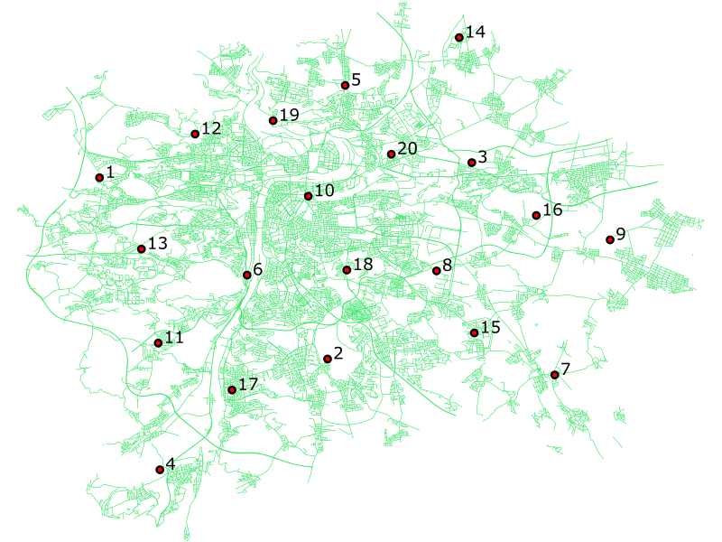

===============================
 Vytváříme prostorovou tabulku
===============================

*Záhadná vesmírná obludnost ukryla po Praze svoje zrůdná
vejce. Podařilo se, s nasazením života, získat jejich
souřadnice. Nyní musíme vytvořit v PostGISu tabulku, ze které si je
budou moci zobrazit terénní agenti, aby vejce našli a zneškodnili,
dřív, než se z nich vylíhnou malé, nepředstavitelně ohavné, obludky.*

Import dat do PostgreSQL
========================

Dejme tomu, že `naše data
<http://training.gismentors.eu/geodata/postgis/body.csv>`_ budou
vypadat nějak takto:

::

   1	-750922.065478723	-1042251.84362287
   2	-740606.682644681	-1050443.47116755
   3	-734083.719970213	-1041569.20799415
   4	-748191.52296383	-1055449.46577819
   5	-739810.27441117	-1038080.18144734
   ...

S tím, že známe strukturu, která vypadá takto:

::

   id	x	y

Oddělovačem je tabulátor.

.. note::
   
   Naimportovat tato data do PostgreSQL můžeme různými způsoby. Pomocí
   unixového programu ``sed`` můžeme např. převést jednotlivé řádky na
   :sqlcmd:`INSERT` statementy. Nebo můžeme použít Libre/OpenOffice,
   jak je popsáno `zde
   <http://grasswiki.osgeo.org/wiki/Openoffice.org_with_SQL_Databases#Converting_Excel.2C_CSV.2C_..._to_PostgreSQL.2FMySQL.2F..._via_OO-Base>`_
   (to je, mimochodem, velice užitečná technika, pokud někdy budete
   potřebovat do PostgreSQL převést větší množství dat z MS Excel,
   jako jsou číselníky ČÚZK, data se statistického úřadu
   apod). Tabulku můžeme otevřít v QGISu a ze souřadnic rovnou
   vytvořit geometrii, uložit do formátu Esri Shapefile a použít pro
   import do PostGISu nástroj ``shp2pgsql``, který je součástí
   instalace PostGIS. To se hodí, obzvlášť pokud dostanete od někoho
   data opsané ručně z GPS navigace v minutách a vteřinách. QGIS umí
   načíst tato data rovnou a ušetříte si poměrně otravné
   přepočítávání. Nicméně nejpřímější cesta jak dostat textovou
   tabulku do PostgreSQL je použití příkazu :sqlcmd:`COPY`.

Nejdříve si vytvoříme pracovní schéma.

.. code-block:: sql

   CREATE SCHEMA ukol_1;

Tabulku vytvoříme klasicky, příkazem :sqlcmd:`CREATE TABLE`.

.. code-block:: sql

   CREATE TABLE ukol_1.vesmirne_zrudice(id INT PRIMARY KEY, x FLOAT, y FLOAT);

.. note:: Je vhodné, pokud má tabulka celočíslený primární klíč 
   (datový typ *INTEGER*). Pokud je primární klíč jiného datového typu
   nebo dokonce chybí úplně, tak některé programy nemusí s tabulkou
   pracovat korektně.  Například u dat `VFK
   <http://freegis.fsv.cvut.cz/gwiki/VFK>`_, kde jsou primární klíče v
   typu *NUMERIC(30)*. Zde ovšem můžeme narazit u skutečně objemných
   dat, nebo číselných řad sdílených mezi více tabulkami. Aktuální
   verze QGISu se, naštěstí, dokaže vypořádat s většinou celočíselných
   primárních klíčů. Přesto je dobré na tento problém pamatovat a v
   případě problémů jej prověřit.
   
COPY
----

Příkaz :pgsqlcmd:`COPY <sql-copy>` může vypadat například takto

.. code-block:: sql
                
   COPY ukol_1.vesmirne_zrudice FROM '/home/user/Downloads/body.csv' DELIMITER E'\t' csv;

:sqlcmd:`COPY` je příkaz pro kopírování dat mezi databázovou tabulku a
textovým souborem. A to v obou směrech. Kopírovat můžeme z/do
souboru, z výstupu skriptu či ze standardního vstupu/na
standardní výstup. Je možné nastavovat přehršel možností,
oddělovače polí, řádků, hodnoty NULL, přítomnost řádku s
hlavičkou, kódování a další. V případě, že máme data v
exotickém formátování, vyplatí se vyzkoušet, jestli se nám
nepodaří je nakopírovat přímo příkazem :sqlcmd:`COPY`, než
začnete používat specializované programy na přeformátování.

.. notecmd:: Příklad využití :sqlcmd:`COPY` pro přenos dat mezi dvěma databázovými servery

   .. code-block:: bash

      psql -h prvni_server.cz -c "COPY a TO STDOUT" db3 | \
      psql -h druhy_server.cz -c "COPY b (a, b, c) FROM STDIN" db2

.. noteadvanced:: Od verze 9.4 umí PostgreSQL jednu velice šikovnou
                  věc a to *COPY FROM PROGRAM*, pomocí kterého
                  nekopírujete ze souboru, ale ze spuštěného
                  skriptu. Velice praktické například při pravidelném
                  skenování stránek s nějakými uspořádanými daty
                  (`příklad použití
                  <http://www.cybertec.at/importing-stock-market-data-into-postgresql/>`_). Je
                  však třeba vzít v potaz, že skript je spouštěn pod
                  uživatelem, pod kterým běží databázový server a je
                  nutné, aby tomu odpovídalo nastavení práv.

                  .. code-block:: bash

                     \copy ukol_1.vesmirne_zrudice (id, x, y)
                     FROM program 'wget -qO- http://training.gismentors.eu/geodata/postgis/body.csv'

Nás ovšem bude zajímat kopírování ze souboru do tabulky. Příkaz
:sqlcmd:`COPY`, jakkoliv je skvělý, má jedno omezení. Kopíruje totiž
soubor, který je umístěn na databázovém serveru a jako uživatel, pod
kterým je spuštěn PostgreSQL (obvykle `postgres`). Někdy může být
problematické soubor na server dostat a udělit mu patřičná
oprávnění. Řeší se to několika triky.

Dump formát
-----------

Upravíme data do podoby v jaké bývají produkována z ``pg_dump``:

.. code-block:: sql

   COPY ukol_1.vesmirne_zrudice (id, x, y) FROM stdin;
   1	-750922.065478723	-1042251.84362287
   2	-740606.682644681	-1050443.47116755
   3	-734083.719970213	-1041569.20799415
   4	-748191.52296383	-1055449.46577819
   5	-739810.27441117	-1038080.18144734
   \.

Jak patrno, stačí doplnit první řádek s :sqlcmd:`COPY` a poslední s
označením konce vkládání (``\.``). Výsledný skript pustíme pomocí
:program:`psql`.

Tento postup je výhodný, pokud píšete skripty pro převody dat. Stačí
doplnit dva jednoduché řádky, potom můžete snadno posílat výstup ze
skriptu rovnou na :program:`psql`, aniž by bylo třeba ho někam
ukládat.

Roura
-----

Další možnost je posílat data tzv. rourou. Tento postup je určen pouze
pro operační systém unixového typu jako je např. GNU/Linux.

.. code-block:: bash
                
   cat body.csv | psql -h server.cz -c "COPY ukol_1.vesmirne_zrudice (id, x, y) FROM STDIN" db

Metacommand \\copy
------------------

Příkaz ``\copy`` funguje podobně jako :sqlcmd:`COPY`, ovšem s tím
rozdílem, že kopírujete data z počítače, na kterém je spuštěno
:program:`psql` a pod právy uživatele, který jej spustil. Pokud tedy
chcete naplnit tabulky daty, které máte na svém počítači, je toto
nejefektivnější postup.

.. warning:: ``\copy`` je metacommand :program:`psql`, nikoliv SQL
             dotaz, funguje tedy pouze v :program:`psql`, není možné s
             ním počítat v rámci přístupu k databázi z programovacích
             jazyků, různých grafických nástrojů apod.

Vytváříme tabulku
=================

Vytvořit tabulku, do které půjdou uložit prostorová data lze více
způsoby. Sloupec s geometrii můžete od verze PostGIS 2.0 přidávat
standardně pomocí :sqlcmd:`ALTER TABLE ... ADD COLUMN`. Ve starších
verzích (PostGIS a 1.5 a nižších) byla jedinou možností funkce
:pgiscmd:`AddGeometryColumn`, která je nicméně pro zachování zpětné
kompatibility součástí i novějších verzí.

Krom samotného přidání sloupce s typem ``geometry`` se vytvoří
*constrainty*, neboli omezení, na geometrický typ, dimenzi prvků a
souřadnicových systém. V praxi to obnáší dvě podstatné věci. Tou první
je, jak by se dalo očekávat omezení vkládaných prvků na prvky
splňující určitá kritéria (typ, SRID, počet dimenzí). Což zamezí tomu,
aby Vám nezodpovědný uživatel vyrobil v databázi nepořádek, případně
abyste si ho tam v záchvatu kreativity vyrobili sami.

.. note::
   
   Druhou věcí, kterou zmíněné *constrainty* řeší, je generování
   *pohledu* (view) s metadaty :dbtable:`geometry_columns`. V případě,
   že constrainty nejsou vytvořené, bude jako typ geometrie uvedeno
   obecné ``geometry`` a jako SRID "0". S tím mohou mít některé
   programy přistupující k datům problém, například do QGISu se Vám
   takovou vrstvu nepodaří přidat, natož jí zobrazit. Nicméně, sluší
   se zmínit, že v některých, avšak velice vzácných, případech má
   použití takové tabulky své opodstatnění. Jedním z nich je tvorba
   databázového modelu, kde potřebujete kombinovat v jedné tabulce
   data různých geometrických typů, nebo dat v různých souřadnicových
   systémech. Databáze potom slouží jako úložiště a data jí opouštějí
   (například ve formátu GeoJSON) pomocí specifických procedur, kdy
   jsou potřebné informace doplněny a aparát na udržování
   geometrických metadat je tedy zbytečný. Dalším případem mohou být
   NOSQL databáze, kde vrstva v klasickém, relačním, pojetí pozbývá
   smyslu. Nicméně jedná se o případy specifické, ojedinělé a
   pokročilé, rozhodně nad rámec tohoto školení.

.. noteadvanced:: Ve verzích PostGIS nižších než 2.0 nebyl
                  :dbtable:`geometry_columns` definován jako pohled,
                  ale jako regulérní tabulka. Při přidání pohledů na
                  data nebo při ruční registraci nových tabulek či
                  sloupců s prostorovými daty bylo třeba do ní záznamy
                  přidávat manuálně. To v aktuálních verzích PostGISu
                  odpadá.

Sloupců s geometrií můžeme do tabulky přidat prakticky libovolné
množství. Například k tabulce budov můžeme přidat sloupec s polygony
pro obrys a s body pro definiční bod. Jedná se určitě o lepší řešení,
než obojí uložit do jednoho sloupce do typu *GEOMETRY COLLECTION*.

Přidání sloupce z geometrií
---------------------------

K tabulce přidáme sloupec s geometrií, v tomto případě použijeme
geometrický typ *POINT*.

.. code-block:: sql

   ALTER TABLE ukol_1.vesmirne_zrudice ADD COLUMN geom_p geometry(point, 5514);
                
.. note:: Nebo pomocí funkce ``AddGeometryColumn()`` (v PostGIS verze
   1.x je to jediný způsob). Tento způsob již ale ve verzi
   PostGIS 2.0 a vyšší postrádá smysl.
                          
   .. code-block:: sql
                   
      SELECT AddGeometryColumn ('ukol_1','vesmirne_zrudice','geom_p',5514,'POINT',2); 

Do tabulky :dbtable:`vesmirne_zrudice` ve schématu :dbtable:`ukol_1`
jsme přidali sloupec :dbcolumn:`geom_p` s 2D bodovými prvky v
souřadnicovém systému se SRID *5514*.

.. note:: SRID ve většině případů odpovídá EPSG kódu.

Do vytvořené tabulky vložíme data jedním z dříve uvedených způsobů.

.. tip:: Přehled atributů s geometrií v databázi poskytuje tabulka
   (pohled) :dbtable:`geometry_columns`.

   .. code-block:: sql

      SELECT * FROM geometry_columns;

   ::

      f_table_catalog   | pokusnik
      f_table_schema    | ukol_1
      f_table_name      | vesmirne_zrudice
      f_geometry_column | geom_p
      coord_dimension   | 2
      srid              | 5514
      type              | POINT

Vytváříme geometrii prvků
=========================

V následujícím kroku si ze souřadnic x a y vytvoříme geometrii
prvků. Opět to lze provést několikerým způsobem.

Abychom nemuseli nadále vypisovat název schématu, přidáme si ho do
*SEARCH_PATH*.

.. code-block:: sql

   SET SEARCH_PATH = ukol_1, public;

ST_Point(x,y)
-------------

Nejobvyklejším způsobem je použití funkce :pgiscmd:`ST_Point`, která
vytvoří z páru souřadnic geometrický prvek typu bod.

.. code-block:: sql

   SELECT ST_Point(x,y) FROM vesmirne_zrudice;

ST_GeomFrom*
------------

Další možností je sestavit si geometrii ve `WKT
<http://en.wikipedia.org/wiki/Well-known_text>`_ použít funkci
:pgiscmd:`ST_GeomFromText`. WKT je textový formát dle `standardu OGC
<http://www.opengeospatial.org/standards>`_ pro zápis vektorové
geometrie.

.. note:: Podobným způsobem můžeme využít také binární zápis geometrie
          *WKB*, a funkci :pgiscmd:`ST_GeomFromWKB`, což se může hodit
          například při migraci dat pomocí knihovny `GDAL
          <http://gdal.org>`_. Stejně se může hodit
          :pgiscmd:`ST_GeomFromGML`, případně
          :pgiscmd:`ST_GeomFromGeoJSON` atd. Další možnosti nabízí
          :pgiscmd:`ST_GeomFromEWKT` a
          :pgiscmd:`ST_GeomFromEWKB`. EWKT a EWKB je rozšíření OGC
          WKT/WKB o třetí rozměr a zápis souřadnicového systému. Je
          také třeba upozornit na fakt, že funkce ST_GeomFromGML
          neumí, na rozdíl například od knihovny GDAL všechny typy
          prvků, které se mohou v GML vyskytnout. Problematický je
          například kruh a také některé typy oblouků.

Geometrický prvek vytvoříme tedy například takto.

.. code-block:: sql

   SELECT ST_GeomFromText('POINT('||x::text||' '||y::text||')') FROM vesmirne_zrudice;

Nebo také:

.. code-block:: sql

   SELECT ST_GeomFromWKB('\x01010000005c6d862194ea26c13a56efaf97ce2fc1');

.. tip:: Elegantnějším a nepochybně přehlednějším způsobem zápisu, než je
   spojování řetězců je využití funkce `format
   <https://www.postgresql.org/docs/current/static/functions-string.html#FUNCTIONS-STRING-FORMAT>`_.

   .. code-block:: sql

      SELECT format(
         'POINT(%s %s)'
         , x
         , y
      )::geometry
      FROM vesmirne_zrudice;

ST_AsText
---------

PostGIS si také umí inteligentně převádět řetězce na geometrii pomocí
funkce :pgiscmd:`ST_AsText`. Můžeme tedy využít jednoduchý cast, který
bude fungovat z WKB, WKT, EWKT a EWKB.

.. code-block:: sql

   SELECT ST_AsText('01010000005c6d862194ea26c13a56efaf97ce2fc1'::geometry);

Případně:

.. code-block:: sql

   SELECT ('POINT('||x::text||' '||y::text||')')::geometry FROM vesmirne_zrudice;

Přidáváme geometrii do tabulky
==============================

UPDATE
------

Geometrii můžeme tvořit různě, u průběžně aktualizované tabulky si
můžeme například vytvořit :ref:`trigger <geometrie-trigger>`, který
nám už při importu souřadnic geometrii sestaví. Pro jednorázový import
je ovšem nejsnazší aktualizovat geometrii pomocí :sqlcmd:`UPDATE`.

.. code-block:: sql

   UPDATE vesmirne_zrudice SET geom_p = ST_POINT(x,y);

A vida, nedaří se to.

.. code-block:: sql

   ERROR:  Geometry SRID (0) does not match column SRID (5514)

Důvod je zjevný. Naše geometrie nemá požadovaný souřadnicový
systém. PostGIS totiž ukládá geometrii včetně *SRID* a to musí, při
vkládání korespondovat s omezeními. Pokud není SRID nastaveno, je jako
defaultní považováno SRID=0.

SRID nastavíme funkcí :pgiscmd:`ST_SetSRID`.

.. tip:: Srovnejte výstupy z následujících dotazů.

   .. code-block:: sql

      SELECT 'POINT(0 0)'::geometry;
      SELECT ST_SetSRID('POINT(0 0)'::geometry, 5514);

Pokud tedy použijeme funkci :pgiscmd:`ST_SetSRID` v :sqlcmd:`UPDATE`,
bude již dotaz pracovat dle očekávání.

.. code-block:: sql
                
   UPDATE vesmirne_zrudice SET geom_p = ST_SETSRID(ST_POINT(x,y), 5514);

.. noteadvanced:: Zde se opět nabízí využití této funkce v triggeru při importu obsáhlejších datasetů.
                     
Geometrii lze přiřadit i dalšími již zmíněnými postupy.
          
Funkce :pgiscmd:`ST_GeomFromText` umožňuje použít SRID jako druhý argument.

.. code-block:: sql

   UPDATE vesmirne_zrudice SET geom_p = ST_GeomFromText('POINT('||x::text||' '||y::text||')', 5514);

V rámci *CAST* si můžeme snadno vypomoci pomocí `EWKT
<http://postgis.net/docs/using_postgis_dbmanagement.html#EWKB_EWKT>`_
.

.. code-block:: sql

   SELECT ('SRID=5514;POINT('||x::text||' '||y::text||')')::geometry FROM vesmirne_zrudice;

Při migraci do položky s geometrií se CAST provede automaticky.

.. code-block:: sql
                
   UPDATE vesmirne_zrudice SET geom_p = 'SRID=5514;POINT('||x::text||' '||y::text||')';

.. tip:: Zkuste si přidat data do sloupce s geometrií všemi výše
         uvedenými způsoby.

.. tip:: Zobrazte si tabulku ve svém oblíbeném GIS desktopu.

    Jako podklad jsou použité pražské ulice.

.. _geometrie-trigger:

Trigger
-------

S pomocí jednoduchého triggeru si můžeme usnadnit podstatně usnadnit
život. Pokud budeme pravidelně vkládat data do tabulky zbavíme se
nutnosti spouštět další dotazy a data budou převedena automaticky.

.. code-block:: sql

   CREATE OR REPLACE FUNCTION geom_z_xy() RETURNS trigger
       LANGUAGE plpgsql SECURITY DEFINER
       AS $BODY$ 
   BEGIN
      NEW.geom_p := 'SRID=5514;POINT('||NEW.x::text||' '||NEW.y::text||')';
      RETURN NEW;
   END;
   $BODY$;

   CREATE TRIGGER geom_z_xy 
   BEFORE INSERT OR UPDATE ON vesmirne_zrudice
   FOR EACH ROW EXECUTE PROCEDURE geom_z_xy();

   TRUNCATE vesmirne_zrudice;

   \copy vesmirne_zrudice (id, x, y) FROM jelen_dta/gismentors/postgis/data/body.csv

   SELECT *, ST_AsText(geom_p), ST_SRID(geom_p) FROM vesmirne_zrudice;

Prostorové indexy
=================

Pro efektivní práci s prostorovými daty je nezbytné tato data
indexovat (pakliže se bavíme o objemu dat od tisícovek záznamů
výše). Obvykle používáme GIST index, ale můžeme využít i jiné.
GIST, SP-GIST a BRIN jsou všechny indexové metody využívané v PostgreSQL
pro efektivní vyhledávání dat v databázi.

.. code-block:: sql

   CREATE INDEX vesmirne_zrudice_geom_p_geom_idx ON vesmirne_zrudice USING gist (geom_p);

.. tip:: Při definování indexu můžete vynechat jeho název. V tomto
   případě si jej PostgreSQL doplní sám.

   .. code-block:: sql

      CREATE INDEX ON vesmirne_zrudice USING gist (geom_p);

.. note:: Zda je tabulka indexovaná (a další podrobnosti o tabulce)
   zjistíme v :program:`psql` pomocí metacomandu ``\d+``:

   .. code-block:: sql

      SELECT pg_get_indexdef('vesmirne_zrudice_geom_p_geom_idx'::regclass);

GIST
----

GIST (Generalized Search Tree) je indexová metoda pro libovolné datové typy.
GIST je velmi flexibilní a může být použit pro indexování různých datových typů včetně textových řetězců,
množin a různých geometrických objektů.

SP-GIST
-------

SP-GIST (Space-Partitioned Generalized Search Tree) je obecná metoda pro vytváření indexů pro libovolné datové typy.
Jedná se o rozšíření GIST, který pracuje s prostorovými daty. Tento index je výhodný v případě, že jsou data
nerovnoměrně distribuována v prostoru resp. vytváří shluky dat.

BRIN
____

BRIN (Block Range INdex) je indexová metoda, která se zaměřuje na efektivitu při práci s velkými tabulkami.
BRIN využívá blokovou orientaci, kde v každém bloku je uchováván minimální a maximální hodnota indexovaného sloupce.
To umožňuje rychlé vyhledávání výsledků v rozsahu hodnot bloku a přiřazení bloku k dotazu,
který omezuje výsledky na menší část tabulky. BRIN index je vhodný pro rozsáhlá a uspořádaná data,
kde existuje jasný vztah mezi jednotlivými hodnotami.

Rozdíl mezi těmito metodami spočívá v tom, jaký typ dat se indexuje a jakým způsobem se index vytváří.
Každá metoda má své výhody a nevýhody a vhodnost použití závisí na konkrétní situaci a datových typech, které se indexují.

Dále uvedené časy jsou velmi orientační na neoptimalizovaném PostgreSQL na HW konfiguraci:
8 CPU Intel(R) Core(TM) i7-6700 CPU @ 3.40GHz, 32 GB RAM.

Rychlost zápisu
---------------

.. code-block:: sql

   create table points_idx_test(id int, note text, geom geometry)
   with (autovacuum_enabled=off,toast.autovacuum_enabled=off);
   create index idx_points_idx_test on points_idx_test using gist (geom);
   insert into points_idx_test
   select id, md5(random()::text), ST_SetSRID(ST_Point(180-random()*360, 90-random()*180),4326)
   from generate_series(1,10000000) t(id);

Čas: 3m 9s

.. code-block:: sql

   drop table points_idx_test;
   create table points_idx_test(id int, note text, geom geometry)
   with (autovacuum_enabled=off,toast.autovacuum_enabled=off);
   create index idx_points_idx_test on points_idx_test using brin (geom) with (pages_per_range =1);
   insert into points_idx_test
   select id, md5(random()::text), ST_SetSRID(ST_Point(180-random()*360, 90-random()*180),4326)
   from generate_series(1,10000000) t(id);

Čas: 16s

.. code-block:: sql

   drop table points_idx_test;
   create table points_idx_test(id int, note text, geom geometry)
   with (autovacuum_enabled=off,toast.autovacuum_enabled=off);
   create index idx_points_idx_test on points_idx_test using spgist (geom);
   insert into points_idx_test
   select id, md5(random()::text), ST_SetSRID(ST_Point(180-random()*360, 90-random()*180),4326)
   from generate_series(1,10000000) t(id);

Čas: 2m 11s

Rychlost vytvoření
------------------
Použijeme stejnou tabulku s 10 mil. bodů

.. code-block:: sql

  drop index idx_points_idx_test;
  create index idx_points_idx_test on points_idx_test using gist (geom);

Čas: 2m 9s

.. code-block:: sql

  drop index idx_points_idx_test;
  create index idx_points_idx_test on points_idx_test using brin (geom)
  with (pages_per_range =1);

Čas: 3s

.. code-block:: sql

  drop index idx_points_idx_test;
  create index idx_points_idx_test on points_idx_test using spgist (geom);

Čas: 1m 28s

Velikost indexu
---------------
.. code-block:: psql

  \di+ idx_points_idx_test

GIST: 521 MB

BRIN: 3.5 MB

SP-GIST: 443 MB

Výběr bodů v polygonu
---------------------
.. code-block:: sql

  explain (analyze,verbose,timing,costs,buffers)
  select * from points_idx_test
  where
  st_within (geom,
  ST_SetSRID(ST_GeomFromText('POLYGON ((0 0, 15 0, 7.5 10, 0 0))'),4326));

GIST: 115 ms

BRIN: 830 ms

SP-GIST: 142 ms

NOINDEX: 830 ms

Z výsledků je vidět, že BRIN nebyl použit vůbec.
V případě SP-GIST indexu je dotaz poněkud pomalejší než u indexu GIST,
protože data jsou distribuována rovnoměrně v rámci celého světa. V následujícím příkladu si ukážeme,
jak se index SPGIST chová u jinak distribuovaných dat.

Jiná distribuce bodů pro GIST a SPGIST
--------------------------------------
.. code-block:: sql

  drop table points_idx_test;
  create table points_idx_test(id int, note text, geom geometry)
  with (autovacuum_enabled=off,toast.autovacuum_enabled=off);

  insert into points_idx_test
  select id, md5(random()::text), ST_SetSRID(ST_Point(180-random()*90, 90-random()*180),4326)
  from generate_series(1,5000000) t(id);

  insert into points_idx_test
  select id, md5(random()::text), ST_SetSRID(ST_Point(-180+random()*90, 90-random()*180),4326)
  from generate_series(1,5000000) t(id);

GIST: 152 ms

SP-GIS: 74 ms

Zde je vidět, jak SP-GIST index funguje. Pokud máme data rozmístěna do oblastí, které je možno separovat
pomocí obdélníků, pak je dotaz výrazně rychlejší.

Využití indexu BRIN pro časoprostorová data
-------------------------------------------

Pakliže máme časoprostorová data, např. získáváme informace o pohybu flotily aut, pak pro nás může být zajímavé
využít kombinaci indexu BRIN a GIST (případně SP-GIST).

Časovou značku indexujeme pomocí indexu BRIN a prostorovu pomocí GIST (SP-GIST).

.. code-block:: sql

  create table points_time_idx_test(id int, dt timestamp, geom geometry)
  with (autovacuum_enabled=off,toast.autovacuum_enabled=off);

  with dts as (SELECT dd as dt
  FROM generate_series
        ( '2023-02-01'::timestamp
        , '2023-02-07'::timestamp
        , '1 second'::interval) dd)
  insert into points_time_idx_test select id, dts.dt,
  ST_SetSRID(ST_Point(-180+random()*90, 90-random()*180),4326) geom
   from generate_series(1,100) t(id), dts order by dt;

  create index on points_time_idx_test using GIST(geom);
  create index on points_time_idx_test using BRIN(dt) with (pages_per_range =1);

  analyze points_time_idx_test;

  explain (analyze,verbose,timing,costs,buffers)
    select * from points_time_idx_test
    where
    st_within (geom,
    ST_SetSRID(ST_GeomFromText('POLYGON ((0 0, 15 0, 7.5 10, 0 0))'),4326))
    and dt between '2023-02-01 01:00:00' and '2023-02-01 02:00:00';

NOINDEX: 1380 ms

BRIN: 164 ms

GIST a BRIN: 7 ms

Pokud tedy potřebujeme pracovat s malým indexem a rychle zapisovat do databáze
velké množství dat a víme, že dotazy budou primárně na časovou složku, můžeme použít pouze index BRIN.
Pokud budou dotazy vždy vracet jen tisíce záznamů před prostorovou filtrací, můžeme prostorový index vynechat.

Pokud však množství zapisovaných dat nebude extrémní, což v našem případě neplatí,
jedná se o stovku řádků každou sekundu. V tomto případě zápis i s existencí indexu GIST trvá cca 20 ms,
což je bez problémů.

Pokud by se však jednalo o 30 tis. záznamů každou sekundu, pak už nám doba zápisu přesáhne 1 s.
V případě, že tabulka nebude obsahovat index GIST, ale pouze index BRIN dobaz bude výrazně nižší
v mém případě 80 ms i při zápisu 30 tis záznamů.

Zdroje
------
https://www.alibabacloud.com/blog/postgresql-best-practices-selection-and-optimization-of-postgis-spatial-indexes-gist-brin-and-r-tree_597034
https://www.crunchydata.com/blog/the-many-spatial-indexes-of-postgis
https://pgsessions.com/assets/archives/gbroccolo_jrouhaud_pgsession_brin4postgis.pdf
https://www.crunchydata.com/blog/postgres-indexing-when-does-brin-win
