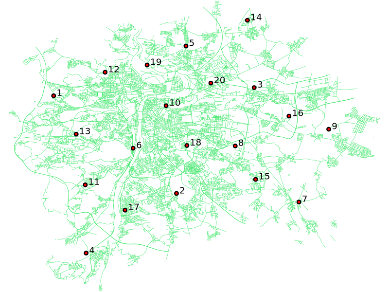

Vytváříme prostorovou tabulku
=============================

*Záhadná vesmírná obludnost ukryla po praze svoje zrůdná vejce. Podařilo se, s nasazením života, získat jejich souřadnice. Nyní musíme vytvořit v postgisu tabulku, ze které si je budou moci zobrazit teréní agenti, aby vejce našli a zneškodnili, dřív, než se z nich vylíhnou malé, nepředstavitelně ohavné, obludky.*

Jak dostat data do Postgre
--------------------------

Dejme tomu, že naše data budou vypadat nějak takto:
::

   1	-750922.065478723	-1042251.84362287
   2	-740606.682644681	-1050443.47116755
   3	-734083.719970213	-1041569.20799415
   4	-748191.52296383	-1055449.46577819
   5	-739810.27441117	-1038080.18144734
   ...

S tím, že známe strukturu, která vypadá takto:
::

   id	x	y

Oddělovač je tabelátor.

Dostat takovouto jednoduchou tabulku do Postgre můžeme celou řadou způsobů. Můžeme pomocí `sed` převést jednotlivé řádky na insert statementy. Můžeme použít libre/open office jak je popsáno `zde <http://grasswiki.osgeo.org/wiki/Openoffice.org_with_SQL_Databases#Converting_Excel.2C_CSV.2C_..._to_PostgreSQL.2FMySQL.2F..._via_OO-Base>`_ (to je, mimochodem, velice užitečná technika, pokud někdy budete potřebovat do Postgre převést větší množství dat z excelu, jako jsou číselníky z ČUZK, data se statistického úřadu apod). Můžeme tabulku otevřít v qgisu a ze souřadnic rovnou udělat geometrii, uložit do shp a použít `shp2pgsql`. To se hodí obzvlášť pokud dostanete od někoho data opsané ručně z GPS navigace v minutách a vteřinách. Qgis umí načíst tato data rovnou a ušetříte si poměrně otravné přepočítávání. Nicméně nejpřímější cesta jak dostat textovou tabulku do postgre je použití **COPY**.

COPY
^^^^

Manuál k COPY je `tady <http://www.postgresql.org/docs/9.4/static/sql-copy.html>`_.

Příkaz může tedy vypadat například takto
::

   COPY vesmirne_zrudice FROM vesmirne_zrudice.txt

Copy je příkaz na kopírování dat mezi databázovou tabulku a textovým souborem. A to v obou směrech. Kopírovate můžeme ze/do souboru, z výstupu skriptu a ze standartního vstupu/na standartní výstup. Je možné nastavovat přehršel možností, oddělovače polí, řádků, hodnoty NULL, přítomnost řádku s hlavičkou, kódování a další. V případě, že máme nějaká data v exotickém formátování, vyplatí se vyzkoušet, jestli se nám nepodaří je do copy nakrmit, než je začneme soukat přez nějaké skripty na přeformátování. 

Příklad kreativního využití `copy` pro přenos dat mezi dvěma servery:
::

   psql -h prvni_server.cz -c "COPY a TO STDOUT" db1 | \
   psql -h druhy_server.cz -c "COPY b (a, b, c) FROM STDIN" db2

.. note:: Od verze 9.4 umí postgre jednu velice šikovnou věc a to *COPY FROM PROGRAM*, pomocí kterého nekopírujete ze souboru, ale z puštěného skriptu. Velice praktické například při pravidelném skenování stránek s nějakými uspořádanými daty. `Příklad použití <http://www.cybertec.at/importing-stock-market-data-into-postgresql/>`_. Je však třeba vzít potaz, že skript je spouštěn pod uživatelem, pod kterým běží databázový server a je nutné, aby tomu odpovídalo nastavení práv.

Nás ovšem bude zajímat kopírování ze souboru do tabulky. Copy, totiž, jakkoliv je skvělé, má jedno omezení. Kopíruje totiž soubor, který leží na databázovém serveru a jako uživatel pod kterým je puštěné postgre (obvykle postgres) a někdy může být problematické soubor na server dostat a patřičná oprávnění mu přidělit. Řeší se to několika triky.

Dump formát
^^^^^^^^^^^

Upravíme data do podoby v jaké bývají produkována z pg_dump:
::

   COPY vesmirne_zrudice (id, x, y) FROM stdin;
   1	-750922.065478723	-1042251.84362287
   2	-740606.682644681	-1050443.47116755
   3	-734083.719970213	-1041569.20799415
   4	-748191.52296383	-1055449.46577819
   5	-739810.27441117	-1038080.18144734
   \.

Jak patrno, stačí doplnit první řádek s COPY a poslední s označením konce vkládání. Výsledný skript pustíme pomocí psql -f. 

Tento postup je výhodný, pokud píšeme nějaké skripty pro převody dat, když doplníme dva jednoduché řádky, můžeme snadno posílat výstup ze skriptu rovnou na psql, aniž by bylo třeba ho někam ukládat.

Roura
^^^^^

Další možnost je posílat data rourou:
::

   cat body.csv | psql -h server.cz -c "COPY body (id, x, y) FROM STDIN" db

Metacommand \\copy
^^^^^^^^^^^^^^^^^^

Poslední možností, kterou já osobně používám nejčastěji pro ruční nahrávání dat, která dostanu v textovém formátu. \\copy funguje podobně jako COPY, ovšem s tím rozdílem, že kopírujete data z počítače na kterém je spuštěno psql a pod právy uživatele, který pustil psql. Když tedy chcete naplnit tabulky daty, které máte na svém lokále, je toto nejefektivnější postup. 

.. note:: \\copy je metacommand psql, nikoliv SQL dotaz, funguje tedy jen v psql, není tedy možné s ním počítat v rámci přístupu k databázi z programovacích jazyků, různých grafických nástrojů apod.

Vytváříme tabulku
-----------------

Vytvořit tabulku, do které půjdou uložit prostorová data lze více způsoby. Jak už to bývá, některé jsou vhodnější, než jiné. 

AddGeometryColumn
^^^^^^^^^^^^^^^^^

Nejrozšířenější způsob je přidání geometrického sloupce k již existující tabulce pomocí postgis funkce `AddGeometryColumn() <http://postgis.refractions.net/docs/AddGeometryColumn.html>`_ která, krom samotného přidání sloupce s typem geometry, také vytvoří *constrainty*, neboli omezení, na geometrický typ, počet dimenzí a souřadný systém pro přidaný sloupec. V praxi to obnáší dvě podstatné věci. Tou první je, jak by se dalo očekávat omezení vkládaných prvků na prvky splňující určitá kritéria (typ, SRID, počet dimenzí). Což zamezí tomu, aby Vám nezodpovědný uživatel vyrobil v databázi nepořádek, případně abyste si ho tam v záchvatu kreativity vyrobili sami. Jistě, jsou omezení, která jsou omezující a potažmo škodlivá. Tohle není ten případ.

Druhou věcí, kterou zmíněné *constrainty* řeší je generování *pohledu* s grafickými metadaty **geometry_columns**. Z toho pohledu drtivá většina software získává informace o typech geometrických prvků v databázi. V případě, že constrainty nejsou vytvořené, bude jako typ geometrie uvedeno obecné *GEOMETRY* a jako SRID "0". S tím mohou některé software mít problém, například do QGISu se Vám takovou vrstvu nepodaří přidat, natož jí zobrazit. Nicméně, sluší se zmínit, že v některých, avšak velice vzácných, případech má použití takové tabulky své opodstatnění. Jedním z nich je tvorba databázového modelu, kde potřebujete kombinovat v jedné tabulce data různých geometrických typů, nebo dat v různých souřadných systémech, databáze slouží jako úložiště a data jí opouštějí (například ve formátu GeoJSON) pomocí specifických procedur, kdy jsou potřebné informace doplněny, aparát na udržování geometrických metadat je tedy zbytečný. Dalším případem mohou být NOSQL databáze, kde vrstva v klasickém, relačním, pojetí pozbývá smyslu. Nicméně jedná se o případy specifické, ojedinělé a pokročilé, rozhodně nad rámec těchto lekcí.

.. note:: Ve verzích PostGIS nižších než 2.0 nebyl *geometry_columns* pohled, ale tabulka. Při přidání pohledů, nebo při ruční registraci tabulek bylo třeba přidat do ní záznamy. V aktuálních verzích postgisu toto odpadá.

Sloupců s geometrií můžeme k tabulce přidat prakticky libovolné množství, například k tabulce budov můžeme přidat sloupec s polygony pro obrys a s body pro definiční bod. Jedná se určitě o lepší řešení, než obojí uložit do jednoho sloupce do typu GEOMETRY COLLECTION.

Tabulka
^^^^^^^

Nejdříve si vytvoříme pracovní schéma.
::

   CREATE SCHEMA ukol_1;

Tabulku vytvoříme klasicky, příkazem *CREATE TABLE*.
::

   CREATE TABLE ukol_1.vesmirne_zrudice( id int PRIMARY KEY, x float, y float);

Je vhodné, když tabulka má primární klíč v datovém typu *INTEGER*, pokud je primární klíč v jiném datovém typu, nebo, pokud dokonce chybí úplně, některé software nemusí s tabulkou pracovat korektně. 

.. note:: Například u dat ČUZAK ve VFK, kde jsou primární klíče v typu *NUMERIC(30)*. Zde ovšem můžeme narazit u skutečně objemných dat, nebo číselných řad sdílených mezi více tabulkami. Aktuální verze QGISu se, naštěstí, dokaže vypořádat s většinou celočíselných primárních klíčů. Přesto je dobré na tento problém pamatovat a v případě problémů jej prověřit.

K tabulce přidáme sloupec s geometrií, v tomto případě použijeme geometrický typ *POINT*.
::

   SELECT AddGeometryColumn ('ukol_1','vesmirne_zrudice','geom_p',5514,'POINT',2); 

Přidáváme tedy k tabulce *vesmirne_zrudice* ve schématu *ukol_1* sloupec s jednoduchými body v souřadném systému se SRID *5514* a 2D nazvaný *geom_p*.

Do vytvořené tabulky nasypeme data jedním z dříve uvedených způsobů.

.. tip:: Vytvořte si tabulku a naplňte ji `daty <https://raw.githubusercontent.com/GISMentors/postgis/master/data/body.csv>`_. Vyzkoušejte více způsobů. 

Tvoříme geometrii
-----------------

V následujícím kroku si ze souřadnic x a y vytvoříme geometrii. Opět to lze provést několikerým způsobem.

ST_Point(x,y)
^^^^^^^^^^^^^

Nejobvyklejším způsobem je použití funkce *ST_POINT(x,y)*, která vytvoří z páru souřadnic geometrický prvek typu bod.
::

   SELECT ST_Point(x,y) FROM ukol_1.vesmirne_zrudice;

ST_GeomFrom*
^^^^^^^^^^^^

Další možností je sestavit si geometrii ve `WKT <http://en.wikipedia.org/wiki/Well-known_text>`_, a použijeme funkci ST_GeomFromText. WKT je textový dle `standardu OGC <http://www.opengeospatial.org/standards>`_ zápis vektorové geometrie.

.. note:: Podobným způsobem můžeme využít také binární zápis geometrie *WKB*, a funkci *ST_GeomFromWKB*, což se může hodit například při migraci dat pomocí knihovny *GDAL*. Stejně se může hodit *ST_GeomFromGML*, případně *ST_GeomFromGeoJSON* atd. Další možnosti nabízí *ST_GeomFromEWKT* a *ST_GeomFromEWKV*. EWKT a EWKB je rozšíření OGC WKT/WKB o třetí rozměr a zápis souřadného systému. Je také třeba upozornit na fakt, žefunkce ST_GeomFromGML neumí, na rozdíl například od gnihovny GDAL všechny typy hran, které se mohou v GML vyskytnout, problematický je například kruh a také některé typy oblouků.

Abychom nemuseli nadále vypisovat název schématu, přidáme si ho do **SEARCH_PATH**
::

   SET SEARCH_PATH = ukol_1, public;

Geometrický prvek vytvoříme tedy například takto.
::

   SELECT ST_GeomFromText('POINT('||x::text||' '||y::text||')') FROM vesmirne_zrudice;

Nebo také:
::

   SELECT ST_GeomFromWKB('\x01010000005c6d862194ea26c13a56efaf97ce2fc1');

PostGIS si také umí inteligentně převádět řetězce na geometrii, můžeme tedy využít jednoduchý cast, který bude fungovat z WKB, WKT, EWKT a EWKB.
::

   SELECT ST_AsText('01010000005c6d862194ea26c13a56efaf97ce2fc1'::geometry);

Případně:
::

   SELECT ('POINT('||x::text||' '||y::text||')')::geometry FROM vesmirne_zrudice;

Přidáváme geometrii do tabulky
------------------------------

UPDATE
^^^^^^

Geometrii můžeme tvořit různě, u průběžně aktualizované tabulky si můžeme například vytvořit trigger, který nám už při importu souřadnic geometrii sestaví. Pro jednorázový import je ovšem nejsnazší aktualizovat geometrii pomocí *UPDATE*.
::

   UPDATE vesmirne_zrudice SET geom_p = ST_POINT(x,y);

A vida, nedaří se to.
::

   ERROR:  Geometry SRID (0) does not match column SRID (5514)

Důvod je zjevný. Naše geometrie nemá požadovaný souřadný systém. PostGIS totiž ukládá geometrii včetně *SRID* a to musí, při vkládání korespondovat s omezeními. Pokud není SRID nastaveno, je jako defaultní považováno SRID=0.

SRID nastavíme funkcí `ST_SetSRID(geometry,SRID) <http://postgis.net/docs/ST_SetSRID.html>`_ .

.. tip:: Srovnej výstupy z následujících dotazů.

...
::

   SELECT 'POINT(0 0)'::geometry;
   SELECT ST_SetSRID('POINT(0 0)'::geometry, 5514);

Pokud tedy použijeme funkci ST_SetSRID v UPDATE, bude již dotaz pracovat dle očekávání. Zde se opět nabízí využití této funkce v triggeru při importu obsáhlejších datasetů.

Funkce *ST_GeomFromText* umožňuje použít SRID jako druhý argument.
::

   SELECT ST_GeomFromText('POINT('||x::text||' '||y::text||')', 5514) FROM vesmirne_zrudice;
   UPDATE vesmirne_zrudice SET geom_p = ST_GeomFromText('POINT('||x::text||' '||y::text||')', 5514);

V rámci *CAST* si můžeme snadno vypomoci pomocí `EWKT <http://postgis.net/docs/using_postgis_dbmanagement.html#EWKB_EWKT>`_ .
::

   SELECT ('SRID=5514;POINT('||x::text||' '||y::text||')')::geometry FROM vesmirne_zrudice;

Při migraci do položky s geometrií se CAST provede automaticky.
::

   UPDATE vesmirne_zrudice SET geom_p = 'SRID=5514;POINT('||x::text||' '||y::text||')';

.. tip:: Zkuste si přidat data do sloupce s geometrií všemi výše uvedenými způsoby.

.. tip:: Zobrazte si tabulku ve svém oblíbeném GIS desktopu.

    Jako podklad jsou použité pražské ulice

Trigger
^^^^^^^

S pomocí jednoduchého triggeru si můžeme usnadnit podstatně usnadnit život. Pokud budeme pravidelně vkládat data do tabulky zbavíme se nutnosti spouštět další dotazy a data budou převedena automaticky.
::

   CREATE OR REPLACE FUNCTION geom_z_xy() RETURNS trigger
       LANGUAGE plpgsql SECURITY DEFINER
       AS $BODY$ 
   BEGIN
      NEW.geom_p := 'SRID=5514;POINT('||NEW.x::text||' '||NEW.y::text||')';
      RETURN NEW;
   END;
   $BODY$;

   CREATE TRIGGER geom_z_xy 
   BEFORE INSERT OR UPDATE ON vesmirne_zrudice
   FOR EACH ROW EXECUTE PROCEDURE geom_z_xy();

   TRUNCATE vesmirne_zrudice;

   \copy vesmirne_zrudice (id, x, y) FROM jelen_dta/gismentors/postgis/data/body.csv

   SELECT *, ST_AsText(geom_p), ST_SRID(geom_p) FROM vesmirne_zrudice;
