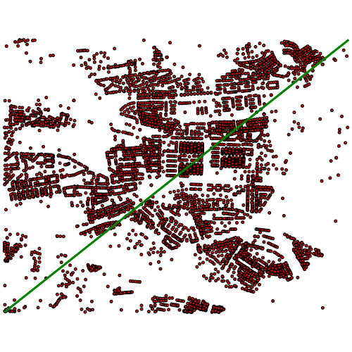

Operátory datového typu geometry
================================

*S datovým typem geometry nám v PostgreSQL přibude několik poměrně
zajímavých* `operátorů
<http://postgis.net/docs/manual-2.1/reference.html#Operators>`_. *Rozhodně
není od věci se s nimi seznámit. Vesměs řeší vzájemnou polohu*
**minimálních ohraničujících obdélníků (MOO)** *prvků. Kromě pohodlného a
přehledného zápisu jsou obvykle velice rychlé.*

Překryv MOO
-----------

Operátor &&
^^^^^^^^^^^

Operátor **&&** vrací pravdivou hodnotu, pokud je MOO prvního prvku
alespoň částečně překryt MOO druhého prvku nebo pokud se
MOO prvků dotýkají. To se dá využít jako nejjednodušší prostorový
filtr pro zobrazení, případně jako předvýběr dat pro další analýzu,
pokud chceme optimalizovat dotaz. Setkáte se s ním například pokud
budete logovat všechny dotazy v databázi, nad kterou někdo pracuje s
QGISem.

.. code-block:: sql

   SELECT adresnibod FROM ukol_1.adresy 
    WHERE adresnibod && 'LINESTRING(-739719.43 -1046851.61,-735806.08 -1043755.06)'::geometry;

    
    Adresní body vybrané pomocí MOO linie.

Dalším využitím je, jak již bylo řečeno **optimalizace dotazů**. Dejme
tomu, že chceme spočítat počet adresních bodů v okruhu 250 metrů okolo
bodu vesmírných vajec s ``id=1``.

.. code-block:: sql

   SET SEARCH_PATH = ukol_1, public;

   -- neoptimalizovaný dotaz
   EXPLAIN ANALYZE
    SELECT COUNT(*) FROM adresy a JOIN vesmirne_zrudice v 
     ON v.id = 1 
     AND ST_Distance(a.adresnibod, v.geom_p) <=  250;

   -- optimalizovaný dotaz
   EXPLAIN ANALYZE
    SELECT COUNT(*) 
     FROM 
     (
      SELECT geom_p, adresnibod FROM adresy a JOIN vesmirne_zrudice v 
      ON v.id = 1 
      AND a.adresnibod && ST_Expand(v.geom_p, 250)
     ) data
     WHERE ST_Distance(adresnibod, geom_p) <= 250;

Operátor @ a ~
^^^^^^^^^^^^^^

Operátor **@** funguje podobně jako operátor **&&**, ovšem s tím
rozdílem, že vrací prvky, jejichž MOO je zcela překryt MOO druhého
prvku.

Použití je podobné jako u předešlého operátoru, s tím rozdílem, že
nevybereme prvky, které leží na hranici. Pokud bychom, například
vybírali polygony, které leží celé uvnitř nějakého polygonu,
zredukujeme počet analyzovaných prvků, už v rámci "hrubého" filtru (a
ušetříme výkon), o prvky které nemohou v obalové zóně ležet.

Operátor **~** funguje stejně jako **@**, ovšem s obráceným pořadím
prvků. Vrací tedy jen takové prvky, jejichž MOO zcela zakrývá
MOO prvku za operátorem.

Příklady:

.. code-block:: sql

   SELECT 'LINESTRING(0 0, 1 1)'::geometry && 'LINESTRING(0 0, -1 -1)'::geometry;
   SELECT 'LINESTRING(0 0, 1 1)'::geometry @ 'LINESTRING(0 0, -1 -1)'::geometry;
   SELECT 'LINESTRING(0 0, 1 1)'::geometry @ 'LINESTRING(0 0, 2 2)'::geometry;
   SELECT 'LINESTRING(0 0, 2 2)'::geometry @ 'LINESTRING(0 0, 1 1)'::geometry;
   SELECT 'LINESTRING(0 0, -1 -1)'::geometry @ 'LINESTRING(0 0, 2 2)'::geometry;
   SELECT 'LINESTRING(0 0, -1 -1)'::geometry && 'LINESTRING(0 0, 2 2)'::geometry;
   SELECT 'LINESTRING(0 0, 2 2)'::geometry ~ 'LINESTRING(0 0, 1 1)'::geometry;
   SELECT 'LINESTRING(0 0, 1 1)'::geometry ~ 'LINESTRING(0 0, 1 1)'::geometry;
   SELECT 'LINESTRING(0 0, 1 1)'::geometry ~ 'LINESTRING(0 0, 2 2)'::geometry;

Operátory <-> a <#>, vzdálenost
-------------------------------

Tyto dva operátory vrací vzdálenost. Operator **<->** vrací vzdálenost
centroidů, **<#>** vrací nejkratší vzdálenost MOO prvků. Využít je to
možné například pro `optimalizaci vyhledávání nejbližšího prvku
<http://boundlessgeo.com/2011/09/indexed-nearest-neighbour-search-in-postgis/>`_. 

.. code-block:: sql

   -- vzdálenost mezi body
   SELECT 'POINT(0 0)'::geometry <-> 'POINT(0 10)'::geometry;
   SELECT 'POINT(0 0)'::geometry <#> 'POINT(0 10)'::geometry;
   SELECT 'POINT(0 3)'::geometry <-> 'POINT(4 0)'::geometry;

   -- vzdálenost mezi liniemi
   SELECT 'LINESTRING(0 0,10 10)'::geometry <-> 'LINESTRING(0 5,10 15)'::geometry;
   SELECT 'LINESTRING(0 0,10 10)'::geometry <#> 'LINESTRING(0 5,10 15)'::geometry;

   -- vzdálenost mezi polygony
   SELECT ST_Buffer('POINT(0 0)'::geometry, 10) <-> ST_Buffer('POINT(10 0)'::geometry, 10);
   SELECT ST_Buffer('POINT(0 0)'::geometry, 10) <#> ST_Buffer('POINT(10 0)'::geometry, 10);

.. warning:: Centroid nemusí ležet uvnitř geometrie (např u různých
             dutých tvarů).

.. important:: Výčet operátorů není kompletní. Určitě není na škodu
               věnovat pozornost `manuálové stránce
               <http://postgis.net/docs/manual-2.1/reference.html#Operators>`_.

.. note:: Je zjevné, že u některých typů prvků předvýběr pomocí MOO
          nemusí být zase taková výhra (například dlouhé multilinie
          a obecně hodně členité prvky).

Na závěr si ukážeme, jak vyřešit úlohu s body v určité vzdálenosti od
bodu pomocí operátoru a nikoliv funkce :pgiscmd:`ST_Buffer`. Je jedno,
zdali použijeme **<->**, nebo **<#>**, protože se jedná o body.

.. code-block:: sql

   SET SEARCH_PATH = ukol_1, public;
   EXPLAIN ANALYZE
    SELECT COUNT(*) FROM adresy a, vesmirne_zrudice v 
     WHERE v.id = 1 
     AND (a.adresnibod <-> v.geom_p) <= 250;

