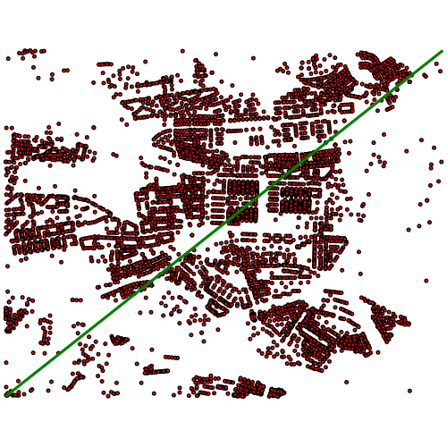

Operátory datového typu geometry
================================

*S datovým typem geometry nám v PostgreSQL přibyde několik poměrně zajímavých* `operátorů <http://postgis.net/docs/manual-2.1/reference.html#Operators>`_. *Rozhodně není od věci se s nimi seznámit. Vesměs řeší vzájemnou polohu bounding boxů prvků a kromě pohodlného a přehledného zápisu jsou obvykle velice rychlé.*

Překryv bounding boxů
---------------------

Operátor &&
^^^^^^^^^^^

Operátor **&&** vrací **true**, pokud je bounding box prvního prvku alespoň částečně překryt bounding boxem druhého prvku, nebo pokud se bounding boxy dotýkají. To se dá využít jako nejjednodušší prostorový filtr pro zobrazení, případně jako předvýběr dat pro další analýzu, pokud chceme optimalizovat dotaz. Setkáte se s ním například pokud budete logovat všechny dotazy v databázi nad kterou někdo pracuje s postgisem.
::

   SELECT adresnibod geom FROM ukol_1.adresy 
   WHERE adresnibod && 'LINESTRING(-739719.43 -1046851.61,-735806.08 -1043755.06)'::geometry;

    Obr. 2: Adresní body vybrané pomocí boundingboxu linie.

Dalším využitím je, jak již bylo řečeno optimalizace dotazů. Dejme tomu, že chceme spočítat počet adresních bodů v okruhu 250 metrů okolo bodu uložení vesmírných vajec s id=1.
::

   SET SEARCH_PATH = ukol_1, public;

   EXPLAIN ANALYZE
   SELECT COUNT(*) FROM adresy a, vesmirne_zrudice v 
   WHERE v.id = 1 
   AND ST_Intersects(a.adresnibod, ST_Buffer(v.geom_p, 250));

   EXPLAIN ANALYZE
   SELECT COUNT(NULLIF(ST_Intersects(adresnibod, ST_Buffer(geom_p, 250)), false)) 
   FROM 
   (
      SELECT geom_p, adresnibod FROM adresy a, vesmirne_zrudice v 
      WHERE v.id = 1 
      AND a.adresnibod && ST_Buffer(v.geom_p, 250)
   ) data
   ;

Operátor @ a ~
^^^^^^^^^^^^^^

Operátor **@** funguje podobně jako operátor **&&**, ovšem s tím rozdílem, že vrací prvky, jejichž bounding box je zcela překryt bounding boxem druhého prvku.

Použití je podobné jako u předešlého operátoru, s tím rozdílem, že nevybereme prvky, které leží na hranici. Pokud bychom, například vybírali polygony, které leží celé uvnitř bafru zredukujeme už v rámci "hrubého" filtru a ušetříme výkon potřebný na provedené průniku s prvky, o kterých víme, že není možné, aby v bafru ležely.

Operátor **~** funguje stejně jako **@**, ovšem s obráceným pořadím prvků. Vrací tedy jen takové prvky, jejichž bounding box zcela zakrývá bounding box prvku za operátorem.
::

   SELECT 'LINESTRING(0 0, 1 1)'::geometry && 'LINESTRING(0 0, -1 -1)'::geometry;
   SELECT 'LINESTRING(0 0, 1 1)'::geometry @ 'LINESTRING(0 0, -1 -1)'::geometry;
   SELECT 'LINESTRING(0 0, 1 1)'::geometry @ 'LINESTRING(0 0, 2 2)'::geometry;
   SELECT 'LINESTRING(0 0, 2 2)'::geometry @ 'LINESTRING(0 0, 1 1)'::geometry;
   SELECT 'LINESTRING(0 0, -1 -1)'::geometry @ 'LINESTRING(0 0, 2 2)'::geometry;
   SELECT 'LINESTRING(0 0, -1 -1)'::geometry && 'LINESTRING(0 0, 2 2)'::geometry;
   SELECT 'LINESTRING(0 0, 2 2)'::geometry ~ 'LINESTRING(0 0, 1 1)'::geometry;
   SELECT 'LINESTRING(0 0, 1 1)'::geometry ~ 'LINESTRING(0 0, 1 1)'::geometry;
   SELECT 'LINESTRING(0 0, 1 1)'::geometry ~ 'LINESTRING(0 0, 2 2)'::geometry;

Operátory <-> a <#>, vzdálenost
-------------------------------

Tyto dva operátory vrací vzdálenost. **<->** vrací vzdálenost centroidů, **<#>** vrací nejkratší vzdálenost boundingboxů. Využít je to možné například pro `optimalizaci vyhledávání nejbližšího prvku <http://boundlessgeo.com/2011/09/indexed-nearest-neighbour-search-in-postgis/>`_. Pokud pracujeme jen s body, vystačíme, samozřejmě, pouze s operátory.
::

   SELECT 'POINT(0 0)'::geometry <-> 'POINT(0 10)'::geometry;
   SELECT 'POINT(0 0)'::geometry <#> 'POINT(0 10)'::geometry;
   SELECT 'POINT(0 3)'::geometry <-> 'POINT(4 0)'::geometry;
   --
   SELECT 'LINESTRING(0 0,10 10)'::geometry <-> 'LINESTRING(0 5,10 15)'::geometry;
   SELECT 'LINESTRING(0 0,10 10)'::geometry <#> 'LINESTRING(0 5,10 15)'::geometry;
   --
   SELECT ST_Buffer('POINT(0 0)'::geometry, 10) <-> ST_Buffer('POINT(10 0)'::geometry, 10);
   SELECT ST_Buffer('POINT(0 0)'::geometry, 10) <#> ST_Buffer('POINT(10 0)'::geometry, 10);

.. note:: Výčet operátorů není kompletní. Určitě není na škodu věnovat pozornost manuálové stránce.

.. note:: Je zjevné, že u některých typů prvků předvýběr pomocí boundingboxu nemusí být zase taková výhra (například dlouhé multilinie a obecně hodně členité prvky).

Prostorové funkce
=================

Z celé přehršle funkcí a funkcionalit nabízených PostGISem vyberem jen některé. Zaměříme se na vybrané `analytické funkce <http://postgis.net/docs/manual-2.1/reference.html#Spatial_Relationships_Measurements>`_ a `funkce na processing geometrií <http://postgis.net/docs/manual-2.1/reference.html#Geometry_Processing>`_.

Výpočet plochy, obvodu, délky a dalších charakteristik geometrie
----------------------------------------------------------------

Asi nejzákladnější informace, kterou můžeme o ploše zjistit je její rozloha. Kromě základního zadání "zjisti, jak velkou mají Vomáčkovi zahrádku" je nezbytná pro provedení pokročilejších úloh typu "vyber obce, jejichž rozloha leží alespoň z osmdesáti procent v národním parku atp". Poměr plochy a obvodu se používá při odstraňování "sliverů".

Jedná se například o funkce:

:ST_Area:
   Výpočet plochy

:ST_Length:
   Délka linie

:ST_Centroid:
   Vrací centroid 

:ST_Perimeter:
   Vrací obvod

Informace o vzájemné poloze prvků
---------------------------------

Geometrické analýzy
-------------------

Agregační funkce
----------------
