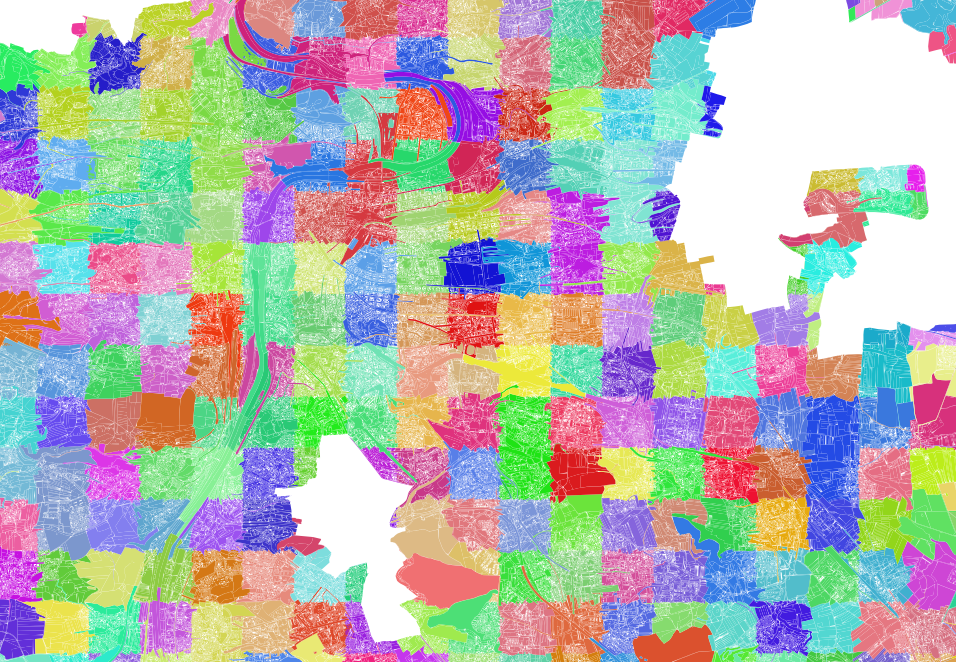
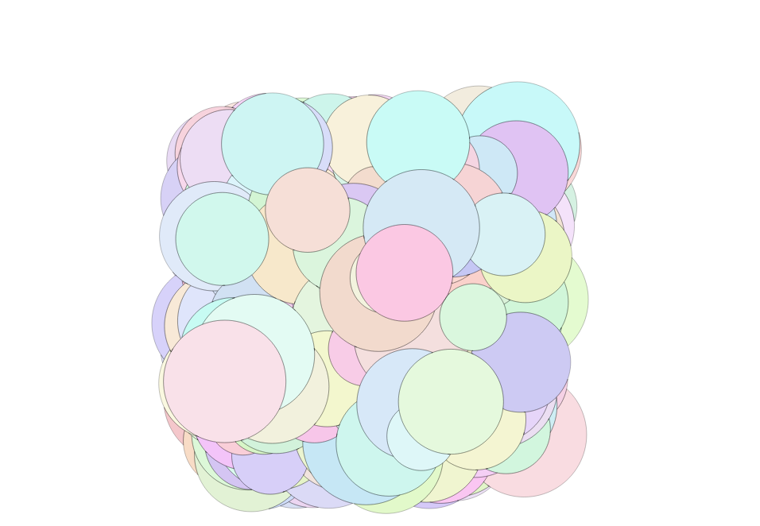
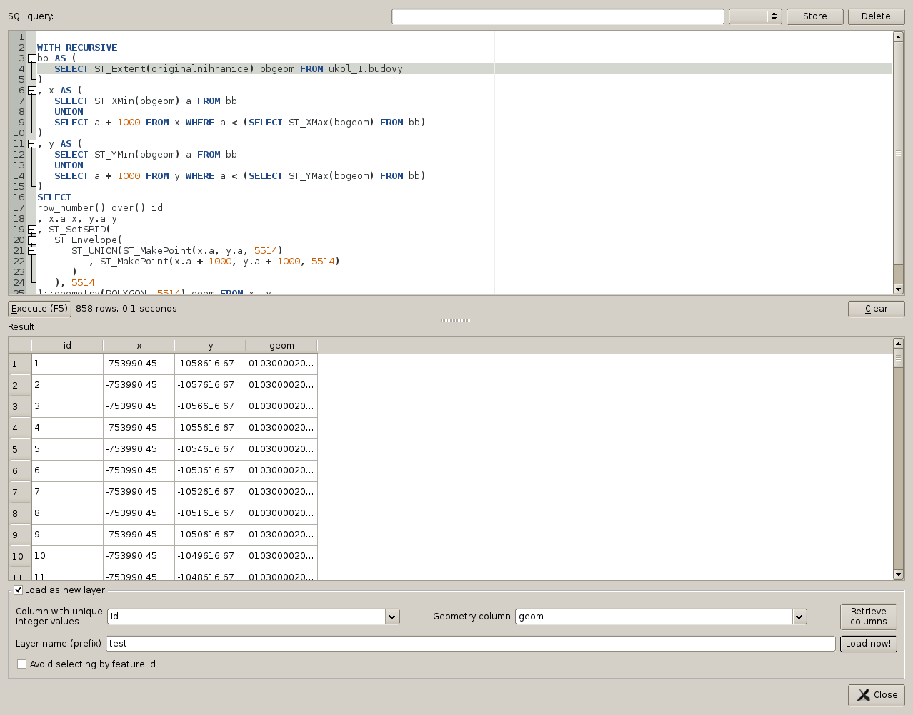
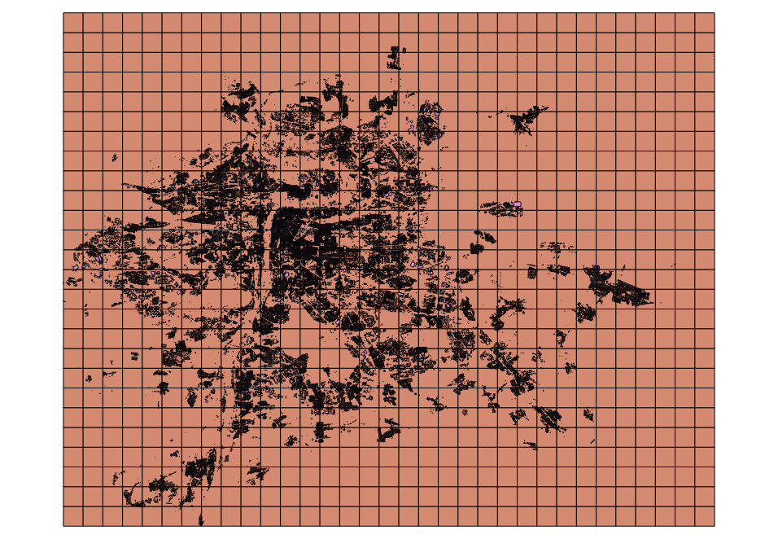

===============
Efektivní práce
===============

Pohledy
=======

:pgsqlcmd:`Pohled <sql-createview>` v databázi je v podstatě dotaz, který se
tváří jako tabulka. Můžeme mu nastavit práva a dotazovat ho. Výhodou pohledů
je, že pracují s tabulkami se stejnými právy, jaká měl jejich tvůrce. Můžeme
tedy pomocí pohledů zpřístupnit uživateli obsah tabulek, které mu nechceme
ukázat celé.

Pohledy můžeme zobrazit v QGISu, pakliže obsahují grafickou složku. Můžeme si
tedy, připravit dotazy, které nás zajímají a pracovat s nimi, aniž bychom museli
výsledky analýz ukládat do nových tabulek.

.. code-block:: sql

   SET SEARCH_PATH TO ukol_1, public;

   CREATE OR REPLACE VIEW parcely_podle_gridu AS
   SELECT row_number() over() id1
   , p.*, grid.id grid_id
   FROM parcely p, jtsk_grid grid
   WHERE p.definicnibod && grid.geom;

UDF funkce
==========

Funkce vytváříme příkazem :pgsqlcmd:`CREATE FUNCTION 
<sql-createfunction>`. Funkce může být napsaná přímo v jazyce `SQL`, v 
procedurálním jazyce PostgreSQL `PL/pgSQL`, případně v jednom z jazyků,
které podopruje PostgreSQL.

Ukažme si jednoduchý příklad funkce, která vrací kolik procent polygonu
je zakryto druhým polygonem.

.. code-block:: sql

   CREATE OR REPLACE FUNCTION procento_prekryvu(geometry, geometry) 
   RETURNS float AS $fbody$
      SELECT
      (
         ST_Area(ST_Intersection($1, $2))/
         ST_Area($1)
      ) * 100;
   $fbody$
   LANGUAGE SQL;

   SELECT procento_prekryvu(
      ST_Buffer(ST_MakePoint(0,0), 50),
      ST_Buffer(ST_MakePoint(50,0), 25));

.. noteadvanced:: U funkcí v PostgreSQL funguje přetěžování proměnných, takže
   je možné napsat celou řadu funkcí pro různé kombinace proměnných.

Složitější funkci si ukážeme v Pl/pgSQL. Bude se jmenovat `šupiny` a bude vracet
polygon oříznutý o části, které jsou zakryté polygony v tabulce šupiny.

.. code-block:: sql

   BEGIN;

   CREATE TABLE supiny (
      id SERIAL PRIMARY KEY
      , geom geometry(POLYGON, 0)
   );

   CREATE OR REPLACE FUNCTION supiny(sup geometry) 
   RETURNS geometry AS $$
   DECLARE 
   odecist geometry;
   BEGIN
      odecist := ST_MemUnion(geom) FROM supiny
      --normální UNION zlobí kvůli topologickým chybám
      WHERE geom && sup;
      /* vyfiltruji prvky z okoli zajmoveho uzemi*/
      IF odecist IS NULL THEN --odecist je prazdny
         RETURN sup;
      ELSE
         RETURN 
            ST_CollectionExtract(ST_Difference(sup, odecist),3)
            ;
         /* Collection extract vybere pouze polygony*/
      END IF;

   END;
   $$ LANGUAGE plpgsql;

   --vygeneruji náhodná data

   DO $$
      DECLARE i int;
      BEGIN
         FOR i in 1..500 LOOP
            INSERT INTO supiny(geom)
            SELECT (ST_Dump(
                  supiny(
                     ST_Buffer(
                        ST_Point(
                           random() * 100
                           , random() * 100
                     ), (random() * 10) + 10
                     , 25
                  )
               )
            )).geom;
         END LOOP;
      END
      $$;

   COMMIT;

Common table expression
=======================

:pgsqlcmd:`Common table expression <queries-with>`. Má hned několik 
zajímavých vlastností. Tou první je možnost rekurze. To je možné využít
například při generování čtvercové sítě, nebo generování hierarchických
struktur.

Použití rekruzivního :sqlcmd:`CTE` si předvedeme v následujícím příkladu.

	
.. code-block:: sql

   SET SEARCH_PATH TO ukol_1, public;

   CREATE TABLE jtsk_grid AS
   WITH RECURSIVE
   bb AS (
      SELECT ST_Extent(originalnihranice) bbgeom FROM budovy
   )
   , x AS (
      SELECT ST_XMin(bbgeom) a FROM bb
      UNION
      SELECT a + 1000 FROM x WHERE a < (SELECT ST_XMax(bbgeom) FROM bb)
   )
   , y AS (
      SELECT ST_YMin(bbgeom) a FROM bb
      UNION
      SELECT a + 1000 FROM y WHERE a < (SELECT ST_YMax(bbgeom) FROM bb)
   )
   SELECT 
   row_number() over() id
   , x.a x, y.a y
   , ST_SetSRID(
      ST_Envelope(
         ST_UNION(ST_MakePoint(x.a, y.a, 5514)
            , ST_MakePoint(x.a + 1000, y.a + 1000, 5514)
         )
      ), 5514
   )::geometry(POLYGON, 5514) geom FROM x, y;

.. noteadvanced:: Místo rekurzivního cte lze v tomto příkladu použít
   generate_series s týmž výsledkem.

Dotaz můžeme pustit přímo z db manageru QGISu.

Druhá ze zajímavých vlastností :sqlcmd:`CTE` je způsob, jakými jsou
optimalizovány. Každá :sqlcmd:`CTE` je totiž optimalizována zvlášť.
Toho se dá využít při optimalizaci dotazů.

CTE můžeme libovolně řetězit a navzájem dotazovat. To se dá dobře
použít, když budeme chtít postupně redukovat množinu dotazovaných
prvků pomocí stále přesnějších (a tím pádem výpočetně náročnějších)
dotazů. S pomocí CTE je možné dotáhnout pravidlo `výpočetně náročné
operace provádějte s nejmenším možným počtem prvků`.

Dejme tomu, že chceme zjistit výměru průniků budov s pozemky určenými
k plnění funkce lesa v Praze.

.. code-block:: sql

   SET SEARCH_PATH TO ukol_1, public;

   EXPLAIN ANALYZE
   WITH zpochr_26 AS ( --PUPFL
      SELECT *
      FROM parcely
      WHERE zpusobochranykod = 26
   )
   , bud AS ( --filtr na boundingbox
      SELECT *
      FROM budovy b
      WHERE EXISTS (
         SELECT 1 FROM zpochr_26 z
         WHERE z.originalnihranice && b.originalnihranice
      )
   ), prunik AS
   (
      SELECT ST_CollectionExtract(
            ST_Intersection(
            ST_UNION(z.originalnihranice)
            , ST_Union(b.originalnihranice)
         ), 3
      ) geom
      FROM bud b, zpochr_26 z
      WHERE b.originalnihranice && z.originalnihranice
      GROUP BY z.ogc_fid
   )

   SELECT sum(ST_Area(geom)) from prunik;

   --srovnani

   EXPLAIN ANALYZE
   SELECT sum(ST_Area(
         ST_Intersection(
            p.originalnihranice, b.originalnihranice
         )
      )
   )
   FROM parcely p, budovy b
   WHERE p.zpusobochranykod = 26
   AND ST_Intersects(p.originalnihranice, b.originalnihranice)

Tento příklad ukazuje, že ani mazané použití CTE nemusí být výhodnější,
než použití jednoduchého dotazu. Je to proto, že se jedná o jednoduchý
dotaz, který optimalizátor může správně uchopit. U složitější situace
to může být naopak. Problematické je navíc použití klauzule :sqlcmd:`EXISTS`.

.. code-block:: sql

   SET SEARCH_PATH TO ukol_1, public;

   WITH zpochr_26 AS ( --PUPFL
      SELECT *
      FROM parcely
      WHERE zpusobochranykod = 26
   )
   , bud AS ( --filtr na boundingbox
      SELECT z.originalnihranice a, b.originalnihranice b
      FROM budovy b, zpochr_26 z
      WHERE z.originalnihranice && b.originalnihranice
   )

   SELECT ST_Area(ST_Union(ST_Intersection(a,b))) FROM bud;

Každopádně :pgiscmd:`ST_Intersects` umí využívat operátory a potažmo indexy,
takže v tomto konkrétním případě má stále navrch.

.. code-block:: sql

   SET SEARCH_PATH TO ukol_1, public;

   EXPLAIN ANALYZE
   SELECT sum(ST_Area(
         ST_Intersection(
            p.originalnihranice, b.originalnihranice
         )
      )
   )
   FROM parcely p, budovy b
   WHERE p.zpusobochranykod = 26
   AND ST_Relate(p.originalnihranice, b.originalnihranice, '2********')

Anonymní blok kódu
==================

:pgsqlcmd:`Anonymní blok kódu <sql-do>` umožňuje spouštět dávku v PL/pgSQL mimo
funkce.

Ukázka z přákladu výše ukazuje, jak pustit ve smyčce vytvoření pěti set náhodných
bublin.

.. code-block:: sql

   DO $$
      DECLARE i int;
      BEGIN
         FOR i in 1..500 LOOP
            INSERT INTO supiny(geom)
            SELECT (ST_Dump(
                  supiny(
                     ST_Buffer(
                        ST_Point(
                           random() * 100
                           , random() * 100
                     ), (random() * 10) + 10
                     , 25
                  )
               )
            )).geom;
         END LOOP;
      END
      $$;

Využít se dá s výhodou, když provádíme průnik prvků dvou obsáhlejších tabulek.

.. code-block:: sql

   SET SEARCH_PATH TO ukol_1, public;

   BEGIN;

   CREATE TABLE prunik (
      ogc_fid int, 
      geom geometry(POLYGON, 5514)
   );

   DO $$
      DECLARE r prunik; --record podle tabulky prunik
      g geometry;
      r2 record;

      BEGIN
         FOR r IN SELECT ogc_fid, (ST_Dump(originalnihranice)).geom geom 
            FROM budovy 
            WHERE ST_IsValid(originalnihranice)
            LOOP
            RAISE NOTICE 'zpracovávám ogc_fid %', r.ogc_fid;
            g := ST_Multi(
               ST_CollectionExtract(
                  ST_Intersection(
                     r.geom, ST_Union(ST_MakeValid(originalnihranice))
                  ), 3
               )
            )
            FROM parcely
            WHERE originalnihranice && r.geom;

            FOR r2 IN SELECT (ST_Dump(g)).geom LOOP

               IF ST_GeometryType(r2.geom) = 'ST_Polygon' THEN
                  r.geom := r2.geom;
                  INSERT INTO prunik VALUES(r.*);
               END IF;

            END LOOP;

         END LOOP;
      END
      $$;

      SELECT count(*) FROM prunik;

   ROLLBACK;

