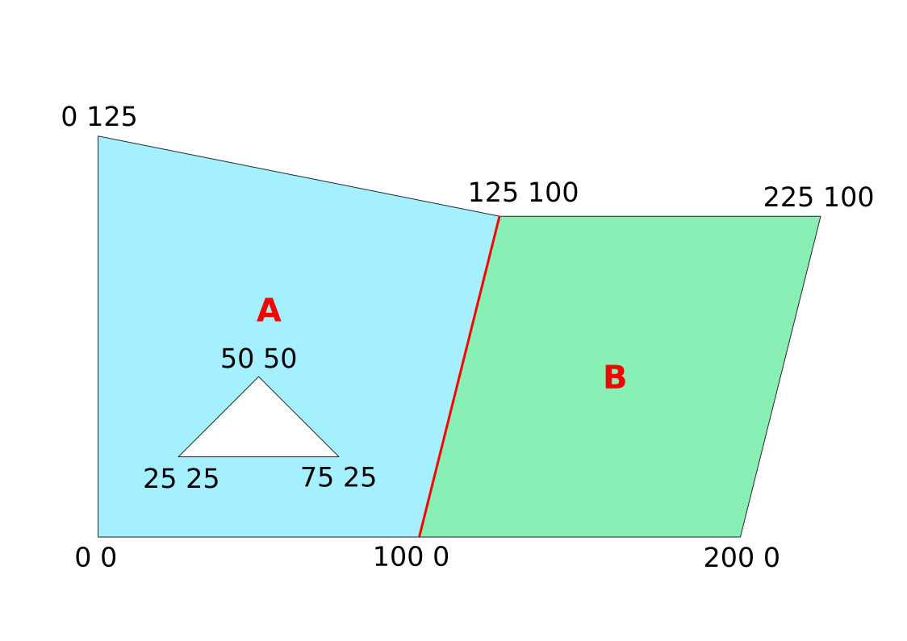
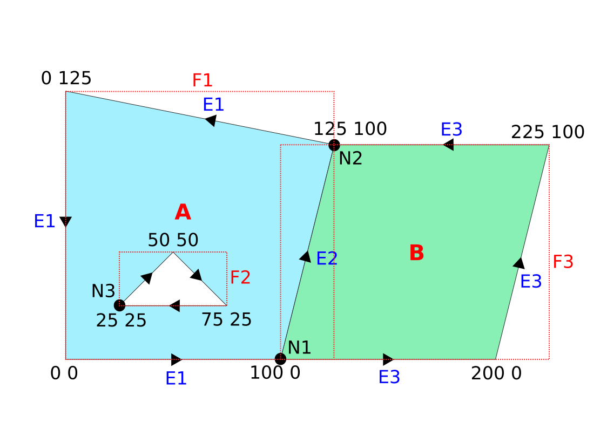

Topologie
=========

*PostGIS vznikl jako projekt implementující standard OGC* `Simple
Features <http://www.opengeospatial.org/standards/sfa>`_ *pro práci s
vektorovými daty ve formě jednoduchých prvků. Od verze 2.0 nicméně
umožnuje práci s vektorovými daty také v topologické formě.*

Rozšíření pro topologická vektorová data nahrajeme příkazem:

.. code-block:: sql
   
  CREATE EXTENSION postgis_topology;

Topologický datový model
------------------------

Rozdíl mezi datovým modelem jednoduchých geoprvků (simple features) a
topologickým modelem si ukážeme na ukázce dvou sousedících polygonů
(jeden z nich obsahuje otvor).

Jednoduché prvky
^^^^^^^^^^^^^^^^

.. _priklad-polygony-sf:

   Dva sousedící polygony jako jednoduché geoprvky.

::

  polygon |              geometrie (WKT)                   
 ---------+----------------------------------------------
     A    | POLYGON((0 0,100 0,125 100,0 125,0 0),(25 25,75 25,50 50,25 25))
     B    | POLYGON((100 0,200 0,225 100,125 100,100 0))

Z výše uvedeného je evidentní, že jsou oba prvky uloženy odděleně. To
vede k tomu, že hranice sousedících polygonů je uložena
dvakrát. Jednou jako součást polygonu :fignote:`A` podruhé jako součást
polygonu :fignote:`B`.

Topologický datový model
^^^^^^^^^^^^^^^^^^^^^^^^

PostGIS Topology používá datový model Topo-Geo, který vychází z
technické normy SQL/MM (`ISO 13249-3:2006
<http://www.wiscorp.com/H2-2004-168r2-Topo-Geo-and-Topo-Net-1-The-Concepts.pdf>`_).

Model pracuje s třemi základními *topologickými primitivy*:

* uzly (*nodes*) 
* hranami (*edges*) 
* stěnami (*faces*) 

Kompozice znázorněná na :ref:`obrázku výše <priklad-polygony-sf>` bude
v topologickém modelu PostGISu popsána (minimálně, reálná situace se
může lišit na základě použitého algoritmu tvorby topologických
primitiv):

* třemi uzly :fignote:`N1`, :fignote:`N2` a :fignote:`N3`
* třemi hranami :fignote:`E1`, :fignote:`E2` a :fignote:`E3`
* třemi stěnami :fignote:`F1`, :fignote:`F2` a :fignote:`F3`

   Dva sousedící polygony z :numref:`priklad-polygony-sf` v topologickém
   modelu.

Ve výsledku bude tedy společná hranice polygonů :fignote:`A` a
:fignote:`B` uložena pouze jednou a to jako hrana :fignote:`E2`.

Příklad
^^^^^^^

.. code-block:: sql

   -- schéma topology a public musí být v cestě uvedeno vždy
   SET search_path TO topo_test,topology,public;

   -- nahrání dat ve formě simple features
   CREATE TABLE p2 (fid serial PRIMARY KEY, geom geometry(Polygon));
   INSERT INTO p2 (geom) VALUES (ST_GeomFromText('Polygon(
    (0 0, 100 0, 125 100, 0 125, 0 0),(25 25, 75 25, 50 50, 25 25))'));
   INSERT INTO p2 (geom) VALUES (ST_GeomFromText('Polygon(
    (100 0, 200 0, 225 100, 125 100, 100 0))'));
    
Každá datová vrstva s topologii je uložena ve zvláštním schématu, nové
schéma vytvoříme pomocí funkce :pgiscmd:`CreateTopology`.

.. code-block:: sql

   SELECT CreateTopology('topo_p2');

.. note:: Topologická schéma jsou uložena v tabulce
          :dbtable:`topology.topology`.

          Všiměte si, že funkce z rozšíření topology nemá prefix "st",
          není tedy součástí standardu ISO SQL M/M.
                   
Do tabulky prvků :dbtable:`p2` vložíme nový atribut, do kterého
posléze sestavíme topologii prvků. K tomu použijeme funkci
:pgiscmd:`AddTopoGeometryColumn`.

.. code-block:: sql

   SELECT AddTopoGeometryColumn('topo_p2', 'topo_test', 'p2', 'topo', 'POLYGON');

Ve výsledku se v tabulce :dbtable:`p2` vytvoří nový sloupce s názvem
:dbcolumn:`topo` a datovým typem :ref:`TopoGeometry <topogeometry>`.

.. note:: Informace o atributech s topologií jsou uloženy v tabulce
         :dbtable:`topology.layer`.

Topologická primitiva sestavíme z jednoduchým prvků pomocí funkce
:pgiscmd:`toTopoGeom`.

.. code-block:: sql

   UPDATE p2 SET topo = toTopoGeom(geom, 'topo_p2', 1);

.. note:: Poslední argument určuje toleranci, se kterou budeme
          topologii sestavovat. V našem případě jsme zvolili toleranci
          1 metr.

.. _topogeometry:

Datový typ TopoGeometry
-----------------------

Datový typ **TopoGeometry** reprezentuje geometrii definovanou
topologickými primitivy. Je složen ze čtyř složek:

* ``topology_id`` (id topologického schématu v tabulce :dbtable:`topology`)
* ``layer_id`` (id topologického atributu v tabulce :dbtable:`layer`)
* ``id`` (id topologické relace)
* ``type`` (geometrický typ jednoduchého prvku)
 * ``1`` bod (point)
 * ``2`` lomená čára (linestring)
 * ``3`` polygon

.. code-block:: sql

   SELECT fid,ST_AsText(geom),topo FROM p2;

V našem případě:

::

    fid |                            st_astext                             |   topo    
   -----+------------------------------------------------------------------+-----------
      1 | POLYGON((0 0,100 0,125 100,0 125,0 0),(25 25,75 25,50 50,25 25)) | (1,1,1,3)
      2 | POLYGON((100 0,200 0,225 100,125 100,100 0))                     | (1,1,2,3)

.. note:: Vztah mezi atributem a daným topologickým primitivem určuje složka
   ``id`` a tabulka :dbtable:`relation` umistěná v topologickém schématu. Příklad:

   .. code-block:: sql

      SELECT face_id, st_astext(mbr) FROM topo_p2.face WHERE face_id IN
      (SELECT r.element_id FROM p2 AS f JOIN topo_p2.relation AS r ON
      (f.topo).layer_id=r.layer_id AND (f.topo).type = r.element_type
      AND (f.topo).id=r.topogeo_id);

   ::

     face_id |                  st_astext                   
    ---------+----------------------------------------------
           1 | POLYGON((0 0,0 125,125 125,125 0,0 0))
           3 | POLYGON((100 0,100 100,225 100,225 0,100 0))

Tabulky s topologickými primitivy
---------------------------------

Topologická primitiva jsou uloženy v tabulkách topologického schématu :dbtable:`node`, :dbtable:`edge` a :dbtable:`face`.

.. code-block:: sql

   -- seznam uzlů
   SELECT node_id,containing_face,st_astext(geom) from topo_p2.node;

   -- seznam hran
   SELECT edge_id,start_node,end_node,next_left_edge,next_right_edge,
    left_face,right_face,st_astext(geom) from topo_p2.edge;         

   -- seznam stěn
   SELECT face_id,ST_AsText(mbr) from topo_p2.face;        

Kontrola konzistence dat
------------------------

Pro kontrolu topologické konzistence můžete použít dvě funkce
:pgiscmd:`TopologySummary` a :pgiscmd:`ValidateTopology`. První z nich
vypisuje souhrné informace o topologii, druhá provádí validaci
topologických primitiv.

.. code-block:: sql

   SELECT TopologySummary('topo_p2');
   SELECT ValidateTopology('topo_p2');

Praktická ukázka
----------------

Z důvodu časové náročnosti si topologii sestavíme pouze na vzorku
parcel na uzemí Hlavního města Prahy.

.. code-block:: sql

   -- vybereme část parcel na území Hl. města Prahy
   CREATE TABLE parcely_732583 AS
    SELECT * FROM ruian_praha.parcely WHERE katastralniuzemikod = 732583;

   -- přídáme primární klíč
    ALTER TABLE parcely_732583 ADD PRIMARY KEY (ogc_fid);            

   -- a prostorové indexy
   CREATE INDEX ON parcely_732583 USING gist (geom);
                
Vytvoříme nové schéma a atribut pro topologii.

.. code-block:: sql
   
   -- topologické schéma
   SELECT CreateTopology('topo_parcely_732583', 5514);

   -- topologický atribut
   SELECT AddTopoGeometryColumn('topo_parcely_732583', 'topo_test',
    'parcely_732583', 'topo', 'POLYGON');

.. tip:: Souřadnicový systém pro topologické schéma můžeme odvodit
         dynamicky pomocí funkce ``find_srid``,
         např. ``find_srid('topo_test', 'parcely_732583', 'geom')``.

Nakonec se pokusíme topologii sestavit z původních jednoduchých prvků.

.. code-block:: sql

   UPDATE parcely_732583 SET topo = toTopoGeom(geom, 'topo_parcely_732583', 1);

.. note:: Sestavení topologie z jednoduchých geoprvků je poměrně
          časově náročná činnost. Na výše uvedeném katastrálním území
          může trvat až několik minut. Funkce :pgiscmd:`toTopoGeom` je
          navíc velmi náchylná na topologické chyby na vstupu a často
          skončí chybou.

.. noteadvanced:: Pro sestavení topologie v PostGISu můžete použít
   externí nástroj `GRASS GIS
   <http://www.gismentors.cz/skoleni/grass-gis/>`_. Následuje zkracený
   návod. Detaily tohoto řešení jsou nad rámec tohoto školení a
   spadají spíše do školení :skoleni:`GRASS GIS pro pokročilé
   <grass-gis-pokrocily>`.

   .. code-block:: bash

      v.in.ogr in=PG:dbname=pokusnik layer=ukol_1.parcely out=parcely
      v.out.postgis -l in=parcely out=PG:dbname=pokusnik out_layer=parcely_topo
                             
Zadání
^^^^^^

Najděte parcely, které sousedí s parcelou, ve které se nachází adresní
bod s označením ``kod=22560840``.

Řešení
^^^^^^

.. code-block:: sql

   WITH original_face_id AS(
      SELECT
      topology.getFaceByPoint('topo_parcely_732583', geom, 0) face_id
      FROM ruian_praha.adresnimista WHERE kod = 22560840
   )
   , sousedni AS (
      SELECT
      CASE right_face
         WHEN original_face_id.face_id THEN left_face
         ELSE right_face
      END face
      FROM original_face_id
      , topology.ST_GetFaceEdges('topo_parcely_732583', face_id)
      JOIN topo_parcely_732583.edge ON edge_id = @edge
   )
   SELECT *
   FROM topo_test.parcely_732583 p
   JOIN topo_parcely_732583.relation r
   ON (p.topo).id = r.topogeo_id
   AND (p.topo).layer_id = r.layer_id
   AND (p.topo).type = 3
   WHERE r.element_id IN (
      SELECT face
      FROM sousedni
   );

Praktická ukázka *Brloh u Drhovle*
----------------------------------

Topologickou funkcionalitu PostGISu můžeme s výhodou využít pro zaplochování a
tvorbu polygonů u dat, kde máme síť hranic a centroidy. Typickým příkladem dat,
která takto dostáváme jsou data ve formátech `VFK
<http://www.cuzk.cz/Katastr-nemovitosti/Poskytovani-udaju-z-KN/Vymenny-format-KN/Vymenny-format-NVF.aspx>`_
a `VKM
<http://www.cuzk.cz/Katastr-nemovitosti/Poskytovani-udaju-z-KN/Vymenny-format-KN/Stary-vymenny-format/Stary-vymenny-format-cast-1.aspx>`_
vydávané `Českým úřadem zeměměřickým a katastrálním <http://www.cuzk.cz/Uvod.aspx>`_.

Další velice užitečnou možností využití funkcionalit topologie v PostGISu je
topologická generalizace.

Zadání
^^^^^^

Na základě `VKM <http://services.cuzk.cz/VKM/ku/>`__ Brlohu u Drhovle
a pomocí skriptu v Bashi vybereme *linie hranic parcel a jejich
definiční body*. Výsledná SQL dávka ke stažení `zde
<http://training.gismentors.eu/geodata/postgis/brloh.sql>`__. Data
jsou připravena k nahrání do schématu :dbtable:`brloh_data`.

Z těchto dat sestavíme polygony parcel. Vytvoříme jednoduchou
geometrii a jejich topologickou reprezentaci. Dále provedeme
generalizaci hranic parcel a porovnáme výsledek generalizace
jednoduchých prvků a topologické reprezentace.

Postup
^^^^^^

Nahrání linií do topologického schématu
~~~~~~~~~~~~~~~~~~~~~~~~~~~~~~~~~~~~~~~

Nejdříve vytvoříme nové topologické schéma. Nazveme ho :dbtable:`brloh`.

.. code-block:: sql

   SELECT topology.CreateTopology('brloh', 5514, 0.01, false);

Zvolíme *SRID* "5514" a centimetrovou přesnost. Poslední parametr funkce
:pgiscmd:`CreateTopology` udává, že ve schématu nepočítáme se souřadnicí Z.

Přidáme všechny linie z tabulky :dbtable:`brloh_data.hranice` do topologie.

.. code-block:: sql

   SELECT topology.TopoGeo_AddLineString('brloh', geom, 0) from brloh_data.hranice;

Zaplochujeme

.. code-block:: sql

   SELECT topology.Polygonize('brloh');

.. note:: V novějších verzích PostGIS se stěny vytvoří automaticky.

Nyní můžeme vytvořit pohled :dbtable:`parcely`, který přidá k definičním bodům
polygony.

.. code-block:: sql

   CREATE VIEW parcely AS
   SELECT debo.id, debo.label
   , topology.ST_GetFaceGeometry(
      'brloh', topology.GetFaceByPoint('brloh', geom, 0)
   ) geom FROM debo;

Případně můžeme geometrii k bodům doplnit přímo do tabulky.

.. code-block:: sql

   ALTER TABLE debo ADD geom_polygon geometry(POLYGON, 5514);
   UPDATE debo
   SET geom_polygon = topology.ST_GetFaceGeometry(
      'brloh'
      , topology.GetFaceByPoint('brloh', geom, 0)
   );

Z již vytvořené topologie můžeme vytvořit topologický atribut bez
toho, abychom jej museli vytvářet na základě jednoduchých prvků.

Nejdříve přidáme nový atribut o datovém typu TopoGeometry.

.. code-block:: sql

                
   SELECT topology.AddTopoGeometryColumn(
      'brloh'
      , 'brloh_data'
      , 'debo'
      , 'topo'
      , 'POLYGON'
   );

Číslo vrstvy zjistíme dotazem v tabulce :dbtable:`topology.layer`.

.. code-block:: sql

   SELECT layer_id
   FROM topology.layer
   WHERE schema_name = 'brloh_data' AND table_name = 'debo';

K vygenerování topogeometrie použijeme funkci :pgiscmd:`CreateTopoGeom`.

.. code-block:: sql

   UPDATE debo
   SET topo = topology.CreateTopoGeom(
      'brloh'
      , 3 --polygonová vrstva
      , 1 --id vrstvy
      , ARRAY[
         ARRAY[
            topology.GetFaceByPoint('brloh', geom, 0) --face_id
            , 3 --značí, že jde o face
         ]
      ]::topology.TopoElementArray
   );

Nyní můžeme zobrazit geometrii sestavenou z topologických primitiv.

.. code-block:: sql

   SELECT id, label, topo::geometry FROM brloh_data.debo;

Případně se přesvědčit, zda se geometrie sestavená z topologie shoduje
s dříve uloženou geometrií vycházející z jednoduchých prvků.

.. code-block:: sql

   SELECT count(*)
   FROM debo
   WHERE NOT ST_Equals(geom_polygon, topo::geometry);

Generalizace
~~~~~~~~~~~~

Nejdříve vyzkoušíme generalizaci jednoduché geometrie. Použijeme
funkci :pgiscmd:`ST_SimplifyPreserveTopology`, která na rozdíl od
:pgiscmd:`ST_Simplify` dohlíží i na validitu vrácených prvků.

.. code-block:: sql

   SELECT id, st_simplifypreservetopology(geom_polygon, 5) geom
   FROM brloh_data.debo;

Výsledek si mohu zobrazit v QGIS.

.. figure:: ../images/simplify.png
   :class: middle

   Výsledek generalizace jednoduchých prvků zobrazený v QGIS.

Z obrázku je celkem jasně patrné, že v důsledku toho, že každý prvek byl
generalizován samostatně vznikla řada překryvů a mezer.

Vyzkoušíme to samé v topologii pomocí funkce :pgiscmd:`TP_ST_Simplify`.

.. code-block:: sql

   SELECT id, topology.st_simplify(topo, 15) geom FROM brloh_data.debo;

.. figure:: ../images/simplify_topo.png
   :class: middle

   Výsledek generalizace s ohledem na topologii zobrazený v QGIS.

Vrácený výsledek naprosto přesně odpovídá nezjednodušeným geometriím. Je to
proto, že se generalizují jednotlivé hrany a zde použité hrany mají všechny
právě dva body a nelze je tedy zjednodušit. Je to důsledek importu z VKM.

Smažeme tedy celé pracně vytvořené topologické schéma. A vytvoříme ho znova.

.. code-block:: sql

   SELECT topology.DropTopology('brloh');
   SELECT topology.CreateTopology('brloh', 5514, 0.01, false);

Tentokrát linie spojíme a rozpustíme pomocí funkce
:pgiscmd:`ST_Dump`. Navíc je třeba použít funkci
:pgiscmd:`ST_LineMerge`, která propojí jednotlivé úseky v rámci
multilinie.

.. code-block:: sql

   SELECT topology.TopoGeo_AddLineString('brloh', geom, 0)
   FROM (
      SELECT (ST_Dump(u_geom)).geom
      FROM (
         SELECT ST_LineMerge(ST_Union(geom)) u_geom
         FROM brloh_data.hranice
      ) uni
   ) geoms;

Dále budeme postupovat stejně.

.. figure:: ../images/simplify_topo_2.png
   :class: middle

   Opravený výsledek generalizace na základě topologie zobrazený v QGIS.

Původní hrany jsou vyznačeny světlou linkou.

Užitečné odkazy
---------------

* `Funkce rozšíření Topology <http://postgis.net/docs/Topology.html>`_
* http://freegis.fsv.cvut.cz/gwiki/PostGIS_Topology
* http://grasswiki.osgeo.org/wiki/PostGIS_Topology
